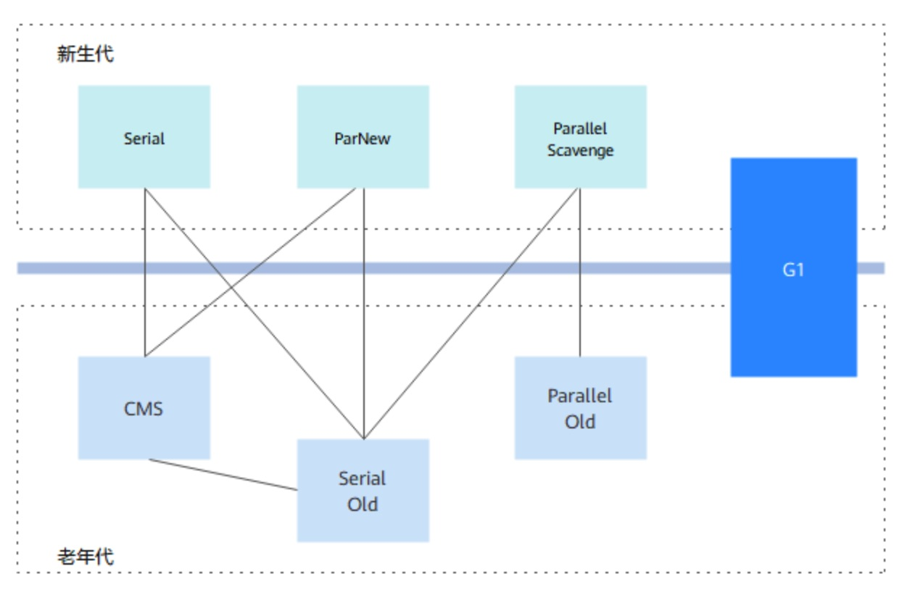
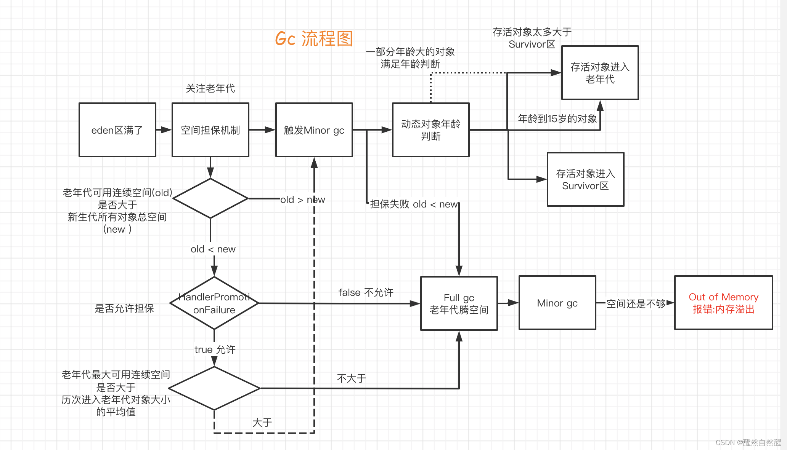
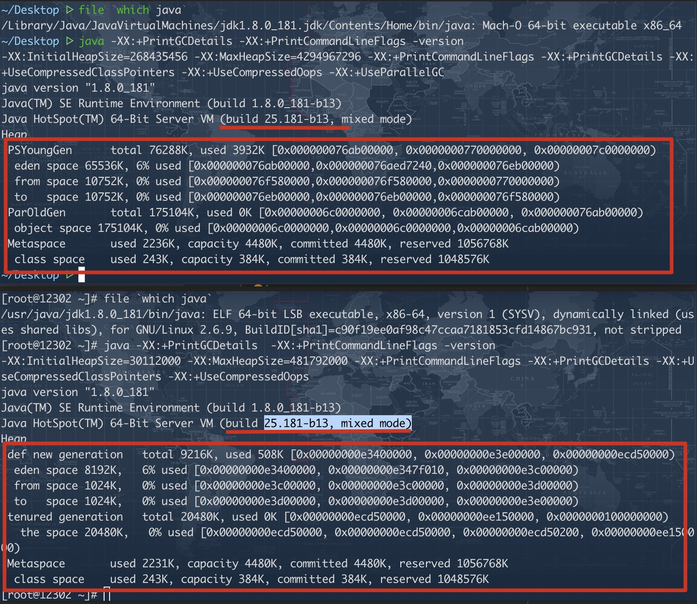
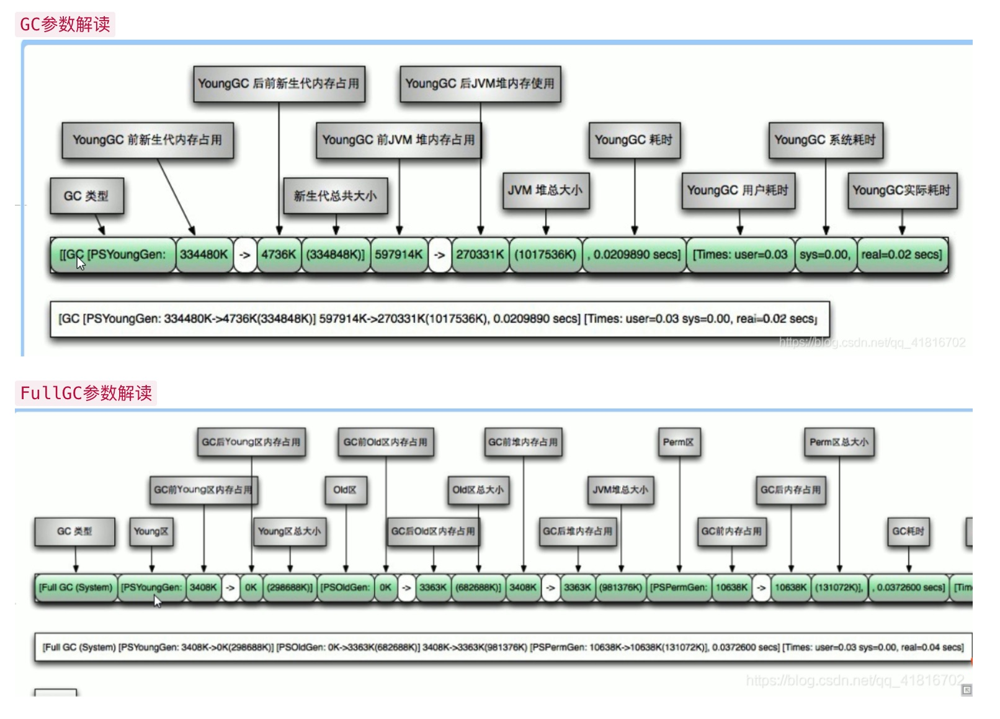
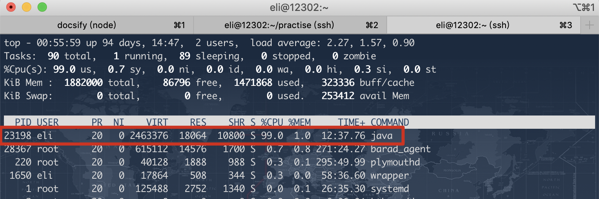
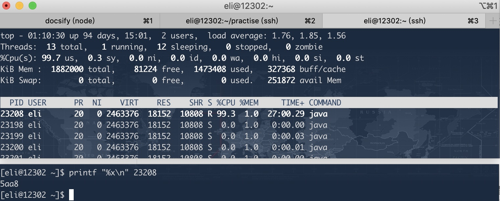
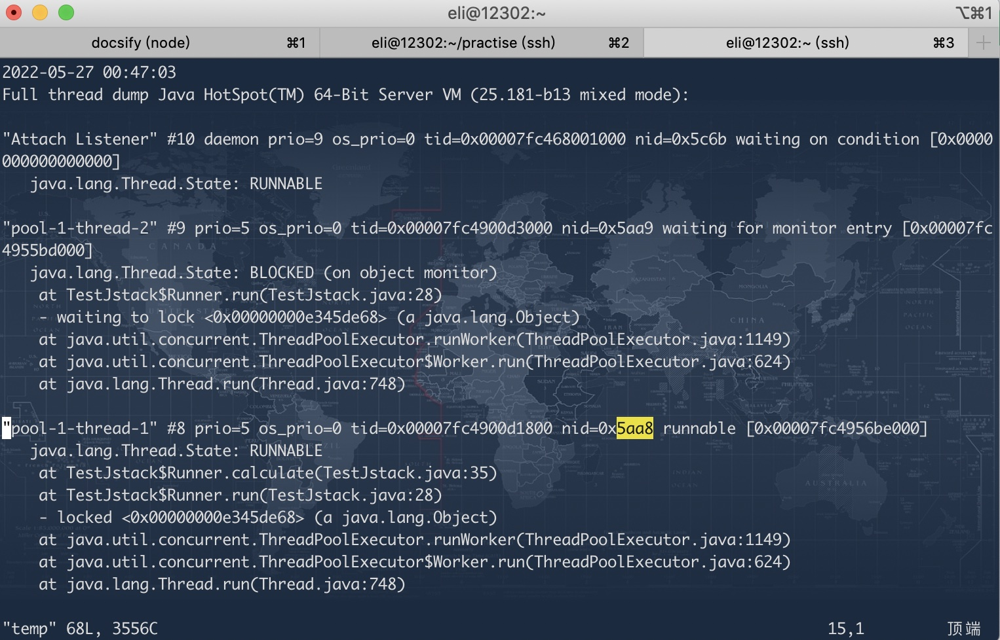

## 内存模型

- [方法区](https://baijiahao.baidu.com/s?id=1731211048001613394&wfr=spider&for=pc)

  > JDK1.7及之前的实现叫做永久代，包括类信息，常量，静态变量以及常量池。1.7将字符串常量池放在堆里了。主要在堆里开辟内存，隶属于堆，连续的物理内存。但是相互隔离。
  >
  > JDK1.8改名为元空间，`元空间不再虚拟机设置的内存中，而是使用本地内存`

  > *[常量池](https://blog.csdn.net/qq_43210583/article/details/116558468)是方法区比较重要的一部分，分为四种：类文件常量池（静态常量池，[字节码文件解析](https://blog.csdn.net/n_fly/article/details/114026651) ），字符串常量池，运行时常量池，封装类常量池。类文件常量池中的数据在类加载的时候会放入到运行时常量池中，并将符号引用在解析阶段转换成运行时常量池中的直接引用。*

  | type     | explain                                                      |
  | -------- | ------------------------------------------------------------ |
  | 字面量   | 文本字符串（代码中双括号包裹的字符串） 声明为final的常量 基本数据类型的表示及属性方法明 |
  | 符号引用 | 类符号引用：类的完全限定名 字段的名称和描述符 方法的名称和描述符 |

  > `String s = new String("ABC")` 这行单纯代码层面来说，只创建一个对象。如果包含类加载的过程，有可能会创建两个，一个在常量池中，一个在堆里面。堆里面的引用常量池中的value。[参考](https://stackoverflow.com/questions/19672427/string-s-new-stringxyz-how-many-objects-has-been-made-after-this-line-of)
  >
  > `String.intern()` 方法首先会在常量池中查找等值字符串，找到了，返回引用。没找到，常量池创建并返回引用。
  > JDK1.7之前。不存在创建的是等值字符串，之后，创建的是堆中的引用。

- 堆

- 虚拟机栈

  - 局部变量表
  
    > 帧栈中，有局部变量表来存储数据，包括参数，所需的内存空间在编译期间就确定了。
    > 存储单位是Slot【32bi t】,大于32的可以分配连续的槽。
    > 根据索引的方式定位局部变量表，下标从0开始。非静态方法的0位是this,静态方法的从参数开始排列
    >
    > slot复用：[影响GC](https://blog.csdn.net/weixin_38106322/article/details/108785468)。当同一个帧栈中局部方法中变量没有被复用，会导致无法垃圾回收。
  
  - 操作数栈
  
    > 先进后出的数据存储结构，可以存储任意的Java数据类型。用来进行算数运算，参数传递及临时存储
    >
    > [栈顶缓存技术](https://blog.csdn.net/qq_40298351/article/details/120730602)。操作数在内存中，频繁操作影响性能。可以将栈顶全部元素缓存在物理CPU寄存器中
  
  - 动态链接
  
  - 方法出口
  
- 本地方法栈

  > 类比虚拟机栈，不过这个是针对本地语言（c/c++），方法一般由native修饰。

- 程序计数器

  > 一块比较小的内存空间，可以看做事当前线程所需执行字节码的行号指示器，通常由执行引擎开执行程序计数器所指向的行号内容。更确切的说。一个线程的执行，是通过字节码解释器改变当前线程 的计数器的值，来获取下一条需要执行的字节码指令，从而确保线程的正确执行。

## 垃圾回收器

> 串行收集器： DefNew：是使用-XX:+UseSerialGC（新生代，老年代都使用串行回收收集器）。 
>
> 并行收集器： ParNew：是使用-XX:+UseParNewGC（新生代使用并行收集器，老年代使用串行回收收集器）或者-XX:+UseConcMarkSweepGC(新生代使用并行收集器，老年代使用CMS)。 
>
> PSYoungGen：是使用-XX:+UseParallelOldGC（新生代，老年代都使用并行回收收集器）或者-XX:+UseParallelGC（新生代使用并行回收收集器，老年代使用串行收集器） 
>
> garbage-first heap：是使用-XX:+UseG1GC（G1收集器)
>
> [Ref:ParNew 和 PSYoungGen 和 DefNew 是一个东西么？](https://zhidao.baidu.com/question/602094329.html)

* 垃圾回收器图解

  

  | 名称              | 模式      | 分代  | 说明                                                         |
  | ----------------- | --------- | ----- | ------------------------------------------------------------ |
  | Serial            | 串行      | 新    | 单线程串行收集器                                             |
  | ParNew            | 并行      | 新    | serial 的并行版本                                            |
  | Parallel Scavenge | 并行      | 新    | 不同体系，并行吞吐量优先。可以通过参数来打开自适应调节策略， 虚拟机会根据当前运行情况收集性能监控信息， 动态调整这些参数以提供最合适的停顿时间或最大的吞吐量， 可以通过参数控制GC时间范围或者比例。 |
  | Parallel Old      | 并行      | 老    | 针对PSScavenge的老年代收集器                                 |
  | Serial Old        | 串行      | 老    | serial老年代                                                 |
  | CMS               | 并发      | 老    | 并行最短时间收集器                                           |
  | G1                | 并发/并行 | 新/老 | 面向局部收集和基于Region内存布局的新型低延时收集器           |

  

## 垃圾回收算法

## 扩展

* JVM部分参数

    | index                        | explain                                                |
    | ---------------------------- | ------------------------------------------------------ |
    | `-Xmx2g`                     | 堆最大值                                               |
    | `-Xms2g`                     | 初始堆大小                                             |
    | `-Xmn1g`                     | 年轻代大小，在堆内存固定的情况下，年轻代和老年代成反比 |
    | `-Xss128k`                   | 线程栈大小                                             |
    | `-XX:NewSize=1024m`          | 年轻代初始值                                           |
    | `-XX:MaxNewSiz=1024m`        | 年轻代最大值                                           |
    | `-XX:PermSize=256m`          | 持久代初始值                                           |
    | `-XX:MaxPermSize=256m`       | 持久代最大值                                           |
    | `-XX:NewRatio=4`             | 年轻代（eden, form,to)和年老代的比值                   |
    | `-XX:SurvivorRatio=4`        | 设置survivor区和eden比值                               |
    | `-XX:MaxTenuringThreshold=7` | 对象年龄晋升阈值                                       |
    
* 新生代到老年代的标准

  1. -XX:MaxTenuringThreshlod设置的默认对象年龄【15】，因为对象年龄用4bit 位表示，最大1111(15)。
  2. 动态对象年龄判断：survivor区域中年龄从低到高对象大小总和大于-XX:TargetSurvivorRatio[:50%]，则将当前年龄及大雨当前年龄的对象晋升。[误区](https://wenku.baidu.com/view/e90d99cc142ded630b1c59eef8c75fbfc77d94a0.html )
  3. 大对象直接进入老年代：-XX:PretenureSizeThreshold。超过这个值的对象直接放在老年代。
  4. 空间分配担保机制：

* GCROOT 对象
  1. 每个帧栈[局部变量表](https://hllvm-group.iteye.com/group/topic/25858)
  2. 常量池中引用的对象。
  3. 方法区中静态变量引用的对象。

* 同一个版本的[JDK](https://repo.huaweicloud.com/java/jdk/8u181-b13/)在不同的平台上使用的垃圾回收器不一样。

* `-XX:+UseParallelGC / -XX:-UseParallelOldGC` 选项[link](https://docs.oracle.com/javase/10/gctuning/available-collectors.htm#JSGCT-GUID-F215A508-9E58-40B4-90A5-74E29BF3BD3C)

  > 使用ParallelGC  并不一定在新生代和年老代都使用并发收集，也就是【ps+po】，也有可能是老年代使用单线程收集，如下官网解释。

  Parallel compaction is a feature that enables the parallel collector to perform major collections in parallel. Without parallel compaction, major collections are performed using a single thread, which can significantly limit scalability. **<u>Parallel compaction</u> is enabled by default if the option -XX:+UseParallelGC has been specified**. You can disable it by using the -XX:-UseParallelOldGC option.

  [[Inside HotSpot] UseParallelGC和UseParallelOldGC的區別](https://www.796t.com/content/1558800122.html)

  [what's the difference between ParallelGC and ParallelOldGC?](https://stackoverflow.com/questions/6236726/whats-the-difference-between-parallelgc-and-paralleloldgc)

  [PSYoungGen ParNewGeneration DefNewGeneration等名词解释](https://blog.csdn.net/ningguixin/article/details/32332635)

* [GC类型：minorGC，majorGC/FullGC](https://blog.csdn.net/weixin_42615068/article/details/102813947)

  > 新生代GC（minor GC），GC非常频繁，回收速度比较快
  >
  > 老年代GC（majorGC/FullGC)，发生在老年代的GC，出现了 major GC经常 伴随至少一次minorGC（并非绝对），major速度一般比minor慢10倍以上。

* `-XX:+PrintGCDetails`  

  - [日志字段解释](https://blog.gceasy.io/2016/02/22/understand-garbage-collection-log/) 
  - [图片来源](https://blog.csdn.net/qq_41816702/article/details/108352220)

  

* [永久代回收](https://www.nowcoder.com/questionTerminal/8f393a761e0f4b67b1c442d092eb484d)

  > 回收的对象是废弃的常量及无用的类
  
* 卡表

* 内存逃逸

* 面试官问数据量多大

## 常见问题及调优

* [由于编写的Java类数量太多导致`PermGen OutOfMemoryError`](https://www.liaoxuefeng.com/article/1336345083510818)  

  > 一次是某公司的超大型Java程序，导致PermGen OutOfMemoryError,那是JDK1.6，原因很简单，编写的Java类数量太多了，撑爆了默认的128M的永久代。解决方法很简单，改成更大的512M（参数名叫啥已经忘了，因为新版JVM没有PermGen限制了）。但是根本问题不是出在JVM，而是代码太垃圾，Java类的数据超多造成的。

* CPU 100% 问题排查

  > 1 在Linux上面使用 `top` 命令进程查询 CPU100% 进程ID[pid]
  >
  > 
  >
  >
  > 2  使用`top -Hp 23198` 查看具体线程所占用CPU,然后将线程通过`printf "%x\n" 23208` 记录线程ID 
  >
  >
  > 
  > 3 使用`jstack 23198` 打印进程下线程状态。根据上一步获取的十六进制的线程ID 查找是那个线程栈导致。

* 内存超标

* 频繁FGC导致线上程序运行缓慢