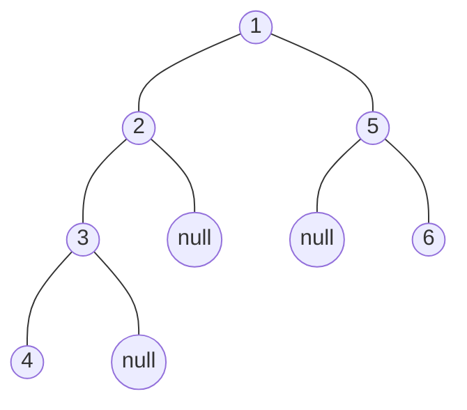

* ## Intro(Tree)
    + ### 一、什么是树？

        ?>在计算机科学中，树是一种非线性的数据结构，用于模拟具有层次关系的数据集合。它由有限节点组成，每个节点可以有零个或多个子节点。树的根节点是层次结构的顶部，其他节点都是其子节点。根据节点的度数（即子节点的数量），树可以分为二叉树、三叉树、多叉树等。
    
    + ### 二、树的遍历方式
        ?> 1. 先序遍历：先访问根节点，然后访问左子树，最后访问右子树。
         2. 中序遍历：先访问左子树，然后访问根节点，最后访问右子树。
         3. 后序遍历：先访问左子树，然后访问右子树，最后访问根节点。

## Demo

## Reference
* https://dprebyl.github.io/syntree
* https://mshang.ca/syntree/
