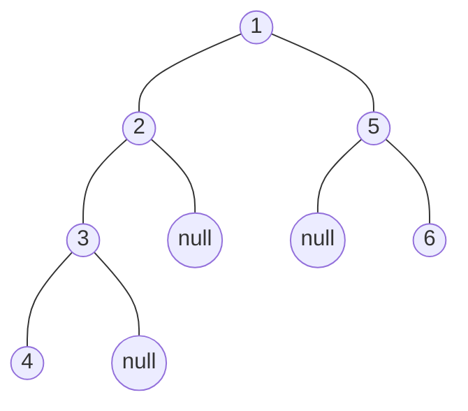

## Demo

```mermaid
graph TB
1((1))---21((2))---31((3))---41((4))
21--- n((null))
31--- n1((null))
1((1))---22((5))---n2((null))
22---32((6))
```

## Reference
* https://dprebyl.github.io/syntree
* https://mshang.ca/syntree/
