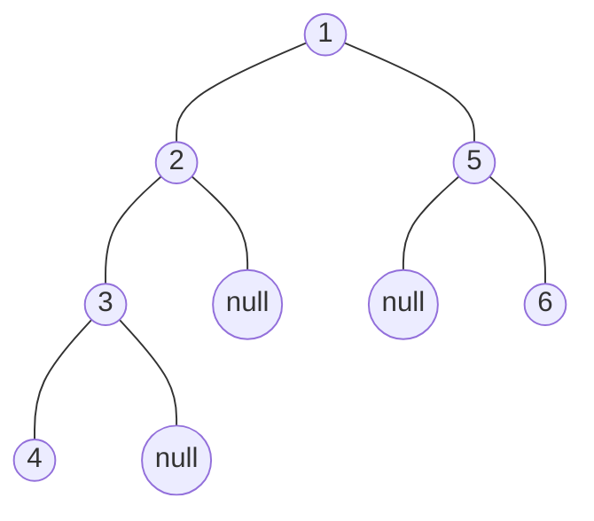

* ## Intro(Tree)
    + ### 一、什么是树？

        ?>在计算机科学中，树是一种非线性的数据结构，用于模拟具有层次关系的数据集合。它由有限节点组成，每个节点可以有零个或多个子节点。树的根节点是层次结构的顶部，其他节点都是其子节点。根据节点的度数（即子节点的数量），树可以分为二叉树、三叉树、多叉树等。
    
    + ### 二、树的遍历方式

        ?> 1. 先序遍历：先访问根节点，然后访问左子树，最后访问右子树。
         2. 中序遍历：先访问左子树，然后访问根节点，最后访问右子树。
         3. 后序遍历：先访问左子树，然后访问右子树，最后访问根节点。
    
    + ### 三、常见的树

        1. [二叉树](./01-binary-tree.md)：二叉树是树的一种特殊形式，每个节点最多有两个子节点（通常称为左子节点和右子节点）。二叉树的遍历方式有限，通常是先序遍历、中序遍历和后序遍历。
        2. [二叉查找树]()：二叉查找树是一种特殊的二叉树，它的每个节点的左子节点的值小于或等于它的值，而右子节点的值大于或等于它的值。这种结构使得在查找、插入和删除元素时具有高效的性能。
        3. [平衡二叉树](./03-01-AVL-tree.md)：平衡二叉树是一种特殊的二叉树，它的左右子树的深度差不超过1，并且每个节点的左子树和右子树的深度都接近于整个树的深度。平衡二叉树的插入、删除等操作的时间复杂度较低，为O(log n)。
            - [AVL树](./03-01-AVL-tree.md)：AVL树是一种自平衡的二叉查找树，它通过旋转操作保持平衡状态。AVL树的插入、删除等操作的时间复杂度为O(log n)。
            - [红黑树](./03-02-RB-tree.md)：红黑树是一种自平衡的二叉查找树，它通过颜色和旋转操作保持平衡状态。红黑树的插入、删除等操作的时间复杂度为O(log n)。
        4. [2-3树]()
        5. [B树]()：B-tree是一种平衡的多叉查找树，它可以用于磁盘文件系统、数据库索引等场合。B-tree的每个节点可以有多个子节点，并且每个节点的值域大小有限制。B-tree的插入、删除等操作的时间复杂度为O(log n)。
        6. [B+树]()
        7. [B*树]()

## Demo

## Reference
* https://www.cs.usfca.edu/~galles/visualization/Algorithms.html
* https://www.autodraw.com/
* https://kleki.com/
* https://dprebyl.github.io/syntree
* https://mshang.ca/syntree/
* [[Data Structure] 数据结构中各种树 ](https://www.cnblogs.com/maybe2030/p/4732377.html)
* [三分钟基础知识：什么是 2-3 树？](https://zhuanlan.zhihu.com/p/92394224)
