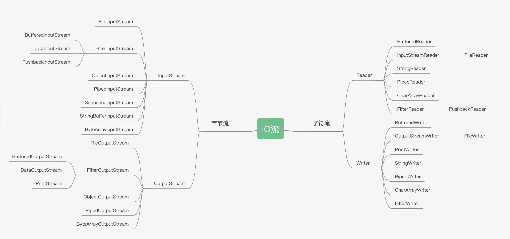

## IO 简介
> IO指以内存为中心，外部到内存为input，内存到外部为output<br>
> 按方向分为输入流和输出流.按传输单位分为字节流和字符流。按形态分为原始流及缓冲流。<br>
> IO流的本质是数据传输，并且流是单向的。<br>



## 字节流
* ### InputStream
    + FileInputStream
        <details><summary>代码</summary>

        ```java
        @Test
        public void demoWithoutTryWithResource(){
            // URL resource = this.getClass().getClassLoader().getResource("../../yqgz.cer");
            // File file = new File(resource.toURI());
            URL resource = this.getClass().getResource("../../res/yqgz.cer");
            File file = new File(resource.getFile());
            InputStream ins = null;
            ByteArrayOutputStream byteArrayOutputStream;
            try {
                System.out.println(file.isFile() ? file.length() : 0);
                ins = new FileInputStream(file);
                byteArrayOutputStream = new ByteArrayOutputStream();
                byte[] data = new byte[1024];
                int len = 0;
                while((len = ins.read(data)) != -1){
                    byteArrayOutputStream.write(data, 0, len);
                }
            System.out.println(byteArrayOutputStream.toByteArray().length);
            } catch (Exception e) {
                e.printStackTrace();
            }finally {
                if(ins != null){
                    try {
                        ins.close();
                    } catch (IOException e) {
                        throw new RuntimeException(e);
                    }
                }
            }
        }
        ```
        </details>

        <details><summary>代码</summary>

        ```java
        @Test
        public void demoWithTryWithResource(){
            URL resource = this.getClass().getResource("../../res/yqgz.cer");
            File file = new File(resource.getFile());
            try (InputStream ins = new FileInputStream(file)){
                // file.length() 与后面读取到的字节数一致。都是1583
                System.out.println(file.isFile() ? file.length() : 0);
                byte[] data = new byte[1024 * 2];
                int count = ins.read(data);
                System.out.println(count);
            } catch (Exception e) {
                e.printStackTrace();
            }
        } 
        ```
        </details>
    + FilterInputStream
        + BufferedInputStream
        + DataInputStream
        + PushbackInputStream
    + ObjectInputStream
    + PipedInputStream
    + ByteArrayInputStream

* ### OutputSteam
    + FileOutputStream
    + FilterOutputStream
        - BufferedOutputStream
        - DataOutputStream
        - PrintStream
    + ObjectOutputStream
    + PipedOutputStream
    + ByteArrayOutputStream

## 字符流


## 三方工具
* [apache](https://commons.apache.org/proper/commons-io/dependency-info.html)
    ```xml
    <dependency>
        <groupId>commons-io</groupId>
        <artifactId>commons-io</artifactId>
        <version>2.11.0</version>
    </dependency>
    ```

<details><summary>查看代码</summary>

```shell
#!/bin/bash
echo 'hello world'
mkdir test
.configure --prefix=/usr/local/bin
```
</details>

## reference
- https://github.com/docsifyjs/docsify/issues/1399
- https://stackoverflow.com/questions/6608795/what-is-the-difference-between-class-getresource-and-classloader-getresource
- https://www.zhangxinxu.com/wordpress/2018/01/html5-details-summary-no-js-ux/
- https://gee.cs.oswego.edu/dl/cpjslides/nio.pdf
