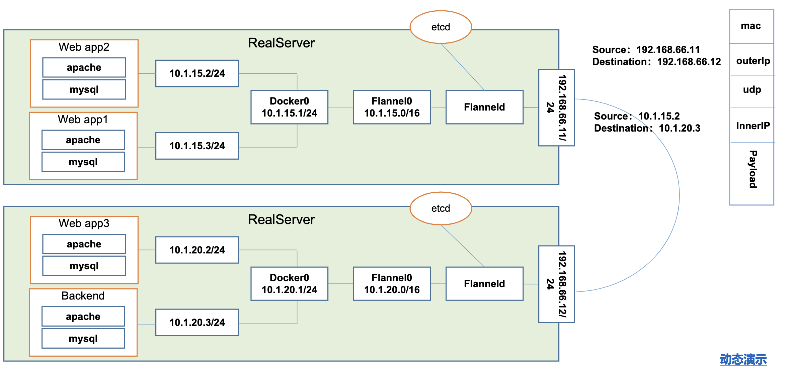

## 基础概念
* ### 各个组件
    |name| explain|
    | -- | -- |
    |APISERVER          | 所有服务访问统一入口 |
    |CrontrollerManager | 维持副本期望数目 |
    |Scheduler          | 负责介绍任务，选择合适的节点进行分配任务 |
    |ETCD               | 键值对数据库  储存K8S集群所有重要信息（持久化）|
    |Kubelet            | 直接跟容器引擎交互实现容器的生命周期管理 |
    |Kube-proxy         | 负责写入规则至 IPTABLES、IPVS 实现服务映射访问的 |
    |COREDNS            | 可以为集群中的SVC创建一个域名IP的对应关系解析 |
    |DASHBOARD          | 给 K8S 集群提供一个 B/S 结构访问体系 |
    |INGRESS CONTROLLER | 官方只能实现四层代理，INGRESS 可以实现七层代理 |
    |FEDERATION         | 提供一个可以跨集群中心多K8S统一管理功能 |
    |PROMETHEUS         | 提供K8S集群的监控能力 |
    |ELK                | 提供 K8S 集群日志统一分析介入平台 |
* ### POD
    K8S 中包装的最小单位，一个POD（容器组）中可以包含多个容器，用来表示可迁移的lamp，类似于Docker的多层镜像。同一个POD中容器可以直接共享pause共享的网络站或者挂载卷。
    * #### 自主式管理POD
        POD 死亡后没办法继续启动。
    * #### 控制器管理的POD
        |name| explain|
        |--  | -- | 
        | ReplicationControlelr(RC) | 用来确保容器应用的副本数始终保持在用户定义的副本数，如果容器有异常退出，会自动创建新的POD来代替；而异常多出来的容器也会自动回收，新版本中建议使用ReplicaSet 来替代 ReplicationController |
        | ReplicaSet(RS）           | 与上一个没有本质区别，但是这个支持集合式的 selector |
        | Deployment                | 虽然ReplicaSet可以独立使用，但一般还是建议使用Deployment来自动管理ReplicaSet,这样就无需担心跟其他机制的不兼容问题（比如ReplicaSet不支持 rolling-update ，但 Deployment支持）|
        | HorizontalPodAutoScale(HPA) | 也是控制RS,根据CPU使用率自动平衡扩展，收缩，可定义最大，最小副本数 |
        | StatefulSet(SS)           | 主要解决有状态服务问题，包括的场景有：稳定的持久化存储，稳定的网络标志，有序部署，有序收缩 |
        | DaemonSet()               | 可以理解为跟node绑定的一些后台运行的POD，跟随节点进行创建和删除。|
        | Job                       | 负责批处理任务，即仅执行一次的任务.相比于script优点有，封装在POD中可判断是否正常退出，可以重新执行。而且可以设定认为成功的次数。 |
        | CronJob                   | 带有cron 定时任务的JOB |

* ### 网络通信方式
    > 扁平化的网络空间
    * 同一个POD内多个容器，采用pause 共享网络lo
    * 各个POD overlay network
        - 同一个node，Docker0 网桥进行转发
        
        - 不同node，flannel 插件
        
    * POD与service之间的通信，IPVS，iptables，

## 构建K8S集群
!> ommited

## 资源清单
* ### K8s中的资源
    > k8s中的所有内容抽象为资源，资源实例化后叫做对象。可以通过 `kubectl api-resources` 查看所有资源类型

    | type | example |
    | --  | -- |
    | 名称空间级别  | pod, deployment, service |
    | 集群级别      | role, ns, node, ClusterRole, RoleBinding,ClusterRoleBinding | 
    | 元数数据      | HPA, PodTemplate, LimitRange |

* ### 清单样例
    > yaml 验证地址： https://codebeautify.org/yaml-validator, https://www.bejson.com/validators/yaml_editor
    ```yaml
    apiVersion: v1
    kind: Pod
    metadata:
        name: test-pod
    spec:
    # 定义容器，可以多个
    containers: # 只要数组对象中的缩进对齐就行。不包括'-'
        - name: test-k8s # 容器名字
          image: ccr.ccs.tencentyun.com/k8s-tutorial/test-k8s:v1 # 镜像
    ```
* ### 创建POD的方式
    ```shell
    # 直接命令运行
    kubectl run testapp --image=ccr.ccs.tencentyun.com/k8s-tutorial/test-k8s:v1
    # POD
    kubectl apply -f pod.yaml
    # Deployment
    kubectl apply -f deployment.yaml
    ```
* ### 常用字段解释说明
    > 可以通过 `kubectl explain pod, kubectl explain pod.metadata`此类命令查看更详细的解释。

    | name | type | explain |
    | -- | -- | -- |
    | version                           | String    | 这里是指K8s Api的版本，目前基本上是v1,可以用 `kubectl api-versions`命令查询 |
    | kind                              | String    | 指yaml文件定义的资源类型和角色，比如：POD |
    | metadata                          | Object    | 元数据对象，固定值 |
    | metadata.name                     | String    | 资源名称 |
    | metadata.namespace                | String    | 元数据对象的命名空间 ，比如 kube-system |
    | spec                              | Object    | 详细定义对象规范 | 
    | spec.containers[]                 | List      | spec对象容器的列表定义 | 
    | spec.containers[].name            | String    | 定义容器的名字 | 
    | spec.containers[].image           | String    | 定义要用到的镜像名称 | 
    | spec.containers[].imagePullPolicy | String    | 定义镜像拉取策略，有Always，Never，ifNotPresent。Always总是尝试拉取最新，Never仅使用本地镜像，ifNotPresent表示本地没有再去拉取在线镜像。默认值是Always。|
    | spec.containers[].command[]       | List      | 指定容器启动指令，不指定则使用镜像打包时使用的启动命令 |
    | spec.containers[].args[]          | List      | 指定容器启动命令参数 |
    | spec.containers[].workingDir      | String    | 指定容器工作目录 |
    | spec.containers[].volumeMounts[]  | List      | 容器内部存储卷配置 |
    | spec.containers[].volumeMounts[].name | String| 容器挂载的存储卷名称|
    | spec.containers[].volumeMounts[].mountPath |String| 存储卷路径 |
    | spec.containers[].volumeMounts[].readOnly| String | 设置存储卷的读写模式， true 或者false，默认为读写模式|
    | spec.containers[].ports[]         | List      | 指定容器要用到的端口列表 | 
    | spec.containers[].ports[].name    | String    | 名称 |
    | spec.containers[].ports[].containerPort | String| 指定容器要监听的端口号| 
    | spec.containers[].ports[].hostPort| String    | 指定主机对应的端口号，默认跟上面相同，需要注意设置了hostPort，同一主机无法启动该容器的相同副本 |
    | spec.containers[].ports[].protocol| String    | 指定端口协议，支持TCP，UDP，默认为TCP |
    | spec.containers[].env[]           | List      | 指定容器运行前需要设置的环境变量列表 |
    | ...                               |||

* ### 容器生命周期

## POD控制器

## 服务发现

## 存储

## 调度器

## 集群安全机制

## HELM

## 运维部分

## Reference
* [bilibili](https://www.bilibili.com/video/BV1w4411y7Go)
* [百度云-尚硅谷Kubernetes教程](https://pan.baidu.com/s/1gbNLotwVjxe_hLZcDnfAfQ?pwd=f8v2 )
* [kubernetes-入门指南.pdf](https://pan.baidu.com/s/10vlKFCs1H9FowNm8LyXVpw?pwd=7fkc)
* [易文档K8s教程](https://k8s.easydoc.net/docs/dRiQjyTY/28366845/6GiNOzyZ/9EX8Cp45)
* [yaml1](https://gist.githubusercontent.com/jmalloc/f52dc743aaa59339c3eda0ec0a7b0f53/raw/864beb88d739467f54ce01e48d20a8064dc70fce/echo-k8s.yaml)
* [yaml2](https://raw.githubusercontent.com/Ealenn/Echo-Server/master/docs/examples/echo.kube.yaml)
* [ingress-controller](https://raw.githubusercontent.com/kubernetes/ingress-nginx/nginx-0.30.0/deploy/static/mandatory.yaml)
