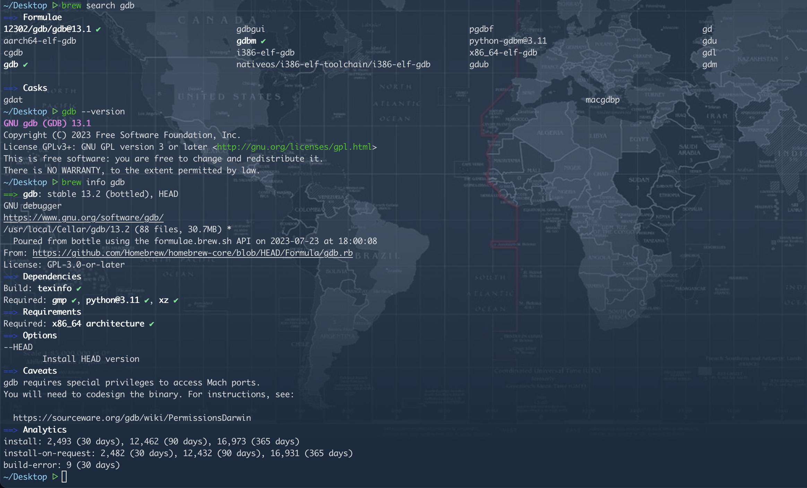

## brew
```shell
# ref from: https://stackoverflow.com/questions/62785290/installing-previous-versions-of-a-formula-with-brew-extract

# TAP=...     # <org>/<repo>, for example "my-org/homebrew-old"
# MODULE=...  # name of module you want to install, e.g. "hugo"
# VERS=...    # version of $MODULE you want to install, e.g., "0.80.0"

brew tap-new 12302/gdb
# 在最新的仓库中提取原来的版本到新建的tap.
brew extract --version 13.1 gdb 12302/gdb
# 运行安装命令（其实这个时候已经可以通过 brew search gdb 搜索到需要安装版本的软件了）
brew install 12302/gdb/gdb@13.1
```


## Reference
* https://github.com/Homebrew
* https://stackoverflow.com/questions/62785290/installing-previous-versions-of-a-formula-with-brew-extract
* https://stackoverflow.com/questions/3987683/homebrew-install-specific-version-of-formula