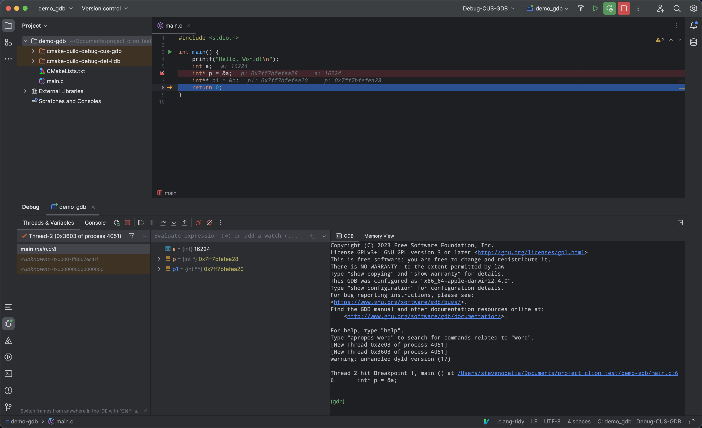

## Clion 安装 GDB 工具
```shell
# 结合brew安装 gdb@13.1, clion 不支持13.2
# PermissionsDarwin相关操作导入证书，一般不用重启。
# 添加gbd启动初始化脚本
echo 'set startup-with-shell off' >> ~/.gdbinit

# 重要的一点，使用GDB 得关闭 mac sip: 不然会一直hangs住
# 查看：csrutil status， 关闭：csrutil disable
# 结合图片进行gdb debug
```
```shell
make -v
# GNU Make 3.81
# This program built for i386-apple-darwin11.3.0
gcc -v 
# Apple clang version 14.0.3 (clang-1403.0.22.14.1)
g++ -v 
# Apple clang version 14.0.3 (clang-1403.0.22.14.1)
```


## Assert



## Reference
* https://sourceware.org/gdb/wiki/PermissionsDarwin
* https://apple.stackexchange.com/questions/420492/gdb-hangs-after-new-thread-on-macos
* https://stackoverflow.com/questions/60499508/why-does-gdb-hang-after-running
* [gdb hangs [New Thread of process ]](https://www.google.com.hk/search?q=gdb+hangs+%5BNew+Thread+of+process+%5D&newwindow=1&source=hp&ei=2uC9ZLiSCtLU4-EP8YaCCA&iflsig=AD69kcEAAAAAZL3u6kX9p3fVZ5__fzwBuI3iXkRwueBJ&ved=0ahUKEwi45-OBpaaAAxVS6jgGHXGDAAEQ4dUDCAk&uact=5&oq=gdb+hangs+%5BNew+Thread+of+process+%5D&gs_lp=Egdnd3Mtd2l6IiJnZGIgaGFuZ3MgW05ldyBUaHJlYWQgb2YgcHJvY2VzcyBdMgcQIRigARgKSJt5UABYm3dwAngAkAEAmAHSBKABgFaqAQsyLTIxLjEyLjEuMbgBA8gBAPgBAcICBxAAGIoFGEPCAgsQLhiABBjHARjRA8ICBRAAGIAEwgIJEAAYigUYChhDwgIFEC4YgATCAgsQABiKBRgKGEMYKsICBxAAGIAEGArCAgcQABgMGIAEwgIHEC4YDBiABMICBRAhGKABwgIHEAAYExiABMICBhAAGB4YE8ICCBAAGAUYHhgTwgIEEAAYHg&sclient=gws-wiz)