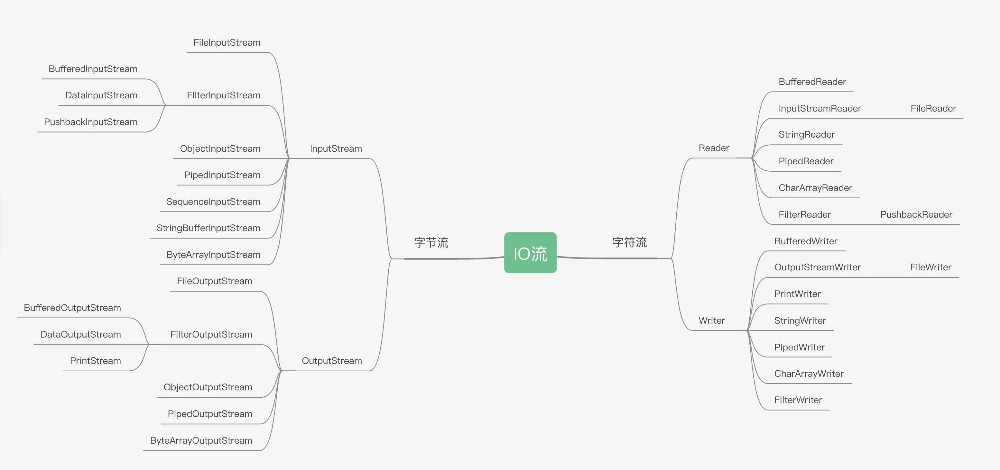

## IO 简介
> IO指以内存为中心，外部到内存为input，内存到外部为output<br>
> 按方向分为输入流和输出流.按传输单位分为字节流和字符流。按形态分为原始流及缓冲流。<br>
> IO流的本质是数据传输，并且流是单向的。<br>



## 获取文件的几种方式

<details><summary>代码</summary>

```java
@Test
public void getFile(){
    // 1，直接获取项目路径下的文件
    File file = new File("pom.xml");
    // 2，获取resources里面的文件
    File file1 = new File("src/main/resources/log4j.properties");

    // 3，类加载器加载文件方式1,多一个resolveName
    URL resource = this.getClass().getResource("../res/yqgz.cer");
    // 4，类加载器加载文件方式2
    URL resource1 = this.getClass().getClassLoader().getResource("_base/io/res/yqgz.cer");
}
```
</details>

## 字节流
* ### InputStream
    + FileInputStream
        <details><summary>FileInputStream读文件到字节代码</summary>

        ```java
        @Test
        public void demoWithoutTryWithResource(){
            // URL resource = this.getClass().getClassLoader().getResource("../../yqgz.cer");
            // File file = new File(resource.toURI());
            URL resource = this.getClass().getResource("../../res/yqgz.cer");
            File file = new File(resource.getFile());
            InputStream ins = null;
            ByteArrayOutputStream byteArrayOutputStream;
            try {
                System.out.println(file.isFile() ? file.length() : 0);
                ins = new FileInputStream(file);
                byteArrayOutputStream = new ByteArrayOutputStream();
                byte[] data = new byte[1024];
                int len = 0;
                while((len = ins.read(data)) != -1){
                    byteArrayOutputStream.write(data, 0, len);
                }
            System.out.println(byteArrayOutputStream.toByteArray().length);
            } catch (Exception e) {
                e.printStackTrace();
            }finally {
                if(ins != null){
                    try {
                        ins.close();
                    } catch (IOException e) {
                        throw new RuntimeException(e);
                    }
                }
            }
        }
        ```
        </details>

        <details><summary>使用try-with-resource方式代码</summary>

        ```java
        @Test
        public void demoWithTryWithResource(){
            URL resource = this.getClass().getResource("../../res/yqgz.cer");
            File file = new File(resource.getFile());
            try (InputStream ins = new FileInputStream(file)){
                // file.length() 与后面读取到的字节数一致。都是1583
                System.out.println(file.isFile() ? file.length() : 0);
                byte[] data = new byte[1024 * 2];
                int count = ins.read(data);
                System.out.println(count);
            } catch (Exception e) {
                e.printStackTrace();
            }
        } 
        ```
        </details>
    + FilterInputStream
        + BufferedInputStream
        + DataInputStream
        + PushbackInputStream
    + ObjectInputStream
    + PipedInputStream
    + ByteArrayInputStream

* ### OutputSteam
    + FileOutputStream
    + FilterOutputStream
        - BufferedOutputStream
        - DataOutputStream
        - PrintStream
    + ObjectOutputStream
    + PipedOutputStream
    + ByteArrayOutputStream

## 字符流

## BIO(blocking IO)
> BIO是传统的Java IO编程，其基本的类和接口在java.io包中，使用的是DMA IO控制方式，数据操作需要在内核态和用户态来回复制。

## NIO(NonBlocking IO)
> NIO全称 java non-blocking IO。从JDK 1.4开始，java提供了一些列改进的输入/输出（I/O）的新特性，被称为NIO，是同步非阻塞的
NIO相关类都被放在java.nio包及其子包下
* ByteBuffer

    > Buffer类型：ByteBuffer,CharBuffer,ShortBuffer,IntBuffer,LongBuffer,FloatBuffer,DoubleBuffer.<br>
    > 四个重要属性： 0 < mark < position < limit < capacity
  
    <details><summary>代码示例</summary>
  
    ```java
    ByteBuffer byteBuffer = ByteBuffer.allocate(16);
    print(byteBuffer);

    String str = "hello";
    byteBuffer.put(str.getBytes());
    print(byteBuffer);

    /*<切换成读模式>_12302_2020-02-02_*/
    byteBuffer.flip();
    print(byteBuffer);

    byte[] dst = new byte[byteBuffer.limit()];
    byteBuffer.get(dst,0,dst.length);
    System.out.println(new String(dst));
    print(byteBuffer);

    /*<rewind 可以将position 的位置倒回>_12302_2020-02-02_*/
    byteBuffer.rewind();
    print(byteBuffer);

    /*<mark, reset _draft.test>_12302_2020-02-02_*/
    byteBuffer.get(dst,0,2);
    System.out.println(new String(dst,0,2));
    byteBuffer.mark();
    byteBuffer.get(dst,0,2);
    System.out.println(new String(dst,0,2));
    print(byteBuffer);
    byteBuffer.reset();
    print(byteBuffer);

    byteBuffer.rewind();
    print(byteBuffer);

    byteBuffer.clear();
    print(byteBuffer);
    System.out.println((char)byteBuffer.get());

    /* _12302_2022/10/21_< compact,压缩缓冲空间，将剩余未读的拷贝到前开头，并且将position的位置放到剩余字节后面。limit = capacity, discard mark > */
    
    ```
    </details>
    
* Channel
    > IO四种控制方式：循环IO测试，程序中断，DMA方式，通道方式 <br>
    > 主要实现类： FileChannel, SocketChannel, ServerSocketChannel,DatagramChannel. <br>
    > 获取方式：Java对支持通道的类提供getChannel()方法，针对各个通道的open()方法，Files工具类的 newByteChannel()方法。 <br>
    > 使用到的技术 mmap,transferTo[sendFile] <br>
    > 分散读取与聚集写入

    <details><summary>代码示例</summary>

    ```java
    @Test
    public void readByteWithSupportChannelClass(){
        try(
                FileInputStream fis = new FileInputStream(this.getClass().getResource("../../res/2.png").getFile());
                FileChannel channel = fis.getChannel();
                ByteArrayOutputStream arrayOut = new ByteArrayOutputStream()
        ){
            ByteBuffer buffer = ByteBuffer.allocate(1024);
            while (channel.read(buffer) != -1){
                buffer.flip();
                byte[] data = new byte[buffer.limit()];
                buffer.get(data,0,data.length);
                arrayOut.write(data);
                buffer.clear();
            }
            // 获取到读到的字节
            System.out.println(arrayOut.toByteArray().length);
        }catch (Exception e) { e.printStackTrace(); }
    }
    ```
    </details>

    <details><summary>代码示例</summary>

    ```java
    @Test
    public void readByteWithOpenMethodAndMappedByteBuffer(){
        try(
                FileChannel inChannel = FileChannel.open(Paths.get(this.getClass().getResource("../../res/2.png").getFile()),
                        StandardOpenOption.READ);
                ByteArrayOutputStream arrayOut = new ByteArrayOutputStream()
        ){
            MappedByteBuffer mBuf = inChannel.map(FileChannel.MapMode.READ_ONLY, 0, inChannel.size());
            byte[] data = new byte[mBuf.limit()];
            mBuf.get(data);
            arrayOut.write(data);
            System.out.println(arrayOut.toByteArray().length);
        }catch (Exception e) { e.printStackTrace();}
    }
    ```
    </details>

    <details><summary>代码示例</summary>

    ```java
    @Test
    public void transferTo(){
        try( FileChannel inChannel = FileChannel.open(
                Paths.get(this.getClass().getResource("../../res/2.png").getFile()),StandardOpenOption.READ);
             FileChannel outChannel = FileChannel.open(
                Paths.get("/tmp/3.png"), StandardOpenOption.CREATE, StandardOpenOption.WRITE)
        ){
            inChannel.transferTo(0 , inChannel.size(), outChannel);
        }catch (Exception e) { e.printStackTrace(); }
    }
    ```
    </details>

* Selector


## 三方工具
* [apache](https://commons.apache.org/proper/commons-io/dependency-info.html)
    ```xml
    <dependency>
        <groupId>commons-io</groupId>
        <artifactId>commons-io</artifactId>
        <version>2.11.0</version>
    </dependency>
    ```

## reference
- https://github.com/docsifyjs/docsify/issues/1399
- https://stackoverflow.com/questions/6608795/what-is-the-difference-between-class-getresource-and-classloader-getresource
- https://www.zhangxinxu.com/wordpress/2018/01/html5-details-summary-no-js-ux/
- https://gee.cs.oswego.edu/dl/cpjslides/nio.pdf
- https://blog.csdn.net/P19777/article/details/105080512/
