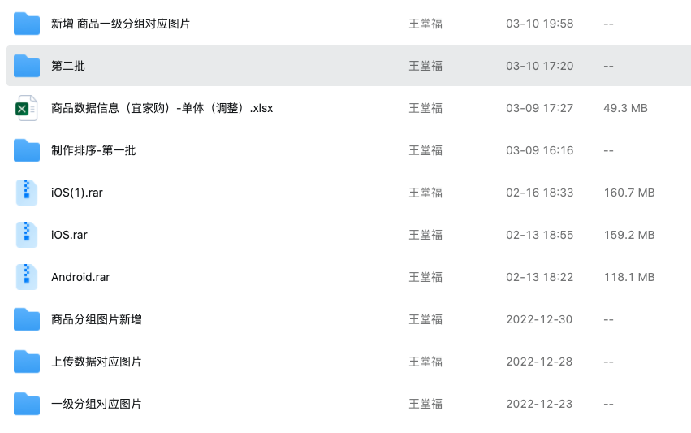
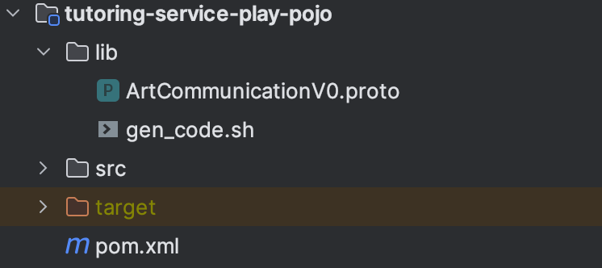
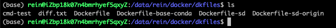

## 文档

### 项目
#### 1. spider
!> [项目地址: https://gitlab.meishubao.com/frame/backend/spider.git](https://gitlab.meishubao.com/frame/backend/spider.git)

* 获取抖音直播地址并使用wss实时获取弹幕信息，并提供tcp服务推流给建立链接的客户端。相关代码入口：`[dev] com.test.ikea.service.impl.DouYinLiveWssServiceImpl#startWss`
* 爬取有赞页面数据。 代码入口: `[dev] com.test.youzan.Main#main`
* 宜家站点数据爬取代码位置： `spider-ikea/src/main/java/com/test/ikea/compose`
* 数据相关文件在钉盘上，可以找胡老师获取。

    

#### 2. arbuy
+ admin

    !> [项目地址：https://gitlab.metaleap.com/arbuy/backend/arbuy-admin.git](https://gitlab.metaleap.com/arbuy/backend/arbuy-admin.git)
    * 店铺靓号管理 代码入口：`com.arbuy.admin.controller.core.ArStoreGoodNumberController`
    * 店铺号回收管理 代码入口：`com.arbuy.admin.controller.core.ArStoreNumberRecycleController`
+ app

    !> [项目地址：https://gitlab.metaleap.com/arbuy/backend/arbuy-app.git](https://gitlab.metaleap.com/arbuy/backend/arbuy-app.git)

#### 3. tutoring

!> [项目组地址: https://gitlab.meishubao.com/tutoring/backend](https://gitlab.meishubao.com/tutoring/backend)

* C端进入房间接口。 代码入口： `com.yyb.tutoring.app.service.play.api.controller.app.v1.AppRoomController`
* 对接声网相关接口测试代码入口： `com.yyb.tutoring.app.service.play.api.controller.test.v1.TestController`
* 对接声网相关支持模块,包括linux 动态链接库文件：`tutoring-service-play-monitor`

    

* 信令结构标准proto文件： `tutoring-service-play-pojo/lib`

    

#### 4. wechat-chatgpt
!> [项目地址：https://gitlab.metaleap.com/openai/backend/wechat-chatgpt.git](https://gitlab.metaleap.com/openai/backend/wechat-chatgpt.git)

* 主要是集成wechaty项目的一个ts项目。
* 目前项目中使用的 provider为`Wechat`，Service为`PodLocal`, 详情可以参考官方 [providers](https://wechaty.js.org/docs/puppet-providers/), [services](https://wechaty.js.org/docs/puppet-services/)
* 前期主要是用`wechaty-puppet-wechat`, 由于是操作浏览器进行的自动化行为，所以会在使用一段时候后内存不足，导致pod发生错误，无法继续提供机器人能力。
* 后面换成`wechaty-puppet-padlocal`,使用第三方提供的token，已pad通信协议登录并监听处理消息。token获取可以在[参考资料](#参考资料4)
* 如果存在多个机器人的话，可以用有状态的部署方式管理。

##### 参考资料4
* https://github.com/fuergaosi233/wechat-chatgpt
* https://github.com/wechaty/wechaty
* https://wechaty.js.org/docs/puppet-services/padlocal

#### 5. animated-drawings
!> [项目地址： https://gitlab.metaleap.com/openai/backend/animateddrawingsclient.git](https://gitlab.metaleap.com/openai/backend/animateddrawingsclient.git)

* Dockerfile `gitlab.metaleap.com:5050/library/python-animated/anaconda3-with-base-pip:v1.*`
    ```dockerfile
    FROM ubuntu:20.04
    RUN /bin/sh -c apt-get update
    RUN /bin/sh -c apt-get install -y wget
    RUN /bin/sh -c wget https://repo.anaconda.com/miniconda/Miniconda3-latest-Linux-x86_64.sh \
        &&  bash Miniconda3-latest-Linux-x86_64.sh -b \
        &&  rm -f Miniconda3-latest-Linux-x86_64.sh \
        &&  /root/miniconda3/bin/conda init bash
    ENV PATH=/root/miniconda3/bin:/usr/local/sbin:/usr/local/bin:/usr/sbin:/usr/bin:/sbin:/bin
    COPY base/condarc.conf /root/.condarc
    COPY base/pip.conf /root/.pip/pip.conf
    COPY ./requirements.txt /build/animated-drawings/requirements.txt
    COPY ./setup.py /build/animated-drawings/setup.py
    WORKDIR /build/animated-drawings
    RUN /bin/sh -c conda install --yes python=3.8.13
    RUN /bin/sh -c pip install --no-cache-dir -r /build/animated-drawings/requirements.txt
    RUN /bin/sh -c pip install --no-cache-dir -e /build/animated-drawings
    RUN /bin/sh -c apt-get update    \
        && apt-get install -y --no-install-recommends libosmesa6-dev freeglut3-dev libglfw3-dev libgles2-mesa-dev libosmesa6     \
        && rm -rf /var/lib/apt/lists/*
    RUN /bin/sh -c pip install --no-cache-dir oss2 distro
    RUN /bin/sh -c pip uninstall --yes opencv-python opencv-contrib-python     \
        && conda install --yes -c conda-forge opencv moviepy libstdcxx-ng
    RUN /bin/sh -c conda clean -afy \
        && rm -rf /root/.cache \
        && rm -rf /build/animated-drawings
    CMD ["/bin/bash"]
    ```
* 镜像地址: https://gitlab.metaleap.com/library/python-animated/container_registry/
 
    

##### 参考资料5
* https://github.com/facebookresearch/AnimatedDrawings.git

#### 6. stable-diffusion-webui
!> [项目地址： https://gitlab.metaleap.com/openai/backend/stable-diffusion-webui.git](https://gitlab.metaleap.com/openai/backend/stable-diffusion-webui.git)
* 项目情况(可在个人提交记录中查看相关信息)
    - 在[原项目](https://github.com/AUTOMATIC1111/stable-diffusion-webui)的基础上增加了zk客户端，用来连接到注册中心。供调度中心`newbrush-admin-sd-dispatcher`感知。
    - 增加部分oss图片上传，用来减少与客户端base64传输消耗的时间。
    - 增加clip快速切换，避免通过http调用修改。
    - 统一自定义配置，去除无用的插件。
    - 增加通过api接口请求文生图和图生图进度支持。
    - 20231109 增加`test-1.6.0`分支，主要是将一些XL相关的代码由原项目合并到当前test分支。暂未全面测试，可能存在一些bug.
* 镜像构建
    ```dockerfile
    FROM ubuntu:20.04 as base

    LABEL maintainer "NVIDIA CORPORATION <cudatools@nvidia.com>"

    COPY sources.list /etc/apt/sources.list
    RUN mkdir ~/.pip  && \
    echo '\n\
    [global]\n\
    index-url = https://mirrors.aliyun.com/pypi/simple/\n\
    \n\
    [install]\n\
    trusted-host=mirrors.aliyun.com\n'\
    >> ~/.pip/pip.conf && \
    apt-get update && apt-get install -y --no-install-recommends \
            git libgl1 libglib2.0-0 google-perftools  && rm -rf /var/lib/apt/lists/* && \
            git config --global --add safe.directory "*"
    # libglu1-mesa-dev

    ADD app/stable-diffusion-webui /app
    WORKDIR /app

    ENV NVARCH x86_64
    ENV NVIDIA_REQUIRE_CUDA "cuda>=12.2 brand=tesla,driver>=450,driver<451 brand=tesla,driver>=470,driver<471 brand=unknown,driver>=470,driver<471 brand=nvidia,driver>=470,driver<471 brand=nvidiartx,driver>=470,driver<471 brand=geforce,driver>=470,driver<471 brand=geforcertx,driver>=470,driver<471 brand=quadro,driver>=470,driver<471 brand=quadrortx,driver>=470,driver<471 brand=titan,driver>=470,driver<471 brand=titanrtx,driver>=470,driver<471 brand=tesla,driver>=525,driver<526 brand=unknown,driver>=525,driver<526 brand=nvidia,driver>=525,driver<526 brand=nvidiartx,driver>=525,driver<526 brand=geforce,driver>=525,driver<526 brand=geforcertx,driver>=525,driver<526 brand=quadro,driver>=525,driver<526 brand=quadrortx,driver>=525,driver<526 brand=titan,driver>=525,driver<526 brand=titanrtx,driver>=525,driver<526"
    ENV NV_CUDA_CUDART_VERSION 12.2.53-1
    ENV NV_CUDA_COMPAT_PACKAGE cuda-compat-12-2
    ENV CUDA_VERSION 12.2.0
    ENV PATH /usr/local/nvidia/bin:/usr/local/cuda/bin:/root/miniconda3/bin:${PATH}
    ENV LD_LIBRARY_PATH /usr/local/nvidia/lib:/usr/local/nvidia/lib64
    # COPY NGC-DL-CONTAINER-LICENSE /

    # nvidia-container-runtime
    ENV NVIDIA_VISIBLE_DEVICES all
    ENV NVIDIA_DRIVER_CAPABILITIES compute,utility
    ENV options=""

    # CMD bash ./webui.sh -f  --listen --port 7960 --no-half-vae --api --xformers --enable-insecure-extension-access --share
    ENTRYPOINT ["/bin/sh", "-c", "./webui.sh -f --listen  --no-half-vae --api --xformers --enable-insecure-extension-access --share $options"]
    # ENTRYPOINT ["/bin/sh", "-c", ". /app/venv/bin/activate  && pip install -r requirements.txt && deactivate && ./webui.sh -f --listen  --no-half-vae --api --xformers --enable-insecure-extension-access $options"]
    ```

* sd-启动过程中报`Cannot locate TCMalloc`警告解决
    !> https://github.com/AUTOMATIC1111/stable-diffusion-webui/issues/10117
* 更多镜像构建详情参考
    - https://gitlab.metaleap.com/openai/backend/stable-diffusion-webui/-/snippets/2
    - artificial-intelligence-(002|001) 机器上目录`/data/rein/docker/dkfiles`下的Dockerfile文件。

        

* 镜像启动(linux举例)：
    ```shell
    # 每个机器上的启动参数不通，可以通过 history查看历史记录，获取正确的参数。
    docker run -dit --rm --gpus=all \
        -v /data/newbrush/soft/miniconda:/root/miniconda3 \
        -v /data/rein/docker/venvs/sd/venv/:/app/venv \
        -v /data/cache/huggingface:/root/.cache/huggingface \
        -v /data/newbrush/ai/stable-diffusion-webui/models:/app/models \
        -v /data/newbrush/ai/stable-diffusion-webui/repositories:/app/repositories \
        -v /data/newbrush/ai/stable-diffusion-webui/styles.csv:/app/styles.csv \
        -v /data/newbrush/ai/stable-diffusion-webui/extensions/sd-webui-controlnet:/app/extensions/sd-webui-controlnet \
        -v /data/newbrush/ai/stable-diffusion-webui/extensions/stable-diffusion-webui-wd14-tagger:/app/extensions/stable-diffusion-webui-wd14-tagger \
        -v /data/newbrush/ai/stable-diffusion-webui/extensions/multidiffusion-upscaler-for-automatic1111:/app/extensions/multidiffusion-upscaler-for-automatic1111 \
        -e options="--port 7863 --zk-addr 10.36.1.160:2181 --cluster-name default  --checkpoint book/nigi3d_v20.safetensors  --custom-domain http://image-route.newbrush.com"   \
        -p 7870:7863  --name image-route me/sd-test:v2.0
    ```

#### 7. newbrush-admin
!> [项目地址： https://gitlab.metaleap.com/newbrush-backend/newbrush-admin.git](https://gitlab.metaleap.com/newbrush-backend/newbrush-admin.git)

* 增加sd调用api路由，通过client注册到注册中心的信息，监听sd客户端节点，动态分配，提供统一API供其项目（例如：newbrush-app）访问。
* 为了避免dev环境本地启动加载zookeeper。使用spring开关排除相关Bean信息。详情见`com.newbrush.admin.sd.config.SdModuleSwitch`
* 后期新增了集群命名。用来区分不通的服务。通过`cluster` 请求头来传递。
* 活跃度统计方法：
    1. 每个实例节点维护一个`com.newbrush.admin.sd.bean.Node`链，链长最大为30，表示最近30分钟内的访问数据。
    2. 根据实际需要可以适当的缩短默认的30分钟。
    3. 更新逻辑：每一分钟相当于1个Node。把当前分钟内的Node.count+1，然后与原来的链表进行合并，并且切除小尾巴（超过30分钟的数据）。
    4. 查询：只需要迭代当前实例的Node链上不超过30分钟的总和即可。
* 动态分配逻辑`com.newbrush.admin.sd.service.impl.SdDispatcherServiceImpl#selectService`：
    1. 不涉及模型切换的api,例如（后期处理，tagger反推）等，在当前集群命名中找一个活跃度最低的实例节点返回即可。
    2. 设计模型切换的api.
        + 在当前集群命名中找到请求模型下的实例。在存在且任务队列小于5的集合里面。找一个接受任务数最小的实例返回。
        + 其他情况则，在当前集群命名中查找其他模型下的没有任务且活跃度最低的实例，并且等待切换模型后返回相应的实例。
        + 这种情况就是返回 null, 555 无实例可用。

#### 8. newbrush-app
!> [项目地址：https://gitlab.metaleap.com/newbrush-backend/newbrush-app.git](https://gitlab.metaleap.com/newbrush-backend/newbrush-app.git)

* 二维码生成
    - 参考[qrbuilder](https://github.com/skrymer/qrbuilder)源代码使用google zxing 进行二维码生成。
    - 生成入口`com.newbrush.common.utils.qrcode.QrCodeGen#gen(java.lang.String)`
    - 自定义`QRCodeWriterEx` 修改 renderResult()方法调整二维码渲染的边距。
    - 相关测试代码`com.newbrush.common.utils.qrcode.QrCodeGen#main`

        运行main方法后在当前项目根生成qrcode.png.可以调整相关参数改变效果。

         

* 动态组合图片
    - 基于[image-combiner](https://gitee.com/dromara/image-combiner)项目进行的图片合成。
    - 根据模板图片自适应合成图片及文字的大小。`com.newbrush.common.utils.composite.ImageBuilder#buildCombinerImage`
    - 相关测试代码`com.newbrush.common.utils.composite.ImageBuilder#main`

        运行main方法后在当前项目根生成combiner.png.可以调整相关参数改变效果。用到的测试文件位于`resources`目录下。

        

    - 合成字体的时候需要注意是否基础镜像系统支持自定义字体库的加载。
    - [一些参考资料](#参考资料8)


* 镜像打包

    !> 主要是为了在原来的当前java环境镜像中打入python环境，用来支持通过命令的方式调用python解释器执行python文件获取结果。后来好像撑不住了， 就分离成http服务了。

    ```shell
    # requirements.txt
    # 20230926
    certifi==2023.7.22
    charset-normalizer==3.2.0
    idna==3.4
    numpy==1.24.4
    opencv-python @ file:///app/opencv-python-4.8.0.76
    Pillow==9.3.0
    requests==2.31.0
    scipy==1.10.1
    urllib3==2.0.5
    ```

    ```dockerfile
    # 此处贴上Dockerfile文件，以做留存。
    FROM gitlab.metaleap.com:5050/library/eclipse-temurin:17.0.2_8-jre-3.8.18-python-alpine3.17 as deps

    ADD ./deps-1/ /usr/local/lib/python3.8/site-packages/
    ADD ./requirements.txt /requirements.txt
    RUN mkdir -p ~/.pip  && \
    echo -e "[global]\n\
    index-url = https://mirrors.aliyun.com/pypi/simple/\n\
    \n\
    [install]\n\
    trusted-host=mirrors.aliyun.com"\
    > ~/.pip/pip.conf && \
    echo -e "http://mirrors.aliyun.com/alpine/v3.14/main\n\
    http://mirrors.aliyun.com/alpine/v3.14/community"\
    > /etc/apk/repositories && \
    echo -e "import cv2\n\
    print(\"OpenCV 版本:\", cv2.__version__)"\
    > opencv_test.py && \
        apk update && \
        apk add --no-cache libstdc++ openblas-dev && \
        ln -s /usr/include/locale.h /usr/include/xlocale.h  && \
        rm -rf /var/cache/apk/* && \
        pip install -r requirements.txt && \
        python opencv_test.py

    # wget -c https://mirrors.aliyun.com/pypi/packages/32/72/03747a6820bc970aeb0b89e653d1084068ac1ed606a83d8b5ac6fc237c14/opencv-python-4.8.0.76.tar.gz
    # tar -zxf opencv-python-4.8.0.76.tar.gz
    # apk add build-base
    # fatal error: linux/auxvec.h: No such file or directory
    # apk add linux-headers
    # /app/opencv-python-4.8.0.76/opencv/modules/python/src2/cv2.hpp:36:10: fatal error: numpy/ndarrayobject.h: No such file or directory
    # ln -s /usr/local/lib/python3.8/site-packages/numpy/core/include/numpy/ /usr/include/numpy  # https://github.com/opencv/opencv/issues/11709
    # pip install ./opencv-python-4.8.0.76

    # -- build  --
    FROM gitlab.metaleap.com:5050/library/eclipse-temurin:17.0.2_8-jre-3.8.18-python-alpine3.17

    COPY --from=deps /usr/local/lib/python3.8/site-packages/ /usr/local/lib/python3.8/site-packages/
    COPY --from=deps /usr/lib/ /usr/lib/
    # test
    ADD ./files /tmp/test/
    WORKDIR /tmp/test/
    RUN echo 'verify install ...' && \
        pip list && \
        python wavfile.py && \
        python TitleForImageNew.py && \
        echo 'complete.'
    CMD ["/bin/sh"]
    ```

    详情参考[代码片段](https://gitlab.metaleap.com/library/eclipse-temurin/-/snippets/4)

    镜像包的参考：
    * https://github.com/docker-library/python/blob/3baa2035e25511b5dcc0e6c0062513cbe06ba803/3.8/alpine3.17/Dockerfile
    * https://github.com/adoptium/containers/blob/130db1e5356f5a86868b70809c8311b0aad0c756/17/jre/alpine/Dockerfile.releases.full

##### 参考资料8
+ https://gitee.com/dromara/image-combiner
+ https://blog.csdn.net/u011837804/article/details/130091685
+ http://itmyhome.com/java-api/java/awt/Graphics.html
+ https://docs.oracle.com/javase/tutorial/2d/text/fonts.html
+ https://stackoverflow.com/questions/54720878/where-is-libfreetype-so-6-in-openjdk-i-got-an-unsatisfiedlinkerror-when-using-a
+ https://www.jianshu.com/p/40926c70ff84
+ https://www.cnblogs.com/wubenhui/p/16476602.html
+ https://github.com/alvr/alpine-android/issues/12
+ https://hub.docker.com/r/neduekwunife/openjdk8-jre-alpine-with-fontconfig

### GAMEOVER