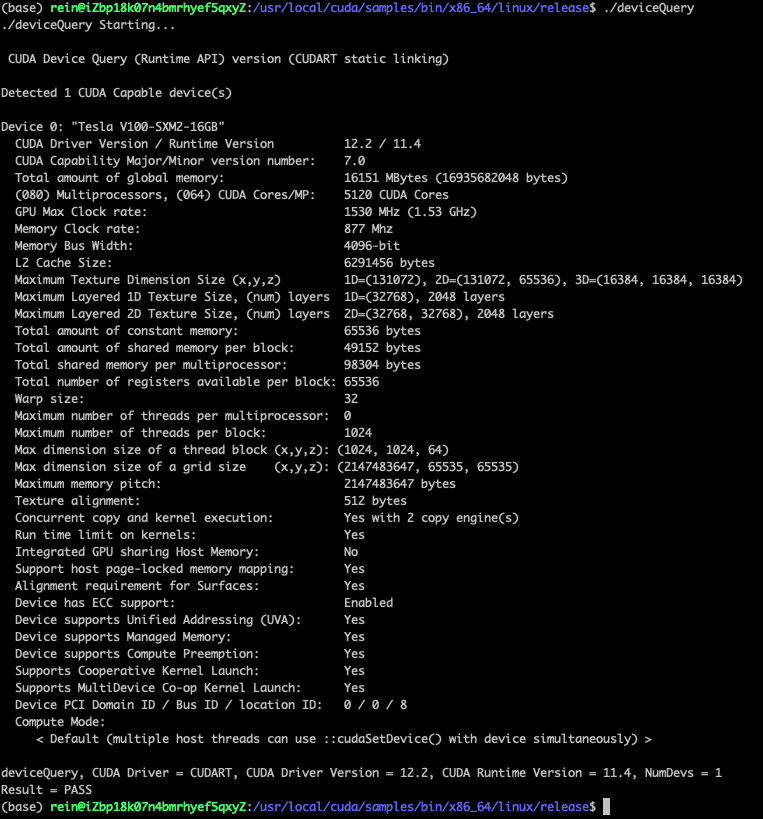
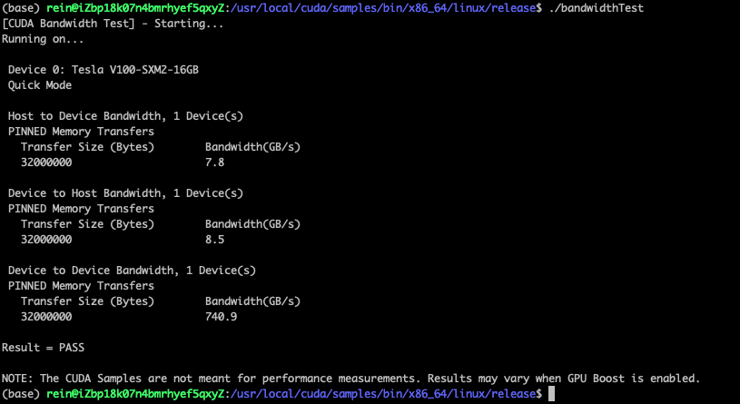
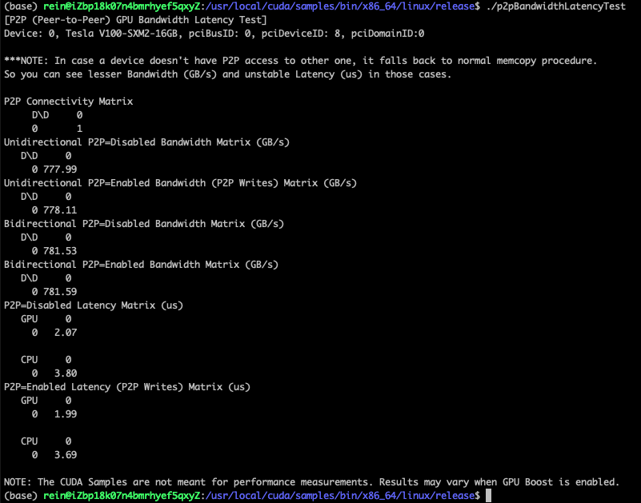
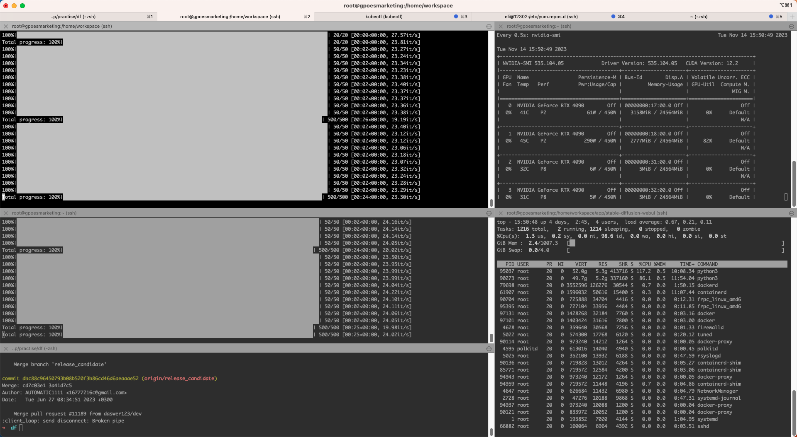
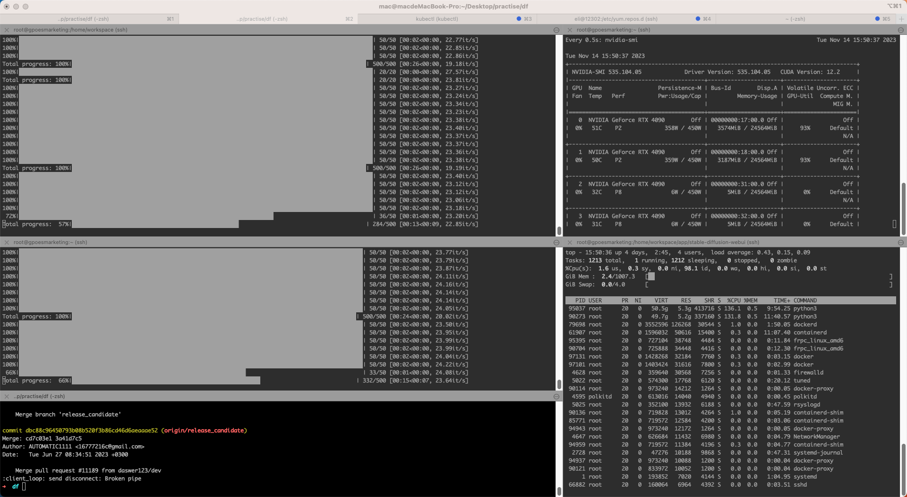

## 测试报告

1. ### 通用计算性能测试

    <!-- tabs:start -->
    #### **阿里云**
    ?> 1. 环境配置：显卡规格：Tesla V100-SXM2-16GB  CUDA 版本：12.2、NVIDIA 驱动版本：535.54.03、cuda-toolkit: cuda_11.4
    <br>2. 测试工具：NVIDIA 官方提供的命令行工具 deviceQuery
    <br>3. 测试目的：验证 CUDA 工具包是否可以正确安装和配置、检查 CUDA 可以访问的 GPU 设备的数量、计算能力、核心数量、内存带宽等硬件规格信息，以及它们是否能正常工作，确保系统硬件配置的稳定性。
    <br>4. 测试结果如下表

    | key | value|
        - | -
    | CUDA Driver Version / Runtime Version          | 12.2 / 11.4
    | CUDA Capability Major/Minor version number:    | 7.0
    | Total amount of global memory:                 | 16151 MBytes (16935682048 bytes)
    | (080) Multiprocessors, (064) CUDA Cores/MP:    | 5120 CUDA Cores
    | GPU Max Clock rate:                            | 1530 MHz (1.53 GHz)
    | Memory Clock rate:                             | 877 Mhz
    | Memory Bus Width:                              | 4096-bit
    | L2 Cache Size:                                 | 6291456 bytes
    | Maximum Texture Dimension Size (x,y,z)         | 1D=(131072), 2D=(131072, 65536), 3D=(16384, 16384, 16384)
    | Maximum Layered 1D Texture Size, (num) layers  | 1D=(32768), 2048 layers
    | Maximum Layered 2D Texture Size, (num) layers  | 2D=(32768, 32768), 2048 layers
    | Total amount of constant memory:               | 65536 bytes
    | Total amount of shared memory per block:       | 49152 bytes
    | Total shared memory per multiprocessor:        | 98304 bytes
    | Total number of registers available per block: | 65536
    | Warp size:                                     | 32
    | Maximum number of threads per multiprocessor:  | 0
    | Maximum number of threads per block:           | 1024
    | Max dimension size of a thread block  (x,y,z): | (1024, 1024, 64)
    | Max dimension size of a grid size     (x,y,z): | (2147483647, 65535, 65535)
    | Maximum memory pitch:                          | 2147483647 bytes
    | Texture alignment:                             | 512 bytes
    | Concurrent copy and kernel execution:          | Yes with 2 copy engine(s)
    | Run time limit on kernels:                     | Yes
    | Integrated GPU sharing Host Memory:            | No
    | Support host page-locked memory mapping:       | Yes
    | Alignment requirement for Surfaces:            | Yes
    | Device has ECC support:                        | Enabled
    | Device supports Unified Addressing (UVA):      | Yes
    | Device supports Managed Memory:                | Yes
    | Device supports Compute Preemption:            | Yes
    | Supports Cooperative Kernel Launch:            | Yes
    | Supports MultiDevice Co-op Kernel Launch:      | Yes
    | Device PCI Domain ID / Bus ID / location ID:   | 0 / 0 / 8

    截图记录：

    
    
    <!-- tabs:end -->
2. ### GPU 显存带宽测试
    <!-- tabs:start -->
    #### **阿里云**
    ?> 1. 环境配置：显卡规格：Tesla V100-SXM2-16GB  CUDA 版本：12.2、NVIDIA 驱动版本：535.54.03、cuda-toolkit: cuda_11.4
    <br>2. 测试工具：NVIDIA 官方提供的命令行工具 bandwidthTest
    <br>3. 测试目的：测试主机到 GPU 设备、GPU 设备到主机、以及设备到设备之间的数据传输速度，可用于评估 GPU 设备与主机之间的带宽，以及用于优化 GPU 计算应用程序的数据传输性能
    <br>4. 测试结果如下

    

    <!-- tabs:end -->

3. ### GPU 之间的 P2P 带宽和延迟测试
    <!-- tabs:start -->
    #### **阿里云**
    ?> 1. 环境配置：显卡规格：Tesla V100-SXM2-16GB  CUDA 版本：12.2、NVIDIA 驱动版本：535.54.03、cuda-toolkit: cuda_11.4
    <br>2. 测试工具：NVIDIA 官方提供的命令行工具 p2pBandwidthLatencyTest
    <br>3. 测试目的：评估两个 GPU 之间的连接性能，包括带宽和延迟，从而评估 GPU 之间的数据传输性能。在多 GPU 并行计算中，GPU 之间的高速数据传输是保证计算性能的重要因素，因此评估 GPU之间连接性能是非常重要的。
    <br>4. 测试结果如下（单卡）

    

    !> p2pBandwidthLatencyTest 测试结果主要包括两个指标：带宽和延迟。带宽是指两个 GPU之间传输数据的速度，一般用 GB/s 作为单位。p2pBandwidthLatencyTest 测试结果中，带宽值越高表示两个 GPU 之间传输数据的速度越快，性能越好。一般来说，如果两个 GPU 连接到同一个 PCIe 根节点，则带宽会比连接到不同 PCIe 根节点的 GPU 之间的带宽要快。延迟是指两个 GPU 数据传输所需要的时间，一般用 us 作为单位。p2pBandwidthLatencyTest 测试结果中，延迟值越低表示数据传输所需要的时间越短，性能越好。一般来说，如果两个 GPU连接到同一个 PCIe 根节点，则延迟会比连接到不同 PCIe 根节点的 GPU 之间的延迟要低。

    <!-- tabs:end -->

4. ### 浮点计算性能测试
    <!-- tabs:start -->
    #### **阿里云**
    ?> 1. 环境配置：显卡规格：Tesla V100-SXM2-16GB  CUDA 版本：12.2、NVIDIA 驱动版本：535.54.03、cuda-toolkit: cuda_11.4
    <br>2. 测试工具：
    <br>3. 测试目的：浮点运算实际性能
    <br>4. 测试结果如下

    <!--  -->
    <!-- tabs:end -->

5. ### 学习能力和推理速度
    <!-- tabs:start -->
    #### **阿里云**
    ?> 1. 环境配置：显卡规格：Tesla V100-SXM2-16GB  CUDA 版本：12.2、NVIDIA 驱动版本：535.54.03、cuda-toolkit: cuda_11.4
    <br>2. 测试工具：pytorch-gpu-benchmark
    <br>3. 测试目的：另外一个维度的测试
    <br>4. 测试结果如下
    ```json
    {
        "WARM_UP": 5,
        "NUM_TEST": 50,
        "BATCH_SIZE": 12,
        "NUM_CLASSES": 1000,
        "NUM_GPU": 1,
        "folder": "result"
    }
    ```
    ```shell
    benchmark start : 2023/12/08 17:50:45
    system_configs

    uname_result(system='Linux', node='iZbp18k07n4bmrhyef5qxyZ', release='5.4.0-153-generic', version='#170-Ubuntu SMP Fri Jun 16 13:43:31 UTC 2023', machine='x86_64')
                        scpufreq(current=2499.99, min=0.0, max=0.0)
                        cpu_count: 8
                        memory_available: 31552704512
    gpu_configs

    Number of GPUs on current device : 1
    CUDA Version : 11.7
    Cudnn Version : 8500
    Device Name : Tesla V100-SXM2-16GB
    benchmark end : 2023/12/08 18:08:55
    ```
    <!-- tabs:start -->
    #### **double_model_inference**
    | mnasnet0_5         | mnasnet0_75        | mnasnet1_0         | mnasnet1_3         | resnet18           | resnet34           | resnet50           | resnet101          | resnet152         | resnext50_32x4d    | resnext101_32x8d  | resnext101_64x4d   | wide_resnet50_2    | wide_resnet101_2   | densenet121        | densenet161       | densenet169        | densenet201        | squeezenet1_0      | squeezenet1_1      | vgg11              | vgg11_bn           | vgg13              | vgg13_bn           | vgg16             | vgg16_bn          | vgg19             | vgg19_bn          | mobilenet_v3_large | mobilenet_v3_small | shufflenet_v2_x0_5 | shufflenet_v2_x1_0 | shufflenet_v2_x1_5 | shufflenet_v2_x2_0 |
|--------------------|--------------------|--------------------|--------------------|--------------------|--------------------|--------------------|--------------------|-------------------|--------------------|-------------------|--------------------|--------------------|--------------------|--------------------|-------------------|--------------------|--------------------|--------------------|--------------------|--------------------|--------------------|--------------------|--------------------|-------------------|-------------------|-------------------|-------------------|--------------------|--------------------|--------------------|--------------------|--------------------|--------------------|
| 9.196758270263672  | 9.592533111572266  | 9.632587432861328  | 15.191793441772461 | 14.199495315551758 | 22.369384765625    | 30.03382682800293  | 49.21889305114746  | 71.27809524536133 | 35.53056716918945  | 99.2429256439209  | 103.74712944030762 | 58.93206596374512  | 111.2508773803711  | 31.342267990112305 | 74.2805004119873  | 40.499210357666016 | 51.33533477783203  | 10.644912719726562 | 7.318735122680664  | 39.4899845123291   | 41.99504852294922  | 57.01494216918945  | 60.0278377532959   | 73.80032539367676 | 77.18396186828613 | 90.55018424987793 | 94.58661079406738 | 10.698556900024414 | 9.800434112548828  | 10.91146469116211  | 11.055707931518555 | 20.161867141723633 | 11.499643325805664 |
| 8.52513313293457   | 9.78398323059082   | 9.595155715942383  | 12.153863906860352 | 13.950109481811523 | 22.14336395263672  | 29.126644134521484 | 49.1330623626709   | 69.96870040893555 | 35.44950485229492  | 98.9542007446289  | 104.00080680847168 | 59.026479721069336 | 111.26065254211426 | 31.325340270996094 | 74.31721687316895 | 40.598392486572266 | 51.27525329589844  | 10.628461837768555 | 7.128715515136719  | 39.43204879760742  | 41.727304458618164 | 56.909799575805664 | 61.090707778930664 | 73.77195358276367 | 77.11505889892578 | 90.5601978302002  | 94.51413154602051 | 10.787248611450195 | 9.363412857055664  | 10.730743408203125 | 10.825634002685547 | 15.177011489868164 | 11.397123336791992 |
| 16.429424285888672 | 9.005308151245117  | 9.499549865722656  | 12.858152389526367 | 13.102531433105469 | 22.03965187072754  | 30.05671501159668  | 49.12257194519043  | 70.28317451477051 | 35.47477722167969  | 99.10774230957031 | 103.52659225463867 | 58.94875526428223  | 111.43994331359863 | 31.466960906982422 | 74.33962821960449 | 40.53640365600586  | 51.25713348388672  | 11.535406112670898 | 7.140636444091797  | 40.70854187011719  | 41.43071174621582  | 57.083845138549805 | 60.053348541259766 | 74.97119903564453 | 77.16155052185059 | 90.82603454589844 | 94.53272819519043 | 10.674715042114258 | 9.404897689819336  | 10.744810104370117 | 10.994672775268555 | 10.475873947143555 | 11.351823806762695 |
| 13.559579849243164 | 8.85772705078125   | 9.470701217651367  | 11.996984481811523 | 14.256954193115234 | 22.0034122467041   | 29.201745986938477 | 49.07512664794922  | 70.21379470825195 | 36.24558448791504  | 98.92678260803223 | 104.75420951843262 | 58.96115303039551  | 111.3433837890625  | 31.3873291015625   | 74.29766654968262 | 42.00267791748047  | 52.434682846069336 | 11.441469192504883 | 9.652376174926758  | 39.55221176147461  | 42.401790618896484 | 56.99038505554199  | 60.009002685546875 | 73.86302947998047 | 78.26375961303711 | 90.99245071411133 | 94.50030326843262 | 10.857820510864258 | 18.118858337402344 | 10.725021362304688 | 11.154651641845703 | 10.642051696777344 | 11.661529541015625 |
| 8.470296859741211  | 8.564472198486328  | 13.548851013183594 | 11.862516403198242 | 13.929128646850586 | 21.947860717773438 | 29.021501541137695 | 49.07059669494629  | 69.98968124389648 | 35.38680076599121  | 99.1964340209961  | 103.73616218566895 | 58.992862701416016 | 111.34529113769531 | 31.328678131103516 | 74.35441017150879 | 40.94219207763672  | 51.2847900390625   | 10.668277740478516 | 10.465860366821289 | 39.48545455932617  | 41.3818359375      | 56.96558952331543  | 60.06455421447754  | 73.91762733459473 | 77.24428176879883 | 90.8195972442627  | 94.51842308044434 | 10.619163513183594 | 9.215831756591797  | 10.852336883544922 | 20.868301391601562 | 20.54119110107422  | 11.286497116088867 |
| 16.296863555908203 | 8.358001708984375  | 9.561538696289062  | 11.887550354003906 | 13.080596923828125 | 21.994352340698242 | 29.059171676635742 | 49.132347106933594 | 69.9925422668457  | 35.413265228271484 | 99.11990165710449 | 103.59025001525879 | 59.11588668823242  | 111.32931709289551 | 31.34632110595703  | 75.23918151855469 | 40.60077667236328  | 51.27882957458496  | 10.692119598388672 | 10.341405868530273 | 39.508819580078125 | 41.398048400878906 | 57.07597732543945  | 60.00089645385742  | 73.85420799255371 | 77.18443870544434 | 90.70992469787598 | 94.44427490234375 | 20.82085609436035  | 17.66037940979004  | 10.80942153930664  | 13.643741607666016 | 11.257648468017578 | 21.218061447143555 |
| 10.735034942626953 | 8.52346420288086   | 9.523153305053711  | 11.904001235961914 | 13.04173469543457  | 22.016286849975586 | 29.062509536743164 | 49.18551445007324  | 70.01566886901855 | 35.38656234741211  | 99.45392608642578 | 103.82652282714844 | 59.15355682373047  | 111.37795448303223 | 31.41474723815918  | 74.25379753112793 | 40.55070877075195  | 51.6664981842041   | 10.660409927368164 | 7.289648056030273  | 39.50095176696777  | 41.376590728759766 | 57.11030960083008  | 60.00852584838867  | 73.84538650512695 | 77.12316513061523 | 90.83294868469238 | 94.48647499084473 | 16.63494110107422  | 16.34955406188965  | 10.908126831054688 | 10.79869270324707  | 10.902166366577148 | 16.462326049804688 |
| 8.449554443359375  | 8.489608764648438  | 9.55653190612793   | 11.912822723388672 | 12.996196746826172 | 21.97265625        | 29.062986373901367 | 49.18360710144043  | 70.15132904052734 | 35.429954528808594 | 99.15041923522949 | 103.73497009277344 | 59.090614318847656 | 111.44137382507324 | 31.427383422851562 | 74.21660423278809 | 40.502071380615234 | 51.294565200805664 | 10.653972625732422 | 7.2154998779296875 | 39.55388069152832  | 41.39232635498047  | 58.080434799194336 | 60.80198287963867  | 74.01442527770996 | 77.19612121582031 | 90.74091911315918 | 94.49982643127441 | 10.518789291381836 | 9.483814239501953  | 11.162996292114258 | 11.121988296508789 | 11.67154312133789  | 11.105060577392578 |
| 8.459806442260742  | 8.414983749389648  | 9.704828262329102  | 11.964082717895508 | 14.150857925415039 | 21.96335792541504  | 30.007123947143555 | 49.09682273864746  | 69.96917724609375 | 35.416603088378906 | 98.83642196655273 | 103.37090492248535 | 59.04650688171387  | 111.27972602844238 | 31.39209747314453  | 74.27310943603516 | 40.48895835876465  | 51.3455867767334   | 10.594844818115234 | 7.173299789428711  | 39.49856758117676  | 41.35584831237793  | 56.978464126586914 | 60.063838958740234 | 73.85683059692383 | 77.17132568359375 | 90.7738208770752  | 94.42019462585449 | 10.629653930664062 | 9.510517120361328  | 10.921716690063477 | 11.709451675415039 | 10.775327682495117 | 11.214017868041992 |
| 8.500814437866211  | 8.763551712036133  | 17.2421932220459   | 11.929035186767578 | 13.917684555053711 | 21.9881534576416   | 29.045820236206055 | 49.07369613647461  | 69.99921798706055 | 35.35294532775879  | 98.9980697631836  | 103.59692573547363 | 59.08203125        | 111.3741397857666  | 31.398773193359375 | 74.33629035949707 | 40.441274642944336 | 51.28288269042969  | 11.851072311401367 | 7.226467132568359  | 39.52765464782715  | 41.5036678314209   | 56.91123008728027  | 59.98682975769043  | 74.24354553222656 | 77.25787162780762 | 90.77692031860352 | 94.42782402038574 | 10.758399963378906 | 9.599924087524414  | 10.6353759765625   | 10.902881622314453 | 10.486125946044922 | 11.108875274658203 |
| 8.759021759033203  | 8.90803337097168   | 16.254186630249023 | 11.969566345214844 | 13.021469116210938 | 22.0944881439209   | 29.99258041381836  | 49.09491539001465  | 69.95368003845215 | 35.54654121398926  | 98.9077091217041  | 103.68585586547852 | 59.01932716369629  | 111.25826835632324 | 31.39972686767578  | 74.52893257141113 | 40.537118911743164 | 51.383256912231445 | 11.492252349853516 | 7.378101348876953  | 39.53909873962402  | 41.49746894836426  | 57.036399841308594 | 59.99922752380371  | 73.9133358001709  | 77.15082168579102 | 90.78288078308105 | 94.48957443237305 | 10.81085205078125  | 9.948968887329102  | 10.8489990234375   | 12.786865234375    | 10.566949844360352 | 11.057615280151367 |
| 8.680582046508789  | 16.951799392700195 | 9.439229965209961  | 11.978387832641602 | 14.173030853271484 | 22.019624710083008 | 29.085159301757812 | 49.21150207519531  | 70.0681209564209  | 35.36796569824219  | 98.98996353149414 | 103.72543334960938 | 59.05294418334961  | 111.29355430603027 | 31.40735626220703  | 74.30410385131836 | 41.46981239318848  | 51.312923431396484 | 10.805368423461914 | 7.288694381713867  | 39.432525634765625 | 41.457176208496094 | 56.96868896484375  | 60.00638008117676  | 73.90499114990234 | 77.14009284973145 | 90.74759483337402 | 94.49410438537598 | 10.624408721923828 | 9.695768356323242  | 10.686159133911133 | 11.106252670288086 | 10.680913925170898 | 11.124134063720703 |
| 8.616209030151367  | 15.538454055786133 | 9.378910064697266  | 11.956453323364258 | 13.876676559448242 | 21.96025848388672  | 29.031753540039062 | 49.01623725891113  | 70.0228214263916  | 35.48717498779297  | 99.0610122680664  | 103.91950607299805 | 59.08465385437012  | 111.27305030822754 | 31.77475929260254  | 74.26667213439941 | 40.47083854675293  | 51.27978324890137  | 10.76364517211914  | 7.211923599243164  | 39.50691223144531  | 41.48459434509277  | 56.96535110473633  | 59.99422073364258  | 73.81033897399902 | 77.19254493713379 | 90.80266952514648 | 94.4814682006836  | 10.586023330688477 | 9.504079818725586  | 10.379552841186523 | 10.647058486938477 | 10.393619537353516 | 10.975122451782227 |
| 8.606433868408203  | 8.264780044555664  | 9.446382522583008  | 11.911630630493164 | 13.047933578491211 | 21.947860717773438 | 28.99909019470215  | 49.26323890686035  | 69.96273994445801 | 35.39848327636719  | 99.08843040466309 | 103.65891456604004 | 59.0672492980957   | 111.27018928527832 | 31.362295150756836 | 74.25522804260254 | 40.45391082763672  | 51.67365074157715  | 10.759353637695312 | 8.032798767089844  | 39.5660400390625   | 41.473388671875    | 56.99014663696289  | 60.04142761230469  | 73.82392883300781 | 77.16941833496094 | 90.73638916015625 | 94.47288513183594 | 20.45273780822754  | 9.594440460205078  | 19.755840301513672 | 10.709762573242188 | 10.715484619140625 | 11.077165603637695 |
| 8.662700653076172  | 8.208513259887695  | 9.535074234008789  | 11.807441711425781 | 13.3514404296875   | 21.96049690246582  | 29.022693634033203 | 49.34263229370117  | 70.05143165588379 | 35.541534423828125 | 98.80185127258301 | 103.99770736694336 | 59.01765823364258  | 111.23347282409668 | 31.45575523376465  | 74.24378395080566 | 40.50874710083008  | 51.271915435791016 | 10.666131973266602 | 7.505178451538086  | 39.44849967956543  | 41.49484634399414  | 56.97464942932129  | 60.456275939941406 | 73.82035255432129 | 77.16870307922363 | 90.73162078857422 | 94.49577331542969 | 16.68405532836914  | 9.693384170532227  | 15.918254852294922 | 10.512351989746094 | 10.789632797241211 | 11.03353500366211  |
| 9.138107299804688  | 8.337736129760742  | 9.580850601196289  | 11.853218078613281 | 13.004779815673828 | 21.98028564453125  | 29.026031494140625 | 49.208879470825195 | 70.04594802856445 | 35.56108474731445  | 99.09963607788086 | 103.81460189819336 | 59.08942222595215  | 111.21869087219238 | 31.37993812561035  | 74.29790496826172 | 40.4510498046875   | 51.34868621826172  | 10.700464248657227 | 7.323026657104492  | 39.53075408935547  | 41.58639907836914  | 58.129310607910156 | 60.00089645385742  | 73.84872436523438 | 77.16965675354004 | 90.81554412841797 | 94.48099136352539 | 10.772228240966797 | 9.54294204711914   | 10.400772094726562 | 10.541915893554688 | 10.706663131713867 | 11.074066162109375 |
| 9.05299186706543   | 8.416891098022461  | 9.728670120239258  | 11.953115463256836 | 14.168262481689453 | 21.977663040161133 | 29.02531623840332  | 49.03817176818848  | 70.01948356628418 | 35.2933406829834   | 99.08652305603027 | 103.68013381958008 | 59.09442901611328  | 111.26255989074707 | 31.36444091796875  | 74.29242134094238 | 40.637969970703125 | 51.26380920410156  | 10.675191879272461 | 10.190963745117188 | 39.589643478393555 | 41.43095016479492  | 57.031869888305664 | 60.086965560913086 | 73.83894920349121 | 77.11195945739746 | 90.78121185302734 | 94.52986717224121 | 10.675191879272461 | 9.780406951904297  | 10.174751281738281 | 10.741710662841797 | 10.480880737304688 | 11.514902114868164 |
| 8.682489395141602  | 8.427858352661133  | 16.99042320251465  | 11.930227279663086 | 13.938665390014648 | 21.955490112304688 | 29.30474281311035  | 49.15785789489746  | 70.05119323730469 | 35.443782806396484 | 98.66976737976074 | 103.63054275512695 | 59.08060073852539  | 111.28711700439453 | 31.412839889526367 | 74.23543930053711 | 40.51041603088379  | 51.308631896972656 | 10.679960250854492 | 9.929656982421875  | 39.633750915527344 | 41.46289825439453  | 57.12103843688965  | 60.111284255981445 | 73.87590408325195 | 77.1341323852539  | 90.7449722290039  | 94.47216987609863 | 10.67209243774414  | 9.431123733520508  | 10.241031646728516 | 10.488510131835938 | 10.294675827026367 | 11.084556579589844 |
| 8.63194465637207   | 8.548259735107422  | 10.442018508911133 | 11.981964111328125 | 13.06605339050293  | 21.97408676147461  | 29.047727584838867 | 49.25537109375     | 69.9918270111084  | 35.416364669799805 | 98.92153739929199 | 103.6531925201416  | 59.04531478881836  | 111.27781867980957 | 31.405925750732422 | 74.43428039550781 | 40.50326347351074  | 51.323890686035156 | 10.801076889038086 | 9.459495544433594  | 39.60394859313965  | 41.50843620300293  | 57.03902244567871  | 60.17947196960449  | 73.91524314880371 | 77.15320587158203 | 90.74139595031738 | 94.47646141052246 | 10.761022567749023 | 9.534835815429688  | 10.423898696899414 | 10.54692268371582  | 10.308027267456055 | 11.282205581665039 |
| 8.727073669433594  | 16.829967498779297 | 9.506464004516602  | 11.965036392211914 | 14.183759689331055 | 21.96979522705078  | 29.089689254760742 | 49.17025566101074  | 70.07598876953125 | 35.43591499328613  | 99.15423393249512 | 103.68466377258301 | 59.03935432434082  | 111.21797561645508 | 31.39042854309082  | 74.31459426879883 | 40.491580963134766 | 51.31864547729492  | 10.791778564453125 | 7.247686386108398  | 39.55221176147461  | 41.44763946533203  | 57.019948959350586 | 60.09984016418457  | 73.87375831604004 | 77.08883285522461 | 90.7907485961914  | 94.45023536682129 | 11.04593276977539  | 9.778022766113281  | 10.139226913452148 | 10.561227798461914 | 10.364532470703125 | 11.215925216674805 |
| 10.555505752563477 | 15.805482864379883 | 9.563446044921875  | 11.909723281860352 | 13.978004455566406 | 22.000789642333984 | 29.085636138916016 | 49.170732498168945 | 70.01924514770508 | 35.41111946105957  | 98.93321990966797 | 103.61313819885254 | 59.07726287841797  | 111.23466491699219 | 31.35967254638672  | 74.24402236938477 | 40.50493240356445  | 51.39970779418945  | 10.74838638305664  | 7.197141647338867  | 39.58487510681152  | 41.45932197570801  | 57.021379470825195 | 60.07075309753418  | 73.8687515258789  | 77.12292671203613 | 90.83843231201172 | 94.50173377990723 | 10.602951049804688 | 9.873151779174805  | 10.298967361450195 | 10.656356811523438 | 10.832071304321289 | 10.993242263793945 |
| 8.655548095703125  | 8.378982543945312  | 9.485483169555664  | 11.884927749633789 | 13.020038604736328 | 22.25351333618164  | 29.024839401245117 | 49.14999008178711  | 70.06120681762695 | 35.436153411865234 | 98.87361526489258 | 103.93762588500977 | 59.04984474182129  | 111.2525463104248  | 31.46195411682129  | 74.32985305786133 | 40.425777435302734 | 51.3157844543457   | 10.65373420715332  | 7.179498672485352  | 39.574623107910156 | 41.413068771362305 | 57.04379081726074  | 60.04667282104492  | 73.87137413024902 | 77.13651657104492 | 90.74521064758301 | 94.56801414489746 | 20.769357681274414 | 9.574174880981445  | 19.711732864379883 | 10.65373420715332  | 10.25533676147461  | 11.025428771972656 |
| 8.86225700378418   | 8.293390274047852  | 9.584426879882812  | 11.874914169311523 | 13.051271438598633 | 22.105693817138672 | 28.983116149902344 | 49.1490364074707   | 70.10555267333984 | 35.54964065551758  | 98.97613525390625 | 103.62720489501953 | 59.040069580078125 | 111.26470565795898 | 31.432390213012695 | 74.1739273071289  | 40.51709175109863  | 51.335811614990234 | 10.792016983032227 | 7.216453552246094  | 39.595842361450195 | 41.44930839538574  | 56.99896812438965  | 60.033321380615234 | 73.83084297180176 | 77.12674140930176 | 90.7449722290039  | 94.41614151000977 | 15.667915344238281 | 9.58704948425293   | 14.809846878051758 | 10.574579238891602 | 10.303258895874023 | 10.978937149047852 |
| 8.549928665161133  | 8.365869522094727  | 9.666919708251953  | 11.987924575805664 | 13.163089752197266 | 22.26543426513672  | 29.174089431762695 | 49.17335510253906  | 70.0535774230957  | 35.27379035949707  | 99.16281700134277 | 104.11477088928223 | 59.02099609375     | 111.27376556396484 | 31.441926956176758 | 74.31316375732422 | 40.511369705200195 | 51.31053924560547  | 11.296987533569336 | 7.226467132568359  | 39.56103324890137  | 41.46313667297363  | 57.06429481506348  | 60.03212928771973  | 73.84014129638672 | 77.17514038085938 | 90.70801734924316 | 94.45452690124512 | 10.516881942749023 | 9.482383728027344  | 10.05411148071289  | 10.471582412719727 | 10.489702224731445 | 11.014461517333984 |
| 8.575916290283203  | 8.38327407836914   | 9.717464447021484  | 11.974334716796875 | 14.203786849975586 | 22.174596786499023 | 29.12306785583496  | 49.20649528503418  | 70.05095481872559 | 35.39681434631348  | 98.98734092712402 | 103.61075401306152 | 59.03911590576172  | 111.21773719787598 | 31.398773193359375 | 74.2192268371582  | 40.40336608886719  | 51.27143859863281  | 11.056661605834961 | 9.771585464477539  | 39.61038589477539  | 41.44477844238281  | 56.98537826538086  | 60.054779052734375 | 73.79722595214844 | 77.04591751098633 | 90.7585620880127  | 94.5291519165039  | 10.416984558105469 | 9.818792343139648  | 9.89675521850586   | 10.636329650878906 | 10.391473770141602 | 10.871171951293945 |
| 8.856534957885742  | 8.431196212768555  | 17.046213150024414 | 11.893987655639648 | 13.997316360473633 | 22.099971771240234 | 29.111862182617188 | 49.15666580200195  | 70.05095481872559 | 35.393476486206055 | 98.99735450744629 | 104.12430763244629 | 59.07583236694336  | 111.23418807983398 | 31.505107879638672 | 74.36490058898926 | 40.4055118560791   | 51.360368728637695 | 10.848760604858398 | 7.281064987182617  | 39.64495658874512  | 41.47529602050781  | 57.004690170288086 | 60.06121635437012  | 73.82941246032715 | 77.12578773498535 | 90.77334403991699 | 94.54989433288574 | 10.511636734008789 | 9.408235549926758  | 10.163068771362305 | 10.559320449829102 | 10.44011116027832  | 10.795354843139648 |
| 8.559703826904297  | 11.965751647949219 | 10.51950454711914  | 11.920928955078125 | 13.443946838378906 | 22.08113670349121  | 29.12616729736328  | 49.15499687194824  | 69.97394561767578 | 35.572052001953125 | 98.99258613586426 | 103.93190383911133 | 59.09442901611328  | 111.22560501098633 | 31.41188621520996  | 74.30696487426758 | 40.532827377319336 | 51.271677017211914 | 10.924339294433594 | 7.332086563110352  | 39.578914642333984 | 41.43071174621582  | 57.068586349487305 | 60.06002426147461  | 73.89354705810547 | 77.07953453063965 | 90.75784683227539 | 94.45405006408691 | 10.643482208251953 | 9.42683219909668   | 10.387420654296875 | 10.449647903442383 | 10.544061660766602 | 11.034488677978516 |
| 8.51297378540039   | 16.382694244384766 | 9.570598602294922  | 11.88969612121582  | 14.206886291503906 | 22.07469940185547  | 29.11996841430664  | 49.21269416809082  | 70.02997398376465 | 35.67767143249512  | 99.01142120361328 | 103.66940498352051 | 59.0822696685791   | 111.2823486328125  | 31.39972686767578  | 74.27740097045898 | 40.503501892089844 | 51.2697696685791   | 11.003255844116211 | 7.357597351074219  | 39.546966552734375 | 41.44573211669922  | 57.0831298828125   | 60.05549430847168  | 73.90403747558594 | 77.16703414916992 | 90.75546264648438 | 94.44499015808105 | 10.650873184204102 | 9.568929672241211  | 10.698318481445312 | 10.553836822509766 | 11.972188949584961 | 10.886907577514648 |
| 8.573532104492188  | 15.561342239379883 | 9.551286697387695  | 11.876583099365234 | 13.968467712402344 | 22.03655242919922  | 29.039382934570312 | 49.22676086425781  | 70.03259658813477 | 35.402536392211914 | 98.7558364868164  | 103.76691818237305 | 59.10301208496094  | 111.30881309509277 | 31.369686126708984 | 74.22804832458496 | 40.44985771179199  | 51.279544830322266 | 11.005163192749023 | 7.40814208984375   | 39.61801528930664  | 41.42880439758301  | 57.03282356262207  | 60.05501747131348  | 73.81057739257812 | 77.16512680053711 | 90.8346176147461  | 94.47908401489258 | 10.761022567749023 | 9.651899337768555  | 10.324478149414062 | 10.524749755859375 | 10.832071304321289 | 10.759592056274414 |
| 8.648157119750977  | 8.260726928710938  | 9.561777114868164  | 11.87753677368164  | 13.103246688842773 | 22.055864334106445 | 29.069185256958008 | 49.178361892700195 | 70.02544403076172 | 35.44330596923828  | 98.97017478942871 | 103.85346412658691 | 59.09371376037598  | 111.30619049072266 | 31.371355056762695 | 74.28884506225586 | 40.514230728149414 | 51.294803619384766 | 11.090755462646484 | 7.370710372924805  | 39.551496505737305 | 41.41807556152344  | 57.03401565551758  | 60.027360916137695 | 73.85921478271484 | 77.10933685302734 | 90.74115753173828 | 94.4209098815918  | 11.26718521118164  | 9.531736373901367  | 10.693073272705078 | 10.761260986328125 | 10.303735733032227 | 11.016130447387695 |
| 8.658885955810547  | 8.252382278442383  | 9.593725204467773  | 11.863946914672852 | 13.138771057128906 | 22.006988525390625 | 29.088497161865234 | 49.176931381225586 | 69.98634338378906 | 35.50267219543457  | 99.05505180358887 | 103.49416732788086 | 59.053897857666016 | 111.27781867980957 | 31.376123428344727 | 74.25737380981445 | 40.54617881774902  | 51.63693428039551  | 10.70547103881836  | 10.096311569213867 | 39.67142105102539  | 41.425228118896484 | 57.06620216369629  | 60.013532638549805 | 73.78101348876953 | 77.10981369018555 | 90.71850776672363 | 94.46525573730469 | 10.961771011352539 | 9.428977966308594  | 10.455131530761719 | 10.645151138305664 | 10.398387908935547 | 11.183977127075195 |
| 8.706092834472656  | 8.663415908813477  | 9.511470794677734  | 11.962413787841797 | 13.097047805786133 | 22.238969802856445 | 29.097795486450195 | 49.134016036987305 | 70.02592086791992 | 35.47501564025879  | 99.16877746582031 | 103.23691368103027 | 59.014081954956055 | 111.2513542175293  | 31.362533569335938 | 74.52917098999023 | 40.540456771850586 | 51.32102966308594  | 10.753393173217773 | 9.915351867675781  | 39.62826728820801  | 41.405439376831055 | 57.04903602600098  | 60.02068519592285  | 73.76670837402344 | 77.1338939666748  | 90.75307846069336 | 94.4511890411377  | 10.970592498779297 | 9.446859359741211  | 10.14399528503418  | 10.603904724121094 | 10.708332061767578 | 11.520862579345703 |
| 8.585214614868164  | 10.597944259643555 | 9.849786758422852  | 11.925935745239258 | 14.148235321044922 | 22.046804428100586 | 29.09541130065918  | 49.14665222167969  | 70.00088691711426 | 35.414934158325195 | 99.08056259155273 | 103.31869125366211 | 59.08918380737305  | 111.48452758789062 | 31.314849853515625 | 74.39088821411133 | 40.54903984069824  | 51.251888275146484 | 10.682821273803711 | 9.454727172851562  | 39.55411911010742  | 41.36776924133301  | 56.976318359375    | 60.04738807678223  | 73.83203506469727 | 77.16679573059082 | 90.70420265197754 | 94.46907043457031 | 10.956764221191406 | 9.749889373779297  | 10.287046432495117 | 10.725975036621094 | 10.487794876098633 | 10.808944702148438 |
| 8.98432731628418   | 11.83176040649414  | 9.77015495300293   | 11.900901794433594 | 13.957977294921875 | 22.064685821533203 | 29.082298278808594 | 49.140214920043945 | 69.98753547668457 | 35.2632999420166   | 99.01070594787598 | 103.72495651245117 | 59.08799171447754  | 111.29188537597656 | 31.40115737915039  | 74.38874244689941 | 40.44461250305176  | 51.310062408447266 | 10.64300537109375  | 7.2956085205078125 | 39.63470458984375  | 41.41807556152344  | 57.062625885009766 | 59.9822998046875   | 73.81510734558105 | 77.08144187927246 | 90.74640274047852 | 94.46907043457031 | 10.838031768798828 | 9.707927703857422  | 10.604381561279297 | 10.698795318603516 | 10.466575622558594 | 10.872602462768555 |
| 8.42142105102539   | 11.6424560546875   | 9.557008743286133  | 11.888504028320312 | 12.992382049560547 | 22.00460433959961  | 29.112577438354492 | 49.172163009643555 | 69.97942924499512 | 35.47048568725586  | 98.94895553588867 | 103.56783866882324 | 59.06367301940918  | 111.27805709838867 | 31.345367431640625 | 74.36656951904297 | 40.42196273803711  | 51.28216743469238  | 10.55598258972168  | 7.140159606933594  | 39.54458236694336  | 41.38898849487305  | 56.97131156921387  | 60.11557579040527  | 73.82440567016602 | 77.12888717651367 | 90.7444953918457  | 94.44856643676758 | 10.647296905517578 | 9.26661491394043   | 10.400772094726562 | 10.328292846679688 | 10.353803634643555 | 10.853290557861328 |
| 8.301496505737305  | 11.296510696411133 | 9.435653686523438  | 11.806011199951172 | 12.982606887817383 | 21.951675415039062 | 29.094219207763672 | 49.09491539001465  | 69.9465274810791  | 35.40205955505371  | 99.09772872924805 | 103.60574722290039 | 58.96902084350586  | 111.18960380554199 | 31.23617172241211  | 74.31960105895996 | 40.31515121459961  | 51.27692222595215  | 10.475873947143555 | 7.01904296875      | 39.580583572387695 | 41.217803955078125 | 57.073116302490234 | 60.1654052734375   | 73.65822792053223 | 77.02040672302246 | 90.67034721374512 | 94.3918228149414  | 10.463953018188477 | 9.192228317260742  | 10.53762435913086  | 10.239124298095703 | 10.279655456542969 | 10.62464714050293  |
| 8.019208908081055  | 11.088132858276367 | 9.347915649414062  | 11.722803115844727 | 12.871980667114258 | 21.943330764770508 | 29.067039489746094 | 49.06058311462402  | 69.95463371276855 | 35.331010818481445 | 98.74439239501953 | 103.24597358703613 | 58.936119079589844 | 111.1612319946289  | 31.140804290771484 | 74.16963577270508 | 40.35043716430664  | 51.22542381286621  | 10.346412658691406 | 6.968021392822266  | 39.536237716674805 | 41.13173484802246  | 56.989431381225586 | 59.911489486694336 | 73.70638847351074 | 76.97367668151855 | 90.68846702575684 | 94.47550773620605 | 10.100126266479492 | 8.881568908691406  | 9.848833084106445  | 10.014772415161133 | 10.096549987792969 | 10.30588150024414  |
| 7.839679718017578  | 10.824203491210938 | 9.283065795898438  | 11.630535125732422 | 12.808561325073242 | 21.938085556030273 | 29.00075912475586  | 49.52073097229004  | 69.88739967346191 | 35.17460823059082  | 99.09462928771973 | 103.22856903076172 | 58.96162986755371  | 111.13953590393066 | 31.194448471069336 | 74.24616813659668 | 40.2531623840332   | 51.16844177246094  | 10.32400131225586  | 6.8111419677734375 | 39.481401443481445 | 41.01085662841797  | 56.915998458862305 | 59.845685958862305 | 73.64296913146973 | 76.96199417114258 | 90.71111679077148 | 94.32792663574219 | 9.66954231262207   | 8.738279342651367  | 9.56273078918457   | 9.86480712890625   | 9.654760360717773  | 10.246515274047852 |
| 7.52711296081543   | 10.592937469482422 | 9.115219116210938  | 11.562108993530273 | 12.71820068359375  | 21.918058395385742 | 28.93352508544922  | 49.08108711242676  | 69.87547874450684 | 35.13050079345703  | 98.88744354248047 | 103.52182388305664 | 58.88533592224121  | 111.15670204162598 | 31.135082244873047 | 74.1739273071289  | 40.227413177490234 | 51.13649368286133  | 10.302305221557617 | 6.813526153564453  | 39.51001167297363  | 41.01705551147461  | 56.9157600402832   | 59.82041358947754  | 73.66323471069336 | 76.86138153076172 | 90.67893028259277 | 94.76876258850098 | 9.462356567382812  | 8.566856384277344  | 9.319543838500977  | 9.552478790283203  | 9.49716567993164   | 10.139226913452148 |
| 7.441043853759766  | 7.917881011962891  | 9.1094970703125    | 11.512279510498047 | 12.650489807128906 | 21.894216537475586 | 28.87129783630371  | 49.072265625       | 69.99349594116211 | 35.08281707763672  | 98.87576103210449 | 103.60550880432129 | 58.86220932006836  | 111.1299991607666  | 31.096458435058594 | 74.20587539672852 | 40.31038284301758  | 51.13792419433594  | 10.213613510131836 | 7.621049880981445  | 39.499521255493164 | 41.17774963378906  | 56.938886642456055 | 59.79800224304199  | 73.65798950195312 | 77.00395584106445 | 90.69633483886719 | 94.60330009460449 | 9.412288665771484  | 8.598089218139648  | 9.24539566040039   | 9.565114974975586  | 9.266138076782227  | 10.156869888305664 |
| 7.357120513916016  | 7.8487396240234375 | 9.072065353393555  | 11.512279510498047 | 12.622594833374023 | 21.836042404174805 | 28.74588966369629  | 49.10731315612793  | 69.95677947998047 | 35.20369529724121  | 98.86312484741211 | 103.40762138366699 | 58.76970291137695  | 111.1600399017334  | 31.676769256591797 | 74.29909706115723 | 40.21716117858887  | 51.332712173461914 | 10.18977165222168  | 7.580995559692383  | 39.44826126098633  | 41.193246841430664 | 56.84494972229004  | 59.85617637634277  | 73.6379623413086  | 77.09217071533203 | 90.67940711975098 | 94.25806999206543 | 9.668350219726562  | 8.47768783569336   | 9.177446365356445  | 9.609460830688477  | 9.195327758789062  | 10.185480117797852 |
| 7.367610931396484  | 7.901668548583984  | 9.051084518432617  | 11.534929275512695 | 12.607812881469727 | 21.747112274169922 | 28.879642486572266 | 49.12972450256348  | 69.75030899047852 | 35.268545150756836 | 98.7858772277832  | 103.45721244812012 | 58.862924575805664 | 111.13643646240234 | 31.030654907226562 | 74.2800235748291  | 40.15469551086426  | 51.454782485961914 | 10.155677795410156 | 7.343292236328125  | 39.517879486083984 | 41.051387786865234 | 56.955814361572266 | 59.836387634277344 | 73.68803024291992 | 76.92837715148926 | 90.7278060913086  | 94.31076049804688 | 9.613752365112305  | 8.335113525390625  | 9.084224700927734  | 9.57179069519043   | 9.124994277954102  | 9.938955307006836  |
| 7.256984710693359  | 7.796049118041992  | 9.102106094360352  | 11.495828628540039 | 12.561798095703125 | 21.667003631591797 | 28.867006301879883 | 49.054861068725586 | 69.70524787902832 | 35.24637222290039  | 98.72889518737793 | 103.68776321411133 | 58.81476402282715  | 111.15837097167969 | 31.20565414428711  | 74.25117492675781 | 40.24386405944824  | 51.291465759277344 | 10.102987289428711 | 6.965160369873047  | 39.32309150695801  | 41.03970527648926  | 56.874752044677734 | 59.72146987915039  | 73.69303703308105 | 77.11315155029297 | 90.62814712524414 | 94.41065788269043 | 9.606122970581055  | 8.401155471801758  | 9.106636047363281  | 9.475231170654297  | 9.156465530395508  | 9.78994369506836   |
| 7.364988327026367  | 7.803678512573242  | 9.057760238647461  | 11.460304260253906 | 12.642860412597656 | 21.681785583496094 | 28.903484344482422 | 49.07703399658203  | 69.7789192199707  | 35.368919372558594 | 99.08914566040039 | 103.52277755737305 | 58.89606475830078  | 111.2523078918457  | 31.14938735961914  | 74.14555549621582 | 40.35496711730957  | 51.128387451171875 | 10.033845901489258 | 6.880044937133789  | 39.427757263183594 | 40.962934494018555 | 56.87761306762695  | 59.86142158508301  | 73.61721992492676 | 77.01921463012695 | 90.62790870666504 | 94.3453311920166  | 9.461402893066406  | 8.284807205200195  | 9.214162826538086  | 9.652853012084961  | 9.287118911743164  | 9.711503982543945  |
| 7.272243499755859  | 7.811069488525391  | 8.990049362182617  | 11.436939239501953 | 12.604713439941406 | 21.742582321166992 | 28.93972396850586  | 49.06511306762695  | 69.78964805603027 | 35.185813903808594 | 99.02143478393555 | 103.79791259765625 | 58.92038345336914  | 111.19890213012695 | 31.07452392578125  | 74.23043251037598 | 40.25578498840332  | 51.123619079589844 | 10.024070739746094 | 6.777286529541016  | 39.49689865112305  | 40.95458984375     | 56.88595771789551  | 59.906959533691406 | 73.65274429321289 | 77.04496383666992 | 90.49057960510254 | 94.29526329040527 | 9.382247924804688  | 8.211851119995117  | 9.413480758666992  | 9.469747543334961  | 9.540557861328125  | 9.740591049194336  |
| 7.257223129272461  | 7.776021957397461  | 9.038209915161133  | 11.490821838378906 | 12.568235397338867 | 21.87323570251465  | 28.893709182739258 | 49.12853240966797  | 69.74244117736816 | 35.34245491027832  | 98.82903099060059 | 103.26123237609863 | 58.87746810913086  | 111.07993125915527 | 31.106948852539062 | 74.11050796508789 | 40.232181549072266 | 51.04422569274902  | 9.998083114624023  | 6.769657135009766  | 39.4594669342041   | 40.885210037231445 | 56.996822357177734 | 59.844017028808594 | 73.56381416320801 | 76.97057723999023 | 90.51132202148438 | 94.35772895812988 | 9.2010498046875    | 8.080720901489258  | 9.352684020996094  | 9.310245513916016  | 9.432554244995117  | 9.637832641601562  |
| 7.292509078979492  | 7.788896560668945  | 8.946418762207031  | 11.448383331298828 | 12.674808502197266 | 21.740198135375977 | 28.85150909423828  | 49.085378646850586 | 69.69022750854492 | 35.10117530822754  | 98.95730018615723 | 103.25145721435547 | 58.93683433532715  | 111.03630065917969 | 31.5248966217041   | 74.16272163391113 | 40.25983810424805  | 51.13935470581055  | 10.08296012878418  | 6.721973419189453  | 39.39628601074219  | 40.84157943725586  | 56.91075325012207  | 59.85307693481445  | 73.63629341125488 | 76.96771621704102 | 90.5618667602539  | 94.33555603027344 | 9.219169616699219  | 8.026599884033203  | 9.207963943481445  | 9.208440780639648  | 9.432315826416016  | 9.621620178222656  |
| 7.223367691040039  | 7.7877044677734375 | 8.96906852722168   | 11.432409286499023 | 12.610197067260742 | 21.73447608947754  | 28.871536254882812 | 49.126625061035156 | 69.67520713806152 | 35.02535820007324  | 98.97470474243164 | 103.36589813232422 | 58.86554718017578  | 111.13858222961426 | 31.075477600097656 | 74.24521446228027 | 40.21000862121582  | 51.000118255615234 | 10.227203369140625 | 6.583213806152344  | 39.31474685668945  | 40.84658622741699  | 56.902408599853516 | 59.8452091217041   | 73.61555099487305 | 76.93767547607422 | 90.61241149902344 | 94.30623054504395 | 9.077310562133789  | 8.014678955078125  | 9.172916412353516  | 9.224653244018555  | 9.27734375         | 9.628772735595703  |
| 7.222890853881836  | 7.825374603271484  | 9.00411605834961   | 11.39378547668457  | 12.59922981262207  | 21.773576736450195 | 28.888940811157227 | 49.08561706542969  | 69.87571716308594 | 35.29763221740723  | 98.94442558288574 | 103.39713096618652 | 58.87889862060547  | 111.27877235412598 | 31.05926513671875  | 74.16272163391113 | 40.27080535888672  | 51.058053970336914 | 10.144710540771484 | 6.64210319519043   | 39.29400444030762  | 41.03541374206543  | 56.90503120422363  | 59.79657173156738  | 73.65226745605469 | 76.91431045532227 | 90.54422378540039 | 94.42305564880371 | 9.084224700927734  | 8.025169372558594  | 9.072542190551758  | 9.208917617797852  | 9.180784225463867  | 9.864330291748047  |
| 7.225513458251953  | 7.810831069946289  | 8.967161178588867  | 11.358022689819336 | 12.651920318603516 | 21.767616271972656 | 28.738021850585938 | 49.134254455566406 | 69.7321891784668  | 35.186767578125    | 98.74129295349121 | 103.5308837890625  | 58.83002281188965  | 111.16719245910645 | 31.165122985839844 | 74.23758506774902 | 40.25578498840332  | 51.06401443481445  | 10.160207748413086 | 6.562232971191406  | 39.2301082611084   | 41.187286376953125 | 56.8540096282959   | 59.80730056762695  | 73.69279861450195 | 76.95889472961426 | 90.52801132202148 | 94.34390068054199 | 9.215354919433594  | 7.950067520141602  | 9.091377258300781  | 9.320497512817383  | 9.168386459350586  | 9.991645812988281  |

    #### **double_model_train**
    | mnasnet0_5         | mnasnet0_75        | mnasnet1_0         | mnasnet1_3         | resnet18           | resnet34          | resnet50          | resnet101          | resnet152          | resnext50_32x4d    | resnext101_32x8d   | resnext101_64x4d   | wide_resnet50_2    | wide_resnet101_2   | densenet121        | densenet161        | densenet169        | densenet201        | squeezenet1_0      | squeezenet1_1      | vgg11              | vgg11_bn           | vgg13              | vgg13_bn           | vgg16              | vgg16_bn           | vgg19              | vgg19_bn           | mobilenet_v3_large | mobilenet_v3_small | shufflenet_v2_x0_5 | shufflenet_v2_x1_0 | shufflenet_v2_x1_5 | shufflenet_v2_x2_0 |
|--------------------|--------------------|--------------------|--------------------|--------------------|-------------------|-------------------|--------------------|--------------------|--------------------|--------------------|--------------------|--------------------|--------------------|--------------------|--------------------|--------------------|--------------------|--------------------|--------------------|--------------------|--------------------|--------------------|--------------------|--------------------|--------------------|--------------------|--------------------|--------------------|--------------------|--------------------|--------------------|--------------------|--------------------|
| 27.567148208618164 | 32.56797790527344  | 35.564422607421875 | 51.42784118652344  | 37.989139556884766 | 68.48573684692383 | 91.8891429901123  | 160.86935997009277 | 226.2270450592041  | 112.39218711853027 | 322.65591621398926 | 330.765962600708   | 187.6070499420166  | 353.18589210510254 | 93.52660179138184  | 209.46788787841797 | 118.21246147155762 | 149.32942390441895 | 28.456687927246094 | 19.18339729309082  | 120.25570869445801 | 127.86006927490234 | 174.835205078125   | 187.54816055297852 | 226.60470008850098 | 241.34469032287598 | 278.7046432495117  | 295.26281356811523 | 35.38060188293457  | 27.681827545166016 | 27.317523956298828 | 34.38687324523926  | 30.06601333618164  | 33.54215621948242  |
| 37.97197341918945  | 32.21750259399414  | 40.111541748046875 | 41.10550880432129  | 39.00933265686035  | 66.98155403137207 | 91.8722152709961  | 157.9611301422119  | 230.3166389465332  | 112.72120475769043 | 322.49999046325684 | 330.39402961730957 | 189.55278396606445 | 353.99436950683594 | 93.41001510620117  | 209.61523056030273 | 118.0875301361084  | 152.99010276794434 | 28.540372848510742 | 18.87035369873047  | 120.2077865600586  | 129.39739227294922 | 174.99065399169922 | 187.64996528625488 | 226.71198844909668 | 242.18463897705078 | 279.71482276916504 | 297.1081733703613  | 40.610313415527344 | 24.54996109008789  | 34.09981727600098  | 37.95957565307617  | 30.284643173217773 | 37.445783615112305 |
| 27.9996395111084   | 32.282114028930664 | 38.52510452270508  | 41.16535186767578  | 37.9791259765625   | 66.9867992401123  | 91.74203872680664 | 157.97829627990723 | 226.35602951049805 | 112.55264282226562 | 322.6602077484131  | 330.599308013916   | 188.1887912750244  | 353.6875247955322  | 93.42575073242188  | 210.02793312072754 | 118.39556694030762 | 149.7189998626709  | 28.30672264099121  | 18.877029418945312 | 120.21660804748535 | 127.8378963470459  | 174.81732368469238 | 187.64734268188477 | 226.50623321533203 | 242.02442169189453 | 278.13196182250977 | 296.25535011291504 | 35.01558303833008  | 31.36610984802246  | 27.204513549804688 | 27.988910675048828 | 29.986858367919922 | 33.42843055725098  |
| 27.722597122192383 | 32.29212760925293  | 34.66320037841797  | 41.6417121887207   | 39.15262222290039  | 67.01898574829102 | 91.7673110961914  | 158.0641269683838  | 226.36866569519043 | 112.77532577514648 | 323.11129570007324 | 330.40356636047363 | 188.80105018615723 | 353.43027114868164 | 93.6124324798584   | 209.49482917785645 | 118.31474304199219 | 149.32942390441895 | 28.415679931640625 | 18.866777420043945 | 120.30744552612305 | 127.71272659301758 | 174.940824508667   | 187.51239776611328 | 226.67193412780762 | 240.7991886138916  | 278.3687114715576  | 296.7679500579834  | 34.970998764038086 | 24.491548538208008 | 27.23217010498047  | 34.3320369720459   | 30.27510643005371  | 34.180641174316406 |
| 27.594804763793945 | 38.39564323425293  | 34.7137451171875   | 41.727542877197266 | 37.83702850341797  | 66.88094139099121 | 91.91346168518066 | 158.79273414611816 | 226.45950317382812 | 112.82634735107422 | 322.10493087768555 | 330.1713466644287  | 187.68763542175293 | 352.7874946594238  | 93.67680549621582  | 209.82718467712402 | 118.28756332397461 | 149.34873580932617 | 28.388261795043945 | 23.921489715576172 | 120.31006813049316 | 127.86197662353516 | 174.84593391418457 | 187.5779628753662  | 226.5181541442871  | 241.55688285827637 | 278.42140197753906 | 297.26648330688477 | 35.0031852722168   | 34.683942794799805 | 27.216196060180664 | 27.6644229888916   | 30.100345611572266 | 37.172555923461914 |
| 27.496814727783203 | 33.516645431518555 | 35.7668399810791   | 41.53704643249512  | 37.774085998535156 | 67.05188751220703 | 93.39475631713867 | 158.61845016479492 | 226.52912139892578 | 113.16919326782227 | 322.2954273223877  | 332.8990936279297  | 187.52670288085938 | 354.17628288269043 | 93.48773956298828  | 209.79881286621094 | 118.32118034362793 | 149.51395988464355 | 29.418468475341797 | 20.339250564575195 | 120.21374702453613 | 127.94065475463867 | 174.78609085083008 | 187.8640651702881  | 226.5949249267578  | 241.91713333129883 | 280.15637397766113 | 296.4155673980713  | 35.29644012451172  | 23.746490478515625 | 27.192354202270508 | 27.654409408569336 | 30.049800872802734 | 46.361446380615234 |
| 28.023719787597656 | 32.70363807678223  | 34.81626510620117  | 41.49913787841797  | 37.818193435668945 | 67.08478927612305 | 91.45689010620117 | 158.59746932983398 | 226.32217407226562 | 112.97106742858887 | 322.7252960205078  | 330.54566383361816 | 191.40338897705078 | 354.02488708496094 | 93.3845043182373   | 209.38539505004883 | 121.00863456726074 | 149.56116676330566 | 28.36918830871582  | 23.442506790161133 | 120.0723648071289  | 128.00264358520508 | 174.83210563659668 | 187.6688003540039  | 228.21974754333496 | 242.8905963897705  | 278.40375900268555 | 295.60017585754395 | 35.02058982849121  | 24.071931838989258 | 27.38642692565918  | 27.71139144897461  | 29.985427856445312 | 33.00929069519043  |
| 28.186798095703125 | 32.35340118408203  | 34.58142280578613  | 41.66603088378906  | 37.9025936126709   | 67.16179847717285 | 91.0797119140625  | 158.78987312316895 | 226.93181037902832 | 112.59937286376953 | 323.04859161376953 | 330.77549934387207 | 188.48323822021484 | 354.1114330291748  | 93.34635734558105  | 210.30139923095703 | 118.40558052062988 | 149.39236640930176 | 28.3510684967041   | 20.499706268310547 | 120.13649940490723 | 127.96330451965332 | 174.82304573059082 | 187.47568130493164 | 227.84686088562012 | 241.95623397827148 | 278.5961627960205  | 296.0929870605469  | 47.41406440734863  | 24.33013916015625  | 27.74953842163086  | 33.049821853637695 | 29.909849166870117 | 32.5925350189209   |
| 27.539491653442383 | 32.89985656738281  | 34.32416915893555  | 41.61477088928223  | 37.68587112426758  | 67.5058364868164  | 91.51363372802734 | 158.74505043029785 | 226.50909423828125 | 113.44695091247559 | 322.9408264160156  | 330.45005798339844 | 187.99662590026855 | 354.30026054382324 | 93.36447715759277  | 209.94138717651367 | 118.2870864868164  | 149.37853813171387 | 28.344154357910156 | 18.839359283447266 | 120.61548233032227 | 127.84075736999512 | 174.99828338623047 | 188.60101699829102 | 226.56583786010742 | 241.44268035888672 | 278.51319313049316 | 295.86315155029297 | 40.648698806762695 | 24.302005767822266 | 27.90236473083496  | 35.866737365722656 | 30.03525733947754  | 32.624244689941406 |
| 38.00201416015625  | 32.517194747924805 | 46.04482650756836  | 41.50056838989258  | 37.653446197509766 | 67.38805770874023 | 91.53938293457031 | 158.80441665649414 | 226.74155235290527 | 113.19637298583984 | 323.2541084289551  | 331.1176300048828  | 188.02928924560547 | 352.947473526001   | 93.62292289733887  | 209.44929122924805 | 118.15690994262695 | 149.43695068359375 | 28.39803695678711  | 18.836259841918945 | 120.38111686706543 | 129.10795211791992 | 176.25045776367188 | 188.85445594787598 | 226.64713859558105 | 241.30725860595703 | 278.63144874572754 | 295.53794860839844 | 38.82718086242676  | 24.159908294677734 | 27.711868286132812 | 28.025150299072266 | 29.996156692504883 | 32.9136848449707   |
| 28.806686401367188 | 32.286643981933594 | 34.63149070739746  | 41.62454605102539  | 37.775278091430664 | 67.2597885131836  | 92.33403205871582 | 158.71810913085938 | 226.4111042022705  | 113.07525634765625 | 322.87073135375977 | 330.18040657043457 | 187.39771842956543 | 353.8796901702881  | 93.51229667663574  | 210.11662483215332 | 118.30687522888184 | 149.45578575134277 | 28.333187103271484 | 18.857240676879883 | 120.34463882446289 | 127.88891792297363 | 175.84824562072754 | 187.60204315185547 | 226.42874717712402 | 241.96743965148926 | 279.90055084228516 | 295.24731636047363 | 35.857439041137695 | 31.172513961791992 | 28.139591217041016 | 28.408288955688477 | 29.936790466308594 | 32.64808654785156  |
| 28.229236602783203 | 32.42325782775879  | 34.36446189880371  | 41.647911071777344 | 37.73999214172363  | 67.2299861907959  | 91.2618637084961  | 158.53238105773926 | 226.6683578491211  | 113.18492889404297 | 325.44922828674316 | 329.784631729126   | 189.88871574401855 | 353.9080619812012  | 93.34349632263184  | 212.6941680908203  | 118.30687522888184 | 149.37591552734375 | 28.35559844970703  | 18.863677978515625 | 120.14126777648926 | 127.96664237976074 | 174.86190795898438 | 187.44802474975586 | 226.61948204040527 | 240.96179008483887 | 278.6364555358887  | 295.93563079833984 | 35.20536422729492  | 24.585485458374023 | 27.709484100341797 | 29.03604507446289  | 30.05814552307129  | 36.39507293701172  |
| 28.377532958984375 | 32.926082611083984 | 34.63339805603027  | 41.513919830322266 | 37.69564628601074  | 67.02470779418945 | 91.50552749633789 | 158.49733352661133 | 229.8872470855713  | 113.06071281433105 | 322.6630687713623  | 330.7216167449951  | 189.88776206970215 | 352.30159759521484 | 93.43481063842773  | 212.60476112365723 | 118.42155456542969 | 149.37782287597656 | 28.332233428955078 | 23.28348159790039  | 120.19848823547363 | 127.74848937988281 | 174.7145652770996  | 188.41981887817383 | 226.62830352783203 | 240.62681198120117 | 278.7134647369385  | 295.09687423706055 | 47.24431037902832  | 35.00509262084961  | 27.55570411682129  | 41.22471809387207  | 29.897451400756836 | 32.770395278930664 |
| 28.009891510009766 | 32.353878021240234 | 34.87968444824219  | 41.54849052429199  | 37.73093223571777  | 67.09957122802734 | 91.46451950073242 | 158.46014022827148 | 226.41301155090332 | 113.05737495422363 | 322.56412506103516 | 330.6400775909424  | 189.09025192260742 | 353.6233901977539  | 93.67179870605469  | 209.49816703796387 | 118.25323104858398 | 149.54471588134766 | 28.395414352416992 | 20.02739906311035  | 120.42713165283203 | 127.70462036132812 | 174.6535301208496  | 187.49618530273438 | 226.65047645568848 | 242.0978546142578  | 278.32651138305664 | 296.62227630615234 | 34.752607345581055 | 23.82683753967285  | 27.54521369934082  | 27.973413467407227 | 29.961585998535156 | 45.584678649902344 |
| 32.90534019470215  | 32.24301338195801  | 34.475088119506836 | 41.66769981384277  | 37.85204887390137  | 67.42429733276367 | 91.19749069213867 | 158.60533714294434 | 226.40228271484375 | 113.65342140197754 | 322.8306770324707  | 330.5954933166504  | 187.60991096496582 | 354.9985885620117  | 93.3537483215332   | 209.6109390258789  | 118.31974983215332 | 149.4772434234619  | 28.307199478149414 | 23.1020450592041   | 120.3465461730957  | 128.08561325073242 | 174.78275299072266 | 188.53211402893066 | 226.75132751464844 | 242.17462539672852 | 278.28192710876465 | 294.6000099182129  | 34.72590446472168  | 24.091005325317383 | 27.461767196655273 | 41.473388671875    | 30.084848403930664 | 32.775163650512695 |
| 28.417587280273438 | 35.14432907104492  | 36.11612319946289  | 41.031599044799805 | 37.71376609802246  | 67.37112998962402 | 91.37153625488281 | 158.70404243469238 | 226.25184059143066 | 113.54565620422363 | 323.1015205383301  | 330.8732509613037  | 188.33088874816895 | 353.4588813781738  | 94.8326587677002   | 209.80405807495117 | 118.11447143554688 | 149.3535041809082  | 28.340578079223633 | 19.89126205444336  | 120.48459053039551 | 127.98213958740234 | 175.42314529418945 | 188.19880485534668 | 226.52196884155273 | 244.2770004272461  | 278.4228324890137  | 296.70071601867676 | 34.8668098449707   | 24.576902389526367 | 27.606487274169922 | 27.81081199645996  | 29.9835205078125   | 32.78040885925293  |
| 27.911663055419922 | 32.787322998046875 | 40.255069732666016 | 41.14675521850586  | 37.87517547607422  | 67.29817390441895 | 91.66240692138672 | 158.60342979431152 | 226.41515731811523 | 113.0678653717041  | 323.1630325317383  | 330.93905448913574 | 188.7507438659668  | 353.98173332214355 | 93.70565414428711  | 209.40470695495605 | 118.75700950622559 | 149.3840217590332  | 28.35845947265625  | 18.986940383911133 | 120.28264999389648 | 127.78568267822266 | 174.52645301818848 | 187.60180473327637 | 226.69696807861328 | 241.7128086090088  | 278.40590476989746 | 295.6585884094238  | 35.31789779663086  | 24.428606033325195 | 27.518033981323242 | 34.813642501831055 | 29.98185157775879  | 32.537221908569336 |
| 27.919769287109375 | 32.37438201904297  | 35.63380241394043  | 51.54299736022949  | 37.980079650878906 | 67.22211837768555 | 91.29619598388672 | 158.64062309265137 | 226.7441749572754  | 112.3652458190918  | 322.18313217163086 | 330.7604789733887  | 188.97771835327148 | 354.2523384094238  | 93.40476989746094  | 210.08634567260742 | 118.89934539794922 | 149.7490406036377  | 28.43928337097168  | 19.00625228881836  | 120.30887603759766 | 129.02021408081055 | 174.74126815795898 | 187.46089935302734 | 226.61948204040527 | 243.33882331848145 | 278.400182723999   | 295.75634002685547 | 40.552377700805664 | 24.422883987426758 | 27.70066261291504  | 28.005361557006836 | 30.16376495361328  | 36.238908767700195 |
| 28.1217098236084   | 32.17959403991699  | 35.097599029541016 | 40.970563888549805 | 37.78529167175293  | 67.4443244934082  | 91.31836891174316 | 159.0437889099121  | 226.32551193237305 | 113.10625076293945 | 322.4787712097168  | 331.071138381958   | 189.12029266357422 | 354.0768623352051  | 93.3985710144043   | 210.47258377075195 | 118.64447593688965 | 149.3675708770752  | 28.334379196166992 | 18.95761489868164  | 120.452880859375   | 127.87008285522461 | 174.85857009887695 | 187.37506866455078 | 226.8209457397461  | 243.1321144104004  | 280.3206443786621  | 294.72994804382324 | 34.62076187133789  | 31.093835830688477 | 27.684926986694336 | 27.997732162475586 | 30.350446701049805 | 33.13589096069336  |
| 28.43642234802246  | 32.610416412353516 | 34.91044044494629  | 40.96674919128418  | 39.00313377380371  | 67.4288272857666  | 91.31622314453125 | 158.5547924041748  | 226.5620231628418  | 113.1892204284668  | 322.1890926361084  | 331.697940826416   | 190.80376625061035 | 353.2729148864746  | 93.31679344177246  | 210.3283405303955  | 118.68500709533691 | 149.45340156555176 | 29.001235961914062 | 19.0122127532959   | 120.51153182983398 | 127.9456615447998  | 174.78108406066895 | 187.6537799835205  | 226.8667221069336  | 241.50395393371582 | 278.37324142456055 | 295.3624725341797  | 35.02845764160156  | 29.046297073364258 | 27.402162551879883 | 27.9998779296875   | 30.103683471679688 | 33.39242935180664  |
| 27.8627872467041   | 33.313751220703125 | 35.47978401184082  | 41.16082191467285  | 37.78505325317383  | 67.26503372192383 | 91.37558937072754 | 158.58197212219238 | 226.39775276184082 | 113.11793327331543 | 322.28827476501465 | 329.79869842529297 | 187.8669261932373  | 355.1216125488281  | 93.5523509979248   | 210.08586883544922 | 131.4990520477295  | 161.16762161254883 | 28.66506576538086  | 23.174047470092773 | 120.24354934692383 | 127.82430648803711 | 174.83973503112793 | 187.61539459228516 | 226.65739059448242 | 241.54329299926758 | 278.63478660583496 | 295.87244987487793 | 34.956932067871094 | 29.703855514526367 | 26.97920799255371  | 39.52312469482422  | 30.25054931640625  | 36.67163848876953  |
| 27.835607528686523 | 34.89565849304199  | 36.24415397644043  | 41.03279113769531  | 37.77265548706055  | 67.3069953918457  | 91.29595756530762 | 158.7350368499756  | 226.41921043395996 | 113.35372924804688 | 322.5102424621582  | 330.0039768218994  | 188.2326602935791  | 353.4669876098633  | 93.68753433227539  | 210.7524871826172  | 118.27492713928223 | 149.55687522888184 | 28.689861297607422 | 20.182132720947266 | 120.2547550201416  | 127.6710033416748  | 174.84116554260254 | 188.49921226501465 | 226.61089897155762 | 242.02227592468262 | 278.4287929534912  | 295.83740234375    | 34.65461730957031  | 28.981924057006836 | 26.894092559814453 | 28.01227569580078  | 30.617713928222656 | 32.98783302307129  |
| 27.571439743041992 | 32.47976303100586  | 34.95335578918457  | 41.05067253112793  | 37.62626647949219  | 67.02709197998047 | 91.38202667236328 | 158.30349922180176 | 226.38583183288574 | 113.2652759552002  | 323.1792449951172  | 331.32314682006836 | 189.3622875213623  | 354.68077659606934 | 93.6582088470459   | 210.23201942443848 | 118.06941032409668 | 149.4467258453369  | 29.642820358276367 | 18.941879272460938 | 120.31435966491699 | 127.80189514160156 | 174.86310005187988 | 188.91406059265137 | 229.20823097229004 | 242.22707748413086 | 278.4140110015869  | 295.7611083984375  | 34.888505935668945 | 24.292469024658203 | 27.81081199645996  | 37.64963150024414  | 30.29179573059082  | 32.69624710083008  |
| 27.35161781311035  | 35.2473258972168   | 35.48097610473633  | 41.1834716796875   | 38.99717330932617  | 67.1544075012207  | 91.48120880126953 | 161.0710620880127  | 226.51052474975586 | 113.53087425231934 | 323.1627941131592  | 333.0855369567871  | 189.1634464263916  | 356.5409183502197  | 93.46437454223633  | 210.23869514465332 | 117.99407005310059 | 149.28221702575684 | 28.397321701049805 | 19.09184455871582  | 120.46504020690918 | 127.99739837646484 | 174.821138381958   | 189.53180313110352 | 226.64165496826172 | 241.41621589660645 | 278.55539321899414 | 296.2355613708496  | 35.2783203125      | 24.044275283813477 | 27.701854705810547 | 33.92839431762695  | 30.225515365600586 | 32.59563446044922  |
| 27.865171432495117 | 32.765865325927734 | 35.321950912475586 | 41.045427322387695 | 37.756919860839844 | 67.63267517089844 | 91.30668640136719 | 157.88602828979492 | 228.5475730895996  | 113.28005790710449 | 322.5233554840088  | 329.9908638000488  | 190.0503635406494  | 354.0670871734619  | 93.51634979248047  | 210.48593521118164 | 118.64471435546875 | 149.30319786071777 | 28.34343910217285  | 19.112586975097656 | 120.33724784851074 | 127.72417068481445 | 174.81565475463867 | 187.4394416809082  | 226.78256034851074 | 240.5414581298828  | 278.32984924316406 | 296.0467338562012  | 35.2017879486084   | 24.087190628051758 | 27.436256408691406 | 35.16793251037598  | 29.843568801879883 | 32.64284133911133  |
| 27.540922164916992 | 32.41777420043945  | 34.99245643615723  | 51.05233192443848  | 37.62507438659668  | 67.7788257598877  | 91.85123443603516 | 158.07271003723145 | 226.33767127990723 | 114.4256591796875  | 323.1174945831299  | 329.4796943664551  | 189.19754028320312 | 352.36668586730957 | 93.29938888549805  | 210.30092239379883 | 117.92898178100586 | 149.7061252593994  | 28.453588485717773 | 19.167184829711914 | 120.33867835998535 | 128.26299667358398 | 174.75605010986328 | 187.65997886657715 | 227.99158096313477 | 241.64223670959473 | 278.7330150604248  | 295.9628105163574  | 41.35251045227051  | 24.08146858215332  | 40.39788246154785  | 29.42824363708496  | 29.667377471923828 | 32.8521728515625   |
| 27.380943298339844 | 32.29331970214844  | 35.13169288635254  | 41.07332229614258  | 37.61768341064453  | 67.50726699829102 | 91.75896644592285 | 158.18452835083008 | 226.31049156188965 | 112.64181137084961 | 322.62229919433594 | 329.38098907470703 | 188.78555297851562 | 353.909969329834   | 93.37258338928223  | 210.5727195739746  | 118.48068237304688 | 149.5072841644287  | 28.371334075927734 | 19.145727157592773 | 120.35202980041504 | 127.89273262023926 | 174.72147941589355 | 188.82012367248535 | 226.9291877746582  | 242.13337898254395 | 280.5514335632324  | 296.1742877960205  | 35.17889976501465  | 30.94005584716797  | 27.546405792236328 | 28.838634490966797 | 29.704809188842773 | 32.59706497192383  |
| 27.373313903808594 | 33.10036659240723  | 35.53938865661621  | 40.918588638305664 | 37.80627250671387  | 67.38758087158203 | 93.231201171875   | 157.98020362854004 | 226.61399841308594 | 112.83993721008301 | 323.46463203430176 | 329.9107551574707  | 187.84284591674805 | 354.4156551361084  | 100.66008567810059 | 210.38150787353516 | 118.14141273498535 | 149.31130409240723 | 28.60116958618164  | 19.097089767456055 | 120.3298568725586  | 128.08895111083984 | 174.7303009033203  | 188.76886367797852 | 226.81522369384766 | 241.57214164733887 | 278.34153175354004 | 297.0578670501709  | 34.9583625793457   | 24.00970458984375  | 26.903390884399414 | 28.81312370300293  | 29.53505516052246  | 36.565303802490234 |
| 28.26523780822754  | 32.61232376098633  | 35.19487380981445  | 40.99917411804199  | 37.7192497253418   | 67.44670867919922 | 93.16778182983398 | 158.13946723937988 | 226.43566131591797 | 112.59341239929199 | 323.59910011291504 | 332.1046829223633  | 189.162015914917   | 352.88023948669434 | 93.53756904602051  | 210.32238006591797 | 131.64782524108887 | 149.4748592376709  | 28.61928939819336  | 23.10037612915039  | 120.2847957611084  | 127.98309326171875 | 174.8208999633789  | 188.55023384094238 | 226.73821449279785 | 242.0361042022705  | 278.31363677978516 | 296.4341640472412  | 35.04633903503418  | 24.57284927368164  | 27.148008346557617 | 28.804302215576172 | 29.05583381652832  | 32.81831741333008  |
| 28.618335723876953 | 34.71207618713379  | 34.83700752258301  | 41.222572326660156 | 38.0556583404541   | 67.30103492736816 | 91.86697006225586 | 161.52215003967285 | 226.37271881103516 | 113.37590217590332 | 323.09961318969727 | 328.9461135864258  | 188.0948543548584  | 354.4602394104004  | 93.4152603149414   | 209.9282741546631  | 118.04080009460449 | 149.69706535339355 | 28.580188751220703 | 20.119428634643555 | 121.28424644470215 | 127.89726257324219 | 174.80087280273438 | 187.5612735748291  | 226.729154586792   | 241.71972274780273 | 278.5687446594238  | 296.4670658111572  | 35.30573844909668  | 24.370193481445312 | 26.97134017944336  | 28.774023056030273 | 29.475688934326172 | 33.02621841430664  |
| 27.418136596679688 | 32.297372817993164 | 35.518646240234375 | 41.01133346557617  | 38.24567794799805  | 67.55638122558594 | 91.8416976928711  | 158.0941677093506  | 227.21195220947266 | 113.19208145141602 | 322.67236709594727 | 329.60009574890137 | 188.62104415893555 | 355.01837730407715 | 93.40596199035645  | 209.49554443359375 | 117.91229248046875 | 149.4584083557129  | 28.61618995666504  | 18.907785415649414 | 120.35870552062988 | 127.97737121582031 | 174.79753494262695 | 187.6225471496582  | 226.8686294555664  | 242.09189414978027 | 278.55968475341797 | 296.3583469390869  | 34.80172157287598  | 24.254322052001953 | 27.288436889648438 | 28.705358505249023 | 29.24180030822754  | 32.87029266357422  |
| 27.660369873046875 | 35.4006290435791   | 35.63046455383301  | 40.947914123535156 | 37.7655029296875   | 68.28880310058594 | 91.96782112121582 | 157.98377990722656 | 226.96638107299805 | 113.44122886657715 | 323.0400085449219  | 329.76746559143066 | 189.33820724487305 | 353.7168502807617  | 93.48034858703613  | 209.66076850891113 | 118.27588081359863 | 149.3058204650879  | 28.651714324951172 | 19.080400466918945 | 121.22464179992676 | 128.73196601867676 | 174.85547065734863 | 188.68541717529297 | 226.87506675720215 | 241.85419082641602 | 278.2442569732666  | 296.40698432922363 | 34.934282302856445 | 31.6770076751709   | 27.442455291748047 | 28.717994689941406 | 41.49746894836426  | 32.82785415649414  |
| 32.73296356201172  | 32.58085250854492  | 35.05563735961914  | 41.28766059875488  | 37.72306442260742  | 67.87371635437012 | 91.78876876831055 | 157.9906940460205  | 227.43582725524902 | 112.92481422424316 | 323.0781555175781  | 329.50758934020996 | 189.40091133117676 | 355.5128574371338  | 93.88279914855957  | 209.74183082580566 | 117.95234680175781 | 161.03148460388184 | 28.5646915435791   | 18.99433135986328  | 121.79136276245117 | 127.93231010437012 | 174.73602294921875 | 188.0207061767578  | 226.9153594970703  | 241.2741184234619  | 278.52845191955566 | 296.37980461120605 | 34.852027893066406 | 24.63817596435547  | 27.12225914001465  | 28.80072593688965  | 29.071331024169922 | 32.94229507446289  |
| 28.009653091430664 | 32.37414360046387  | 34.937381744384766 | 41.040658950805664 | 37.69087791442871  | 68.20225715637207 | 91.91012382507324 | 158.20574760437012 | 227.04029083251953 | 113.11936378479004 | 323.16064834594727 | 332.61919021606445 | 189.51725959777832 | 353.78479957580566 | 101.24015808105469 | 209.7184658050537  | 118.10851097106934 | 149.47962760925293 | 28.545618057250977 | 19.04582977294922  | 120.21780014038086 | 129.26530838012695 | 174.78275299072266 | 188.65108489990234 | 226.70292854309082 | 241.5759563446045  | 278.4998416900635  | 296.032190322876   | 40.708065032958984 | 25.37226676940918  | 39.63494300842285  | 28.653621673583984 | 29.009342193603516 | 36.21196746826172  |
| 27.332782745361328 | 32.19461441040039  | 35.06350517272949  | 40.908098220825195 | 37.78791427612305  | 68.00985336303711 | 91.80426597595215 | 157.8693389892578  | 227.0488739013672  | 113.17634582519531 | 323.57120513916016 | 329.63037490844727 | 188.62247467041016 | 353.73759269714355 | 93.51205825805664  | 209.60617065429688 | 117.88249015808105 | 149.1866111755371  | 28.545856475830078 | 19.08135414123535  | 120.10002136230469 | 127.67291069030762 | 174.6838092803955  | 187.6394748687744  | 226.81331634521484 | 242.08950996398926 | 278.4726619720459  | 295.98259925842285 | 34.38854217529297  | 24.399757385253906 | 26.662826538085938 | 27.877330780029297 | 28.763771057128906 | 32.59873390197754  |
| 26.973962783813477 | 31.66675567626953  | 34.215688705444336 | 40.828704833984375 | 37.47200965881348  | 67.44909286499023 | 91.73417091369629 | 157.7467918395996  | 227.09131240844727 | 113.16347122192383 | 323.40335845947266 | 329.3874263763428  | 189.26119804382324 | 352.02908515930176 | 93.06907653808594  | 209.6707820892334  | 121.92368507385254 | 148.93150329589844 | 28.367280960083008 | 18.90277862548828  | 120.03588676452637 | 127.69317626953125 | 174.67403411865234 | 188.45868110656738 | 226.36032104492188 | 241.99962615966797 | 278.4466743469238  | 295.9399223327637  | 33.45608711242676  | 24.392366409301758 | 25.829076766967773 | 27.030229568481445 | 28.374195098876953 | 31.8753719329834   |
| 26.751279830932617 | 31.599760055541992 | 33.72550010681152  | 40.57025909423828  | 37.26363182067871  | 67.48723983764648 | 91.54367446899414 | 157.9585075378418  | 226.9439697265625  | 113.13724517822266 | 323.20213317871094 | 329.7290802001953  | 189.0554428100586  | 353.55305671691895 | 92.94581413269043  | 209.53869819641113 | 118.54243278503418 | 151.13592147827148 | 28.322458267211914 | 18.756866455078125 | 119.95244026184082 | 128.10754776000977 | 174.43346977233887 | 187.59751319885254 | 226.57370567321777 | 241.0893440246582  | 278.2585620880127  | 296.9508171081543  | 33.19835662841797  | 23.50449562072754  | 25.518178939819336 | 26.920318603515625 | 27.89902687072754  | 31.563282012939453 |
| 26.94106101989746  | 31.344175338745117 | 33.65373611450195  | 40.518999099731445 | 37.30010986328125  | 67.62266159057617 | 91.55035018920898 | 157.9434871673584  | 227.01096534729004 | 113.22855949401855 | 323.4539031982422  | 329.5097351074219  | 188.27271461486816 | 355.03602027893066 | 92.74530410766602  | 210.01362800598145 | 118.09444427490234 | 149.41048622131348 | 28.22422981262207  | 19.122838973999023 | 120.0408935546875  | 128.2966136932373  | 174.3783950805664  | 187.85834312438965 | 226.33981704711914 | 241.03474617004395 | 278.60569953918457 | 296.39315605163574 | 32.98234939575195  | 22.898197174072266 | 25.478124618530273 | 26.728153228759766 | 27.7099609375      | 31.558752059936523 |
| 26.720762252807617 | 32.15599060058594  | 34.21187400817871  | 40.657997131347656 | 37.348031997680664 | 67.6116943359375  | 91.44020080566406 | 157.8218936920166  | 226.81689262390137 | 113.2054328918457  | 322.62730598449707 | 329.4057846069336  | 187.99424171447754 | 351.8848419189453  | 92.80252456665039  | 209.67459678649902 | 118.05129051208496 | 149.57284927368164 | 28.184175491333008 | 18.61715316772461  | 122.13730812072754 | 127.98833847045898 | 174.58534240722656 | 186.9361400604248  | 226.3941764831543  | 242.4154281616211  | 278.28001976013184 | 296.445369720459   | 38.58661651611328  | 23.197650909423828 | 25.291919708251953 | 26.567459106445312 | 27.923583984375    | 31.373262405395508 |
| 26.473283767700195 | 31.76283836364746  | 33.83278846740723  | 40.55142402648926  | 37.383079528808594 | 67.48509407043457 | 91.44926071166992 | 157.8822135925293  | 226.6850471496582  | 113.10648918151855 | 323.197603225708   | 329.3042182922363  | 188.27390670776367 | 354.9373149871826  | 92.93627738952637  | 209.39373970031738 | 117.8896427154541  | 149.29437637329102 | 28.120756149291992 | 18.5854434967041   | 119.7819709777832  | 128.18002700805664 | 174.51119422912598 | 187.17622756958008 | 226.5949249267578  | 241.66536331176758 | 278.4416675567627  | 295.928955078125   | 39.0932559967041   | 25.503158569335938 | 25.266647338867188 | 26.519775390625    | 27.702808380126953 | 31.134843826293945 |
| 26.348590850830078 | 31.217336654663086 | 34.17348861694336  | 40.47036170959473  | 37.22190856933594  | 67.50011444091797 | 91.56417846679688 | 157.85479545593262 | 226.9437313079834  | 113.10410499572754 | 323.14062118530273 | 329.62632179260254 | 188.24315071105957 | 352.2779941558838  | 92.93222427368164  | 210.09182929992676 | 118.18981170654297 | 149.54352378845215 | 28.155803680419922 | 18.616199493408203 | 119.66991424560547 | 127.28214263916016 | 174.46112632751465 | 186.77520751953125 | 226.19199752807617 | 241.72449111938477 | 278.4452438354492  | 296.0474491119385  | 36.773681640625    | 26.576757431030273 | 25.130510330200195 | 26.567935943603516 | 27.466773986816406 | 31.145334243774414 |
| 26.331186294555664 | 30.884504318237305 | 33.71024131774902  | 40.621042251586914 | 37.33563423156738  | 67.2457218170166  | 91.67981147766113 | 157.94134140014648 | 226.8393039703369  | 112.94889450073242 | 322.91674613952637 | 329.40006256103516 | 188.68303298950195 | 354.11930084228516 | 92.80228614807129  | 208.770751953125   | 118.18885803222656 | 148.80990982055664 | 28.116941452026367 | 18.545866012573242 | 120.42117118835449 | 127.5484561920166  | 174.5450496673584  | 187.103271484375   | 226.55177116394043 | 241.7595386505127  | 278.519868850708   | 295.1638698577881  | 33.09178352355957  | 24.290084838867188 | 25.949954986572266 | 29.5717716217041   | 27.304410934448242 | 31.063318252563477 |
| 27.01735496520996  | 30.68256378173828  | 34.2710018157959   | 40.743350982666016 | 37.64843940734863  | 67.88301467895508 | 91.4003849029541  | 157.8073501586914  | 226.9001007080078  | 112.8380298614502  | 322.69883155822754 | 329.4243812561035  | 189.33773040771484 | 353.2285690307617  | 93.28699111938477  | 209.49149131774902 | 117.95902252197266 | 148.48566055297852 | 28.052568435668945 | 18.6007022857666   | 119.80652809143066 | 127.41208076477051 | 174.17073249816895 | 188.18974494934082 | 226.47356986999512 | 240.3583526611328  | 278.32651138305664 | 296.7817783355713  | 32.95016288757324  | 22.624492645263672 | 26.252269744873047 | 33.075571060180664 | 27.24480628967285  | 30.97367286682129  |
| 26.88765525817871  | 32.337188720703125 | 33.895015716552734 | 40.557146072387695 | 37.13583946228027  | 67.4586296081543  | 91.69387817382812 | 157.8073501586914  | 226.70912742614746 | 113.50226402282715 | 323.0469226837158  | 329.1735649108887  | 188.86804580688477 | 353.23476791381836 | 92.72027015686035  | 209.67864990234375 | 117.97070503234863 | 148.37646484375    | 28.0606746673584   | 18.493175506591797 | 119.7662353515625  | 127.3796558380127  | 174.38340187072754 | 187.06679344177246 | 226.38535499572754 | 241.11700057983398 | 278.58591079711914 | 297.4984645843506  | 33.04767608642578  | 22.570371627807617 | 25.92921257019043  | 27.191638946533203 | 27.132034301757812 | 31.12173080444336  |
| 26.65877342224121  | 31.357765197753906 | 33.600807189941406 | 40.50016403198242  | 37.2309684753418   | 67.8262710571289  | 91.47167205810547 | 157.97758102416992 | 226.78732872009277 | 113.29245567321777 | 322.94511795043945 | 329.17165756225586 | 189.27240371704102 | 354.5656204223633  | 92.85521507263184  | 208.77718925476074 | 117.99931526184082 | 149.77240562438965 | 28.00440788269043  | 18.55921745300293  | 119.78411674499512 | 127.23541259765625 | 174.36838150024414 | 186.86270713806152 | 226.3963222503662  | 242.21301078796387 | 278.49793434143066 | 295.607328414917   | 32.90724754333496  | 22.594928741455078 | 26.14617347717285  | 27.19712257385254  | 27.017831802368164 | 30.93242645263672  |
| 26.684999465942383 | 30.963897705078125 | 33.521413803100586 | 40.513038635253906 | 37.4295711517334   | 67.3985481262207  | 91.43185615539551 | 157.93371200561523 | 227.07843780517578 | 112.83254623413086 | 322.3834037780762  | 329.3917179107666  | 189.64576721191406 | 353.98101806640625 | 93.35517883300781  | 209.35583114624023 | 117.50435829162598 | 148.9112377166748  | 28.066635131835938 | 18.55945587158203  | 119.58861351013184 | 127.49624252319336 | 174.40485954284668 | 186.69652938842773 | 226.4566421508789  | 242.6295280456543  | 278.53989601135254 | 295.8190441131592  | 33.09488296508789  | 22.67169952392578  | 26.420116424560547 | 27.201414108276367 | 26.90744400024414  | 31.0213565826416   |
| 26.965618133544922 | 30.705928802490234 | 34.64770317077637  | 40.57168960571289  | 37.34254837036133  | 67.5041675567627  | 91.53103828430176 | 157.73558616638184 | 226.75013542175293 | 112.69378662109375 | 322.4339485168457  | 328.6898136138916  | 188.68613243103027 | 355.53574562072754 | 93.12963485717773  | 209.8245620727539  | 117.34247207641602 | 148.58722686767578 | 28.019428253173828 | 18.61119270324707  | 119.74525451660156 | 127.47764587402344 | 174.44944381713867 | 186.90943717956543 | 226.52268409729004 | 241.88232421875    | 278.5923480987549  | 296.33641242980957 | 33.60176086425781  | 22.675514221191406 | 26.18122100830078  | 27.048110961914062 | 26.97443962097168  | 31.008005142211914 |
| 26.81422233581543  | 31.319379806518555 | 34.233808517456055 | 40.46177864074707  | 37.291765213012695 | 67.10124015808105 | 91.71295166015625 | 158.066987991333   | 226.87864303588867 | 113.04831504821777 | 322.80707359313965 | 329.1952610015869  | 188.23909759521484 | 351.84645652770996 | 92.9100513458252   | 209.02085304260254 | 117.14386940002441 | 148.6356258392334  | 27.98748016357422  | 18.55158805847168  | 119.74406242370605 | 127.49528884887695 | 174.7269630432129  | 187.36529350280762 | 226.58324241638184 | 240.36169052124023 | 278.4686088562012  | 295.7470417022705  | 33.623695373535156 | 22.303342819213867 | 26.31974220275879  | 26.947975158691406 | 27.052879333496094 | 31.285524368286133 |
| 26.648283004760742 | 31.5093994140625   | 33.820390701293945 | 40.71211814880371  | 37.41002082824707  | 67.10600852966309 | 91.39204025268555 | 157.81021118164062 | 226.89366340637207 | 113.17920684814453 | 322.5362300872803  | 328.9978504180908  | 188.6591911315918  | 354.7182083129883  | 92.95439720153809  | 209.30933952331543 | 117.50078201293945 | 149.15108680725098 | 28.014659881591797 | 18.477439880371094 | 119.62223052978516 | 127.49075889587402 | 175.70090293884277 | 187.87336349487305 | 226.4859676361084  | 241.42813682556152 | 278.3856391906738  | 296.51713371276855 | 34.57164764404297  | 22.173643112182617 | 26.10492706298828  | 27.013301849365234 | 26.915788650512695 | 31.006574630737305 |
| 26.3669490814209   | 31.160593032836914 | 34.29245948791504  | 40.55452346801758  | 37.19592094421387  | 67.00682640075684 | 91.42112731933594 | 158.1258773803711  | 226.82929039001465 | 112.10846900939941 | 322.4525451660156  | 329.30684089660645 | 187.36672401428223 | 353.12700271606445 | 92.75007247924805  | 208.96434783935547 | 117.58899688720703 | 148.54741096496582 | 27.942895889282227 | 18.481016159057617 | 119.78721618652344 | 127.5796890258789  | 174.4976043701172  | 186.8112087249756  | 226.21560096740723 | 242.93041229248047 | 278.55730056762695 | 295.9752082824707  | 34.24239158630371  | 22.281408309936523 | 25.913715362548828 | 26.932954788208008 | 26.889324188232422 | 31.13532066345215  |

    #### **float_model_inference**
    | mnasnet0_5         | mnasnet0_75        | mnasnet1_0         | mnasnet1_3         | resnet18           | resnet34           | resnet50           | resnet101          | resnet152          | resnext50_32x4d    | resnext101_32x8d   | resnext101_64x4d   | wide_resnet50_2    | wide_resnet101_2   | densenet121        | densenet161        | densenet169        | densenet201        | squeezenet1_0      | squeezenet1_1      | vgg11              | vgg11_bn           | vgg13              | vgg13_bn           | vgg16              | vgg16_bn           | vgg19              | vgg19_bn           | mobilenet_v3_large | mobilenet_v3_small | shufflenet_v2_x0_5 | shufflenet_v2_x1_0 | shufflenet_v2_x1_5 | shufflenet_v2_x2_0 |
|--------------------|--------------------|--------------------|--------------------|--------------------|--------------------|--------------------|--------------------|--------------------|--------------------|--------------------|--------------------|--------------------|--------------------|--------------------|--------------------|--------------------|--------------------|--------------------|--------------------|--------------------|--------------------|--------------------|--------------------|--------------------|--------------------|--------------------|--------------------|--------------------|--------------------|--------------------|--------------------|--------------------|--------------------|
| 8.632421493530273  | 11.560201644897461 | 10.187625885009766 | 8.435964584350586  | 10.334253311157227 | 13.604402542114258 | 13.39101791381836  | 21.72541618347168  | 30.34043312072754  | 19.64569091796875  | 50.33087730407715  | 58.329105377197266 | 24.447202682495117 | 40.848731994628906 | 18.831729888916016 | 31.949520111083984 | 25.91562271118164  | 30.230283737182617 | 9.310722351074219  | 9.581804275512695  | 14.244556427001953 | 13.238668441772461 | 16.70551300048828  | 18.4326171875      | 20.37191390991211  | 22.140026092529297 | 23.968935012817383 | 25.983095169067383 | 14.276742935180664 | 8.748292922973633  | 10.003089904785156 | 10.188817977905273 | 15.445709228515625 | 10.335922241210938 |
| 15.710592269897461 | 8.028984069824219  | 8.249282836914062  | 8.586406707763672  | 10.276317596435547 | 8.671760559082031  | 13.403654098510742 | 21.699190139770508 | 30.269861221313477 | 19.596576690673828 | 50.276756286621094 | 57.99746513366699  | 23.55217933654785  | 41.609764099121094 | 18.587350845336914 | 31.915903091430664 | 25.983095169067383 | 42.35672950744629  | 6.084918975830078  | 8.580446243286133  | 14.188289642333984 | 13.246536254882812 | 16.618967056274414 | 18.314838409423828 | 20.318269729614258 | 22.14980125427246  | 23.944377899169922 | 25.92301368713379  | 13.878583908081055 | 17.250776290893555 | 10.053396224975586 | 20.167112350463867 | 10.777711868286133 | 10.334968566894531 |
| 15.500545501708984 | 8.141279220581055  | 8.075952529907227  | 8.713483810424805  | 5.943059921264648  | 8.661031723022461  | 13.426780700683594 | 21.717548370361328 | 30.312299728393555 | 19.685983657836914 | 50.258636474609375 | 58.17151069641113  | 23.70738983154297  | 40.80700874328613  | 18.7225341796875   | 32.05394744873047  | 25.931835174560547 | 30.582904815673828 | 5.891323089599609  | 9.21177864074707   | 14.061450958251953 | 13.212442398071289 | 16.643762588500977 | 18.30744743347168  | 20.27273178100586  | 22.141456604003906 | 23.91362190246582  | 25.920867919921875 | 12.545585632324219 | 16.707420349121094 | 10.205984115600586 | 17.380475997924805 | 10.550975799560547 | 10.448217391967773 |
| 8.208513259887695  | 8.489608764648438  | 8.327007293701172  | 16.404390335083008 | 9.749889373779297  | 14.437198638916016 | 17.116308212280273 | 21.675825119018555 | 30.26127815246582  | 19.72818374633789  | 50.6134033203125   | 57.97123908996582  | 23.60701560974121  | 40.94529151916504  | 33.90932083129883  | 31.93378448486328  | 26.105403900146484 | 30.763864517211914 | 9.389638900756836  | 5.096435546875     | 13.91911506652832  | 13.169050216674805 | 16.57867431640625  | 18.268346786499023 | 20.256757736206055 | 22.09949493408203  | 23.97918701171875  | 25.87723731994629  | 9.838581085205078  | 8.627176284790039  | 10.251045227050781 | 10.064125061035156 | 11.110305786132812 | 10.753870010375977 |
| 7.905721664428711  | 8.26573371887207   | 8.443117141723633  | 16.822099685668945 | 10.075092315673828 | 10.605335235595703 | 17.916440963745117 | 21.690845489501953 | 30.339479446411133 | 19.556760787963867 | 50.60696601867676  | 58.09426307678223  | 23.56553077697754  | 40.8778190612793   | 18.803834915161133 | 41.27693176269531  | 26.447057723999023 | 30.702590942382812 | 9.025096893310547  | 5.079507827758789  | 12.621641159057617 | 13.966083526611328 | 17.03929901123047  | 19.001483917236328 | 20.346879959106445 | 22.107362747192383 | 24.75142478942871  | 25.925397872924805 | 9.820699691772461  | 8.510351181030273  | 9.878158569335938  | 10.103464126586914 | 19.97232437133789  | 10.828971862792969 |
| 7.937431335449219  | 8.250236511230469  | 8.567571640014648  | 9.137153625488281  | 9.885549545288086  | 8.592367172241211  | 16.82901382446289  | 21.638154983520508 | 30.256271362304688 | 19.748210906982422 | 50.48704147338867  | 58.2120418548584   | 23.609399795532227 | 40.84920883178711  | 18.698930740356445 | 42.24658012390137  | 26.12471580505371  | 30.460596084594727 | 8.846282958984375  | 4.898309707641602  | 12.522459030151367 | 13.808250427246094 | 16.94798469543457  | 18.888473510742188 | 21.032333374023438 | 22.045135498046875 | 24.11198616027832  | 26.006221771240234 | 9.984970092773438  | 16.438007354736328 | 10.310649871826172 | 10.040760040283203 | 10.46442985534668  | 10.331392288208008 |
| 15.849113464355469 | 16.178369522094727 | 16.504764556884766 | 8.190155029296875  | 7.332563400268555  | 8.600234985351562  | 13.373851776123047 | 21.667003631591797 | 30.338048934936523 | 19.598007202148438 | 50.51565170288086  | 58.62832069396973  | 23.569583892822266 | 40.895700454711914 | 18.673419952392578 | 31.975984573364258 | 26.120662689208984 | 30.498027801513672 | 9.149551391601562  | 5.791902542114258  | 13.353109359741211 | 13.324499130249023 | 16.56341552734375  | 18.20993423461914  | 20.685434341430664 | 22.05944061279297  | 23.938417434692383 | 25.881290435791016 | 10.087013244628906 | 16.34502410888672  | 11.634588241577148 | 10.25247573852539  | 10.185956954956055 | 14.541149139404297 |
| 15.680551528930664 | 13.557195663452148 | 16.7849063873291   | 8.242607116699219  | 5.847692489624023  | 9.618997573852539  | 13.434886932373047 | 21.692514419555664 | 30.32398223876953  | 19.481658935546875 | 50.504446029663086 | 58.119773864746094 | 24.406909942626953 | 40.84372520446777  | 18.610715866088867 | 31.949520111083984 | 25.71702003479004  | 30.274629592895508 | 6.219387054443359  | 4.915714263916016  | 13.312578201293945 | 13.072490692138672 | 16.5560245513916   | 18.223047256469727 | 20.576953887939453 | 22.017955780029297 | 24.732351303100586 | 25.868892669677734 | 10.096311569213867 | 8.396148681640625  | 19.301414489746094 | 10.108709335327148 | 10.185718536376953 | 12.399435043334961 |
| 8.200645446777344  | 8.04591178894043   | 8.626699447631836  | 8.350372314453125  | 5.841255187988281  | 10.54072380065918  | 13.395071029663086 | 21.669626235961914 | 30.254364013671875 | 19.561290740966797 | 50.46820640563965  | 58.42947959899902  | 24.43552017211914  | 40.885210037231445 | 18.67365837097168  | 31.954050064086914 | 26.079654693603516 | 30.79056739807129  | 6.667852401733398  | 5.190134048461914  | 12.494802474975586 | 13.11635971069336  | 16.52073860168457  | 18.200159072875977 | 20.215511322021484 | 21.977663040161133 | 24.29032325744629  | 25.925874710083008 | 10.229349136352539 | 8.36491584777832   | 9.672403335571289  | 9.734153747558594  | 9.965658187866211  | 12.93325424194336  |
| 8.201360702514648  | 8.052825927734375  | 8.265018463134766  | 8.290290832519531  | 5.831241607666016  | 8.96000862121582   | 13.339996337890625 | 21.6524600982666   | 30.313968658447266 | 19.698619842529297 | 50.99964141845703  | 57.96074867248535  | 23.51546287536621  | 40.88783264160156  | 18.5394287109375   | 31.992673873901367 | 26.299476623535156 | 30.968666076660156 | 8.841276168823242  | 4.9419403076171875 | 13.347387313842773 | 13.148069381713867 | 16.615867614746094 | 18.250465393066406 | 20.244359970092773 | 22.034168243408203 | 23.987770080566406 | 25.983095169067383 | 9.918451309204102  | 16.480684280395508 | 9.47880744934082   | 11.690855026245117 | 12.280702590942383 | 10.330677032470703 |
| 15.867948532104492 | 8.40306282043457   | 8.223772048950195  | 8.344888687133789  | 5.829334259033203  | 10.571002960205078 | 13.416528701782227 | 21.698713302612305 | 30.28583526611328  | 19.652128219604492 | 50.44198036193848  | 58.007001876831055 | 23.513317108154297 | 40.935516357421875 | 18.81718635559082  | 32.01770782470703  | 26.093006134033203 | 30.64870834350586  | 8.681535720825195  | 9.35816764831543   | 13.213872909545898 | 13.200521469116211 | 16.598224639892578 | 18.28145980834961  | 20.31564712524414  | 22.11785316467285  | 24.762392044067383 | 26.099205017089844 | 10.208845138549805 | 14.142990112304688 | 9.398698806762695  | 10.834455490112305 | 10.360479354858398 | 10.093212127685547 |
| 15.931844711303711 | 8.423805236816406  | 8.424043655395508  | 16.43538475036621  | 6.157636642456055  | 10.587692260742188 | 13.347387313842773 | 21.665334701538086 | 30.308246612548828 | 19.594192504882812 | 50.55403709411621  | 58.309316635131836 | 23.535490036010742 | 40.89546203613281  | 19.106388092041016 | 31.95786476135254  | 25.925874710083008 | 30.826330184936523 | 9.002923965454102  | 10.265588760375977 | 13.239383697509766 | 14.119863510131836 | 16.69907569885254  | 18.220186233520508 | 20.354747772216797 | 22.104501724243164 | 24.779558181762695 | 25.932788848876953 | 10.725975036621094 | 8.7127685546875    | 9.458541870117188  | 11.907815933227539 | 9.973764419555664  | 20.12348175048828  |
| 8.051633834838867  | 8.436918258666992  | 8.504867553710938  | 16.466379165649414 | 5.879640579223633  | 10.485172271728516 | 18.117189407348633 | 21.712779998779297 | 30.228853225708008 | 19.64569091796875  | 50.53591728210449  | 58.11452865600586  | 23.641109466552734 | 40.83704948425293  | 19.240856170654297 | 31.925678253173828 | 25.936603546142578 | 37.8115177154541   | 8.540153503417969  | 9.125471115112305  | 12.459278106689453 | 13.810873031616211 | 16.682147979736328 | 19.012451171875    | 20.345449447631836 | 22.08685874938965  | 24.04952049255371  | 25.86984634399414  | 10.147809982299805 | 8.652687072753906  | 9.978294372558594  | 19.36197280883789  | 10.230541229248047 | 18.215417861938477 |
| 8.087396621704102  | 8.869409561157227  | 8.597373962402344  | 8.781194686889648  | 5.936384201049805  | 10.523080825805664 | 16.39556884765625  | 21.73781394958496  | 30.353069305419922 | 19.807100296020508 | 50.629377365112305 | 58.5942268371582   | 23.6051082611084   | 40.87352752685547  | 18.712282180786133 | 39.47162628173828  | 26.054859161376953 | 31.051158905029297 | 6.025791168212891  | 8.72182846069336   | 12.409210205078125 | 13.567447662353516 | 16.600370407104492 | 18.938779830932617 | 20.31874656677246  | 22.034168243408203 | 23.975849151611328 | 25.937795639038086 | 9.989023208618164  | 16.88694953918457  | 10.159492492675781 | 9.59634780883789   | 13.445377349853516 | 10.006904602050781 |
| 8.133411407470703  | 8.300542831420898  | 8.459806442260742  | 8.25810432434082   | 9.829521179199219  | 10.595321655273438 | 13.403654098510742 | 21.786212921142578 | 30.364990234375    | 19.553661346435547 | 50.896644592285156 | 58.14528465270996  | 23.561477661132812 | 40.92764854431152  | 18.505096435546875 | 31.963825225830078 | 26.31855010986328  | 31.084060668945312 | 9.08350944519043   | 4.879474639892578  | 13.044118881225586 | 13.323783874511719 | 16.631126403808594 | 18.167495727539062 | 20.34306526184082  | 22.121906280517578 | 23.949861526489258 | 25.975704193115234 | 10.200023651123047 | 16.44277572631836  | 9.57798957824707   | 9.977340698242188  | 10.227441787719727 | 9.968042373657227  |
| 8.124351501464844  | 8.242607116699219  | 8.504390716552734  | 8.33582878112793   | 9.59920883178711   | 8.923053741455078  | 13.394594192504883 | 21.764278411865234 | 30.31635284423828  | 19.541263580322266 | 50.50158500671387  | 58.19129943847656  | 23.568153381347656 | 41.00394248962402  | 18.611431121826172 | 32.021284103393555 | 26.072263717651367 | 30.790090560913086 | 8.963584899902344  | 4.749774932861328  | 12.212753295898438 | 13.170480728149414 | 16.657114028930664 | 18.243074417114258 | 20.31111717224121  | 22.096872329711914 | 23.986101150512695 | 25.955677032470703 | 10.241508483886719 | 8.604049682617188  | 9.706974029541016  | 9.862661361694336  | 10.134696960449219 | 9.920358657836914  |
| 8.260011672973633  | 8.507728576660156  | 8.443117141723633  | 8.390665054321289  | 9.547948837280273  | 8.695363998413086  | 13.38958740234375  | 21.794795989990234 | 30.298471450805664 | 19.790172576904297 | 50.44412612915039  | 58.08734893798828  | 23.561954498291016 | 40.857791900634766 | 18.83220672607422  | 31.968355178833008 | 25.903701782226562 | 30.762910842895508 | 9.072542190551758  | 4.884004592895508  | 12.189626693725586 | 13.210535049438477 | 16.633272171020508 | 18.34273338317871  | 20.26987075805664  | 22.140026092529297 | 24.053335189819336 | 25.960922241210938 | 10.094404220581055 | 8.463859558105469  | 9.903669357299805  | 10.373830795288086 | 9.930610656738281  | 10.06007194519043  |
| 8.258819580078125  | 8.382320404052734  | 8.529424667358398  | 8.208990097045898  | 9.504079818725586  | 8.72492790222168   | 13.352155685424805 | 21.788597106933594 | 30.30252456665039  | 19.5159912109375   | 50.71210861206055  | 58.2880973815918   | 23.586750030517578 | 40.89975357055664  | 18.703222274780273 | 32.00364112854004  | 25.87413787841797  | 31.061887741088867 | 8.970022201538086  | 8.777141571044922  | 13.063669204711914 | 13.143062591552734 | 16.709089279174805 | 19.15907859802246  | 20.3707218170166   | 22.16506004333496  | 24.83344078063965  | 26.169776916503906 | 10.258674621582031 | 8.553743362426758  | 9.64975357055664   | 9.81760025024414   | 10.100126266479492 | 10.265827178955078 |
| 16.26729965209961  | 16.675710678100586 | 16.85190200805664  | 8.196592330932617  | 5.853414535522461  | 8.615493774414062  | 13.3514404296875   | 21.718502044677734 | 30.315876007080078 | 19.61064338684082  | 50.40884017944336  | 58.11810493469238  | 23.686647415161133 | 40.83609580993652  | 18.88298988342285  | 31.96406364440918  | 25.977373123168945 | 30.59077262878418  | 5.94782829284668   | 8.910655975341797  | 12.988567352294922 | 13.170003890991211 | 16.6628360748291   | 19.000768661499023 | 20.375490188598633 | 22.173643112182617 | 24.852275848388672 | 25.957107543945312 | 10.406017303466797 | 8.52346420288086   | 9.661674499511719  | 10.521411895751953 | 19.649028778076172 | 10.138273239135742 |
| 15.889644622802734 | 16.55292510986328  | 16.243934631347656 | 16.49022102355957  | 9.711980819702148  | 8.629560470581055  | 13.364076614379883 | 21.696805953979492 | 30.282258987426758 | 19.460678100585938 | 50.42552947998047  | 58.31456184387207  | 23.651123046875    | 40.91286659240723  | 18.97740364074707  | 31.977415084838867 | 26.3063907623291   | 30.59864044189453  | 5.844831466674805  | 9.603738784790039  | 12.211084365844727 | 14.024496078491211 | 16.665220260620117 | 18.247365951538086 | 20.329952239990234 | 22.131681442260742 | 24.027347564697266 | 25.94470977783203  | 10.368824005126953 | 8.412361145019531  | 9.63735580444336   | 19.152402877807617 | 16.056299209594727 | 20.4012393951416   |
| 8.021116256713867  | 8.784770965576172  | 9.022712707519531  | 16.51740074157715  | 9.201526641845703  | 8.692741394042969  | 18.06926727294922  | 21.70085906982422  | 30.336856842041016 | 19.76799964904785  | 50.504446029663086 | 58.08544158935547  | 23.589372634887695 | 40.891170501708984 | 22.89128303527832  | 31.94451332092285  | 25.89726448059082  | 30.576467514038086 | 9.01937484741211   | 9.343862533569336  | 12.195348739624023 | 13.896703720092773 | 16.618013381958008 | 19.151687622070312 | 20.316123962402344 | 22.09019660949707  | 24.029016494750977 | 26.393413543701172 | 20.10655403137207  | 9.093761444091797  | 9.691238403320312  | 16.41368865966797  | 9.823799133300781  | 18.381595611572266 |
| 7.869958877563477  | 8.056640625        | 8.213281631469727  | 8.275747299194336  | 9.340047836303711  | 8.705615997314453  | 16.066551208496094 | 21.70395851135254  | 30.28082847595215  | 19.679546356201172 | 50.15730857849121  | 57.81364440917969  | 23.606538772583008 | 40.85230827331543  | 25.742769241333008 | 32.00531005859375  | 25.911331176757812 | 30.67922592163086  | 8.684873580932617  | 5.089282989501953  | 12.163162231445312 | 13.11492919921875  | 16.615629196166992 | 18.932580947875977 | 20.24698257446289  | 22.138357162475586 | 23.931503295898438 | 26.039600372314453 | 16.902446746826172 | 16.869544982910156 | 10.117053985595703 | 9.632349014282227  | 9.755373001098633  | 10.027408599853516 |
| 7.946014404296875  | 8.086442947387695  | 8.288860321044922  | 8.218050003051758  | 6.562232971191406  | 8.661746978759766  | 13.328313827514648 | 21.69203758239746  | 30.342578887939453 | 19.664525985717773 | 50.45771598815918  | 58.11023712158203  | 23.635387420654297 | 40.8477783203125   | 18.81241798400879  | 32.009124755859375 | 30.268430709838867 | 30.80153465270996  | 8.655786514282227  | 4.87065315246582   | 12.169122695922852 | 13.130426406860352 | 16.553401947021484 | 18.279075622558594 | 20.251750946044922 | 22.135496139526367 | 23.940086364746094 | 25.934457778930664 | 9.783744812011719  | 10.277748107910156 | 9.589910507202148  | 9.616851806640625  | 9.899616241455078  | 9.99593734741211   |
| 7.915973663330078  | 8.205652236938477  | 8.206605911254883  | 15.854835510253906 | 5.806446075439453  | 8.654594421386719  | 13.329505920410156 | 21.685123443603516 | 30.283451080322266 | 19.646406173706055 | 50.45795440673828  | 58.054447174072266 | 23.579835891723633 | 40.90476036071777  | 19.00625228881836  | 31.97169303894043  | 29.844045639038086 | 30.75122833251953  | 8.666753768920898  | 5.314826965332031  | 12.200117111206055 | 13.132095336914062 | 16.572237014770508 | 18.25118064880371  | 20.2639102935791   | 22.096872329711914 | 23.981571197509766 | 25.94304084777832  | 9.740591049194336  | 8.574485778808594  | 9.654760360717773  | 9.991884231567383  | 10.144710540771484 | 10.045289993286133 |
| 7.92694091796875   | 8.405923843383789  | 8.47625732421875   | 15.90585708618164  | 5.810737609863281  | 8.722066879272461  | 13.360023498535156 | 21.65508270263672  | 30.32088279724121  | 19.656658172607422 | 50.6284236907959   | 58.01510810852051  | 23.569583892822266 | 40.81916809082031  | 33.812522888183594 | 31.963586807250977 | 25.975465774536133 | 30.519723892211914 | 5.837202072143555  | 8.729696273803711  | 12.214899063110352 | 13.148307800292969 | 16.575098037719727 | 18.298864364624023 | 20.279407501220703 | 22.08256721496582  | 24.051189422607422 | 25.900840759277344 | 9.987354278564453  | 8.491277694702148  | 9.743452072143555  | 9.641647338867188  | 9.847164154052734  | 10.095357894897461 |
| 8.131265640258789  | 8.195877075195312  | 8.668184280395508  | 8.118867874145508  | 9.511947631835938  | 14.509201049804688 | 13.349771499633789 | 21.706342697143555 | 30.330896377563477 | 19.853591918945312 | 51.10335350036621  | 57.99460411071777  | 23.5440731048584   | 40.82655906677246  | 18.903493881225586 | 31.953811645507812 | 27.014732360839844 | 30.421733856201172 | 5.873203277587891  | 8.794784545898438  | 12.18104362487793  | 13.179302215576172 | 16.6318416595459   | 19.1042423248291   | 20.328760147094727 | 22.086620330810547 | 23.9260196685791   | 25.968074798583984 | 9.93490219116211   | 8.582592010498047  | 9.568929672241211  | 9.965896606445312  | 10.16378402709961  | 10.167121887207031 |
| 16.429901123046875 | 8.662939071655273  | 16.794919967651367 | 7.910251617431641  | 9.735345840454102  | 14.316320419311523 | 13.356447219848633 | 21.737337112426758 | 30.26723861694336  | 19.74010467529297  | 50.50039291381836  | 58.26449394226074  | 23.639678955078125 | 41.24569892883301  | 32.3786735534668   | 32.00984001159668  | 25.922060012817383 | 31.27908706665039  | 5.865812301635742  | 8.867502212524414  | 12.19320297241211  | 13.20338249206543  | 16.636371612548828 | 19.008159637451172 | 20.319223403930664 | 22.124290466308594 | 23.936748504638672 | 25.91729164123535  | 10.16855239868164  | 16.790390014648438 | 9.536981582641602  | 10.360240936279297 | 10.106325149536133 | 10.29515266418457  |
| 9.263992309570312  | 8.390188217163086  | 16.193151473999023 | 16.011953353881836 | 9.427070617675781  | 9.351491928100586  | 13.367176055908203 | 21.661996841430664 | 30.28583526611328  | 19.620418548583984 | 50.46272277832031  | 58.31193923950195  | 23.53501319885254  | 40.85040092468262  | 18.54228973388672  | 31.953096389770508 | 25.807619094848633 | 31.304121017456055 | 8.985757827758789  | 8.797407150268555  | 12.197494506835938 | 14.128923416137695 | 16.6018009185791   | 18.264293670654297 | 20.27606964111328  | 22.153377532958984 | 23.90122413635254  | 25.92754364013672  | 10.379791259765625 | 15.6097412109375   | 10.07843017578125  | 19.26589012145996  | 9.976863861083984  | 20.029067993164062 |
| 8.003473281860352  | 16.448497772216797 | 9.0484619140625    | 15.912055969238281 | 6.828784942626953  | 8.726835250854492  | 13.376951217651367 | 21.717309951782227 | 30.287742614746094 | 19.565820693969727 | 50.69375038146973  | 58.36367607116699  | 23.537158966064453 | 40.868282318115234 | 33.03933143615723  | 31.9671630859375   | 25.995731353759766 | 30.611276626586914 | 8.832693099975586  | 5.925416946411133  | 12.237071990966797 | 13.926506042480469 | 16.56651496887207  | 19.14048194885254  | 20.27273178100586  | 22.1250057220459   | 23.966550827026367 | 25.89130401611328  | 19.939184188842773 | 8.361101150512695  | 9.606122970581055  | 17.107248306274414 | 10.326147079467773 | 16.748905181884766 |
| 7.960081100463867  | 9.002923965454102  | 8.316755294799805  | 7.974386215209961  | 5.844354629516602  | 8.647441864013672  | 13.40031623840332  | 21.73590660095215  | 30.287981033325195 | 19.659757614135742 | 50.70614814758301  | 58.38465690612793  | 23.520708084106445 | 40.8480167388916   | 18.764972686767578 | 32.00650215148926  | 26.187419891357422 | 30.790090560913086 | 9.081125259399414  | 4.78816032409668   | 12.418508529663086 | 13.167142868041992 | 16.581058502197266 | 19.040822982788086 | 20.24531364440918  | 22.05967903137207  | 23.96702766418457  | 25.87437629699707  | 14.961957931518555 | 8.263111114501953  | 9.97018814086914   | 9.98997688293457   | 10.411500930786133 | 10.097742080688477 |
| 8.031845092773438  | 8.54039192199707   | 8.386611938476562  | 7.812738418579102  | 5.885839462280273  | 8.661746978759766  | 13.412237167358398 | 21.71015739440918  | 30.394315719604492 | 19.66238021850586  | 50.81963539123535  | 58.19988250732422  | 23.648977279663086 | 40.96698760986328  | 18.73779296875     | 31.988859176635742 | 26.030778884887695 | 30.82561492919922  | 6.936788558959961  | 4.819154739379883  | 12.228012084960938 | 13.17739486694336  | 16.585588455200195 | 18.296241760253906 | 20.2791690826416   | 22.06873893737793  | 23.961544036865234 | 25.93207359313965  | 9.664535522460938  | 8.388996124267578  | 9.47427749633789   | 9.658575057983398  | 9.996175765991211  | 10.53166389465332  |
| 8.073568344116211  | 8.166074752807617  | 8.263587951660156  | 15.920877456665039 | 5.810976028442383  | 8.74471664428711   | 13.419389724731445 | 21.708965301513672 | 30.341625213623047 | 19.733190536499023 | 50.60100555419922  | 57.92522430419922  | 23.56433868408203  | 41.56613349914551  | 19.10877227783203  | 31.975746154785156 | 25.926828384399414 | 30.707836151123047 | 8.882522583007812  | 4.8656463623046875 | 12.17794418334961  | 13.152122497558594 | 16.55268669128418  | 18.28622817993164  | 20.52593231201172  | 22.03989028930664  | 23.932218551635742 | 26.000022888183594 | 9.62376594543457   | 8.356332778930664  | 9.582042694091797  | 10.032176971435547 | 10.037899017333984 | 10.065793991088867 |
| 15.835046768188477 | 8.211851119995117  | 8.340597152709961  | 15.855073928833008 | 5.857706069946289  | 8.704662322998047  | 13.374090194702148 | 21.753311157226562 | 30.319690704345703 | 19.650936126708984 | 50.58860778808594  | 58.722496032714844 | 23.58531951904297  | 40.90404510498047  | 18.976449966430664 | 31.966209411621094 | 25.89893341064453  | 30.547142028808594 | 8.835077285766602  | 4.787445068359375  | 12.19034194946289  | 13.138532638549805 | 16.592741012573242 | 18.25857162475586  | 20.383834838867188 | 22.056102752685547 | 23.936033248901367 | 25.94137191772461  | 9.866476058959961  | 8.737564086914062  | 9.802103042602539  | 9.628772735595703  | 10.4217529296875   | 10.091781616210938 |
| 14.577865600585938 | 15.834569931030273 | 8.429527282714844  | 7.850170135498047  | 5.825042724609375  | 14.310359954833984 | 13.366222381591797 | 21.79884910583496  | 30.696392059326172 | 19.214391708374023 | 50.39191246032715  | 58.14766883850098  | 23.566722869873047 | 41.062355041503906 | 19.08278465270996  | 32.006263732910156 | 26.04079246520996  | 30.431747436523438 | 8.812189102172852  | 4.811525344848633  | 12.17031478881836  | 13.182878494262695 | 16.637802124023438 | 18.98026466369629  | 20.318984985351562 | 22.04585075378418  | 23.983478546142578 | 25.9249210357666   | 9.849786758422852  | 8.693933486938477  | 9.588003158569336  | 10.032176971435547 | 10.277748107910156 | 10.204792022705078 |
| 7.916450500488281  | 13.447999954223633 | 8.533716201782227  | 7.754087448120117  | 5.806684494018555  | 11.604070663452148 | 13.373851776123047 | 21.751880645751953 | 30.279159545898438 | 19.463062286376953 | 50.61483383178711  | 57.904720306396484 | 23.675203323364258 | 41.01967811584473  | 19.164323806762695 | 32.02390670776367  | 25.89130401611328  | 30.428647994995117 | 8.713483810424805  | 4.974126815795898  | 12.125015258789062 | 13.136148452758789 | 16.63661003112793  | 18.849611282348633 | 20.30491828918457  | 22.092580795288086 | 23.95343780517578  | 25.960445404052734 | 9.696722030639648  | 8.713006973266602  | 9.428977966308594  | 9.654045104980469  | 10.623931884765625 | 10.262012481689453 |
| 7.727622985839844  | 7.91621208190918   | 8.74638557434082   | 7.49969482421875   | 5.864858627319336  | 8.574485778808594  | 13.315439224243164 | 21.646499633789062 | 30.199527740478516 | 19.583940505981445 | 50.29940605163574  | 58.07757377624512  | 23.508548736572266 | 40.9390926361084   | 18.717288970947266 | 31.924724578857422 | 25.38466453552246  | 29.968738555908203 | 5.872011184692383  | 5.166292190551758  | 12.046098709106445 | 13.095617294311523 | 16.526460647583008 | 18.159866333007812 | 20.216703414916992 | 22.02892303466797  | 23.946762084960938 | 25.861263275146484 | 9.44375991821289   | 8.378982543945312  | 9.610414505004883  | 9.624004364013672  | 9.966850280761719  | 9.875774383544922  |
| 7.515668869018555  | 7.642030715942383  | 8.00943374633789   | 7.368564605712891  | 5.796909332275391  | 8.569478988647461  | 13.306856155395508 | 21.612882614135742 | 30.322790145874023 | 19.67024803161621  | 50.16779899597168  | 58.037757873535156 | 23.46491813659668  | 40.86780548095703  | 18.386125564575195 | 31.89992904663086  | 24.834156036376953 | 29.24799919128418  | 5.773782730102539  | 4.838466644287109  | 12.083768844604492 | 13.059854507446289 | 16.486644744873047 | 18.064022064208984 | 20.20263671875     | 21.98481559753418  | 23.862838745117188 | 25.860309600830078 | 9.572744369506836  | 8.187294006347656  | 9.165287017822266  | 9.602785110473633  | 9.748697280883789  | 9.769678115844727  |
| 7.399082183837891  | 7.493495941162109  | 7.799863815307617  | 7.356882095336914  | 5.759716033935547  | 8.54802131652832   | 13.265609741210938 | 21.581172943115234 | 30.2736759185791   | 19.675254821777344 | 50.321102142333984 | 58.14027786254883  | 23.492097854614258 | 40.81535339355469  | 17.933130264282227 | 31.92734718322754  | 24.380922317504883 | 28.928279876708984 | 5.766391754150391  | 4.939794540405273  | 12.042045593261719 | 13.004064559936523 | 16.44730567932129  | 18.069028854370117 | 20.16925811767578  | 21.942853927612305 | 23.819446563720703 | 25.86197853088379  | 9.310007095336914  | 7.929086685180664  | 9.043455123901367  | 9.17959213256836   | 9.631633758544922  | 9.755134582519531  |
| 7.310390472412109  | 7.389307022094727  | 7.49516487121582   | 7.249116897583008  | 5.771398544311523  | 8.583307266235352  | 13.280153274536133 | 21.60167694091797  | 30.284643173217773 | 19.522905349731445 | 50.383806228637695 | 58.141469955444336 | 23.459434509277344 | 40.86875915527344  | 17.614126205444336 | 31.87417984008789  | 24.17135238647461  | 28.95212173461914  | 5.797863006591797  | 4.795312881469727  | 12.08949089050293  | 12.989282608032227 | 16.47162437438965  | 18.06354522705078  | 20.19786834716797  | 21.92544937133789  | 23.805856704711914 | 25.792837142944336 | 9.154558181762695  | 7.84754753112793   | 9.150981903076172  | 9.102821350097656  | 9.418010711669922  | 9.539127349853516  |
| 7.275819778442383  | 7.320165634155273  | 7.413387298583984  | 7.248640060424805  | 5.777120590209961  | 8.527040481567383  | 13.293027877807617 | 21.63410186767578  | 30.25221824645996  | 19.622802734375    | 50.350189208984375 | 58.11476707458496  | 23.470640182495117 | 40.84277153015137  | 17.450809478759766 | 31.905174255371094 | 24.31344985961914  | 29.055356979370117 | 5.772113800048828  | 4.760503768920898  | 12.685060501098633 | 12.984275817871094 | 16.432762145996094 | 18.070220947265625 | 20.15089988708496  | 21.949052810668945 | 23.83112907409668  | 25.809288024902344 | 9.082794189453125  | 7.737159729003906  | 8.829116821289062  | 8.931159973144531  | 9.344100952148438  | 9.518861770629883  |
| 7.245302200317383  | 7.287263870239258  | 7.374286651611328  | 7.224559783935547  | 5.777120590209961  | 8.590221405029297  | 13.271570205688477 | 21.612167358398438 | 30.2426815032959   | 19.707202911376953 | 50.272226333618164 | 58.165550231933594 | 23.491621017456055 | 40.82846641540527  | 17.489910125732422 | 31.876802444458008 | 24.519681930541992 | 28.79929542541504  | 5.912542343139648  | 4.690408706665039  | 12.273550033569336 | 12.995719909667969 | 16.465187072753906 | 18.0661678314209   | 20.151853561401367 | 21.952152252197266 | 23.827791213989258 | 25.834321975708008 | 9.759664535522461  | 7.666110992431641  | 8.813858032226562  | 8.911371231079102  | 9.20724868774414   | 9.45734977722168   |
| 7.184267044067383  | 7.243633270263672  | 7.315635681152344  | 7.203817367553711  | 5.767583847045898  | 8.57853889465332   | 13.273239135742188 | 21.613359451293945 | 30.277729034423828 | 19.652128219604492 | 50.421953201293945 | 58.32171440124512  | 23.449420928955078 | 40.88020324707031  | 17.559289932250977 | 31.94451332092285  | 24.225473403930664 | 28.867721557617188 | 5.768537521362305  | 4.599332809448242  | 12.014627456665039 | 12.986183166503906 | 16.4339542388916   | 18.0971622467041   | 20.128965377807617 | 21.932125091552734 | 23.853778839111328 | 25.81048011779785  | 12.763500213623047 | 7.633447647094727  | 8.78286361694336   | 8.828401565551758  | 9.544610977172852  | 9.477615356445312  |
| 7.205724716186523  | 7.287263870239258  | 7.349252700805664  | 7.256269454956055  | 5.739450454711914  | 8.514642715454102  | 13.277053833007812 | 21.570920944213867 | 30.23219108581543  | 19.730806350708008 | 50.22168159484863  | 58.029890060424805 | 23.458242416381836 | 40.86041450500488  | 17.446279525756836 | 31.929731369018555 | 24.22785758972168  | 28.77497673034668  | 5.755424499511719  | 4.521846771240234  | 12.003421783447266 | 12.97616958618164  | 16.42322540283203  | 18.117904663085938 | 20.141124725341797 | 21.91305160522461  | 23.859024047851562 | 25.77996253967285  | 9.509086608886719  | 7.624387741088867  | 8.727312088012695  | 8.882522583007812  | 9.277582168579102  | 9.468317031860352  |
| 7.210969924926758  | 7.2193145751953125 | 7.384061813354492  | 7.2116851806640625 | 5.714178085327148  | 8.587837219238281  | 13.329267501831055 | 21.56805992126465  | 30.232906341552734 | 19.690513610839844 | 50.429344177246094 | 57.787418365478516 | 23.521900177001953 | 40.84134101867676  | 17.473459243774414 | 31.881093978881836 | 24.21402931213379  | 28.96595001220703  | 5.746603012084961  | 4.489898681640625  | 12.005329132080078 | 13.005256652832031 | 16.460657119750977 | 18.12744140625     | 20.174503326416016 | 21.934986114501953 | 23.820161819458008 | 25.76136589050293  | 9.082794189453125  | 7.642984390258789  | 8.704423904418945  | 8.75401496887207   | 9.180307388305664  | 9.430170059204102  |
| 7.504463195800781  | 7.217645645141602  | 7.386207580566406  | 7.241010665893555  | 5.753040313720703  | 8.585929870605469  | 13.281106948852539 | 21.57735824584961  | 30.237436294555664 | 19.57225799560547  | 50.51922798156738  | 58.12430381774902  | 23.52309226989746  | 40.87257385253906  | 18.12005043029785  | 31.943082809448242 | 24.866819381713867 | 29.132366180419922 | 5.7468414306640625 | 4.492282867431641  | 11.992692947387695 | 13.014078140258789 | 16.469240188598633 | 18.122196197509766 | 20.166397094726562 | 21.92974090576172  | 23.833274841308594 | 25.766611099243164 | 8.99958610534668   | 7.65228271484375   | 8.738994598388672  | 8.805990219116211  | 9.187698364257812  | 9.441137313842773  |
| 7.194280624389648  | 7.272243499755859  | 7.372140884399414  | 7.287025451660156  | 5.724668502807617  | 8.587837219238281  | 13.286590576171875 | 21.645069122314453 | 30.280351638793945 | 19.58608627319336  | 50.39644241333008  | 57.845115661621094 | 23.496150970458984 | 40.88854789733887  | 17.94886589050293  | 31.907320022583008 | 24.404287338256836 | 29.104948043823242 | 5.758047103881836  | 4.494190216064453  | 12.002706527709961 | 12.960433959960938 | 16.449451446533203 | 18.098831176757812 | 20.11251449584961  | 21.92974090576172  | 23.833751678466797 | 25.771617889404297 | 8.969545364379883  | 7.600545883178711  | 8.750677108764648  | 8.793354034423828  | 9.186983108520508  | 9.44066047668457   |
| 7.224798202514648  | 7.28297233581543   | 7.475376129150391  | 7.204294204711914  | 5.722522735595703  | 8.597612380981445  | 13.290166854858398 | 21.620512008666992 | 30.21979331970215  | 19.633769989013672 | 50.35233497619629  | 57.95574188232422  | 23.502826690673828 | 40.81916809082031  | 17.821311950683594 | 31.884431838989258 | 24.249792098999023 | 28.567790985107422 | 5.757808685302734  | 4.492759704589844  | 12.008190155029297 | 12.981176376342773 | 16.457080841064453 | 18.091201782226562 | 20.151376724243164 | 21.924734115600586 | 23.853540420532227 | 25.770187377929688 | 9.021282196044922  | 7.6313018798828125 | 8.694171905517578  | 8.767127990722656  | 9.189844131469727  | 9.428739547729492  |
| 7.15947151184082   | 7.213592529296875  | 7.4863433837890625 | 7.197141647338867  | 5.963563919067383  | 8.54635238647461   | 13.356924057006836 | 21.605730056762695 | 30.2431583404541   | 19.643068313598633 | 50.56500434875488  | 58.313608169555664 | 23.454904556274414 | 40.85588455200195  | 18.10622215270996  | 31.89373016357422  | 24.460792541503906 | 28.753280639648438 | 5.739688873291016  | 4.4574737548828125 | 12.004375457763672 | 13.025760650634766 | 16.489028930664062 | 18.08333396911621  | 20.145177841186523 | 21.94046974182129  | 23.836374282836914 | 25.823354721069336 | 8.956670761108398  | 7.637977600097656  | 8.688211441040039  | 8.807182312011719  | 9.238004684448242  | 9.394645690917969  |
| 7.162570953369141  | 7.233858108520508  | 7.389068603515625  | 7.173776626586914  | 5.733251571655273  | 8.548974990844727  | 13.348102569580078 | 21.604061126708984 | 30.279874801635742 | 19.869327545166016 | 50.67610740661621  | 57.89661407470703  | 23.46324920654297  | 40.89832305908203  | 18.152952194213867 | 31.915664672851562 | 24.126291275024414 | 29.050350189208984 | 5.7735443115234375 | 4.459142684936523  | 12.026786804199219 | 12.993097305297852 | 16.47186279296875  | 18.11838150024414  | 20.17045021057129  | 21.96812629699707  | 23.792505264282227 | 25.806188583374023 | 9.21487808227539   | 7.731199264526367  | 8.802413940429688  | 8.76760482788086   | 9.154796600341797  | 9.355306625366211  |
| 7.145166397094727  | 7.253408432006836  | 7.341146469116211  | 7.124185562133789  | 5.707263946533203  | 8.475542068481445  | 13.331413269042969 | 21.630525588989258 | 30.302762985229492 | 19.65618133544922  | 50.63128471374512  | 58.052778244018555 | 23.47421646118164  | 40.85683822631836  | 17.84491539001465  | 31.94570541381836  | 24.11174774169922  | 28.635740280151367 | 5.733013153076172  | 4.345893859863281  | 12.00556755065918  | 12.99595832824707  | 16.47496223449707  | 18.093347549438477 | 20.158767700195312 | 21.912097930908203 | 23.83589744567871  | 25.86650848388672  | 8.993387222290039  | 7.559299468994141  | 8.75997543334961   | 9.05609130859375   | 9.215831756591797  | 9.396553039550781  |

    #### **float_model_train**
    | mnasnet0_5         | mnasnet0_75        | mnasnet1_0         | mnasnet1_3         | resnet18           | resnet34           | resnet50           | resnet101         | resnet152          | resnext50_32x4d    | resnext101_32x8d   | resnext101_64x4d   | wide_resnet50_2   | wide_resnet101_2   | densenet121        | densenet161        | densenet169        | densenet201        | squeezenet1_0      | squeezenet1_1      | vgg11              | vgg11_bn           | vgg13              | vgg13_bn           | vgg16              | vgg16_bn          | vgg19             | vgg19_bn          | mobilenet_v3_large | mobilenet_v3_small | shufflenet_v2_x0_5 | shufflenet_v2_x1_0 | shufflenet_v2_x1_5 | shufflenet_v2_x2_0 |
|--------------------|--------------------|--------------------|--------------------|--------------------|--------------------|--------------------|-------------------|--------------------|--------------------|--------------------|--------------------|-------------------|--------------------|--------------------|--------------------|--------------------|--------------------|--------------------|--------------------|--------------------|--------------------|--------------------|--------------------|--------------------|-------------------|-------------------|-------------------|--------------------|--------------------|--------------------|--------------------|--------------------|--------------------|
| 20.346403121948242 | 22.181034088134766 | 27.878761291503906 | 26.976585388183594 | 16.381502151489258 | 25.456905364990234 | 51.23472213745117  | 65.30117988586426 | 91.69936180114746  | 62.63422966003418  | 167.29068756103516 | 189.7273063659668  | 70.6026554107666  | 122.24960327148438 | 64.36705589294434  | 106.7056655883789  | 92.10443496704102  | 110.87703704833984 | 13.750314712524414 | 11.372089385986328 | 31.83269500732422  | 35.97259521484375  | 46.906471252441406 | 53.86781692504883  | 56.75029754638672  | 64.38708305358887 | 66.61415100097656 | 75.07181167602539 | 28.20611000061035  | 21.091699600219727 | 23.888587951660156 | 24.48248863220215  | 24.73163604736328  | 28.866052627563477 |
| 25.830745697021484 | 22.03083038330078  | 23.87237548828125  | 38.27333450317383  | 15.668630599975586 | 24.437427520751953 | 40.06385803222656  | 76.35235786437988 | 91.93015098571777  | 62.6826286315918   | 167.4201488494873  | 189.894437789917   | 70.55878639221191 | 122.29037284851074 | 64.52298164367676  | 105.09037971496582 | 91.76039695739746  | 110.25571823120117 | 13.761281967163086 | 14.27459716796875  | 31.825542449951172 | 36.064863204956055 | 46.985626220703125 | 53.795576095581055 | 56.784868240356445 | 65.48929214477539 | 66.54548645019531 | 75.1645565032959  | 28.12671661376953  | 21.67487144470215  | 31.920194625854492 | 31.847476959228516 | 37.52422332763672  | 28.912067413330078 |
| 20.05457878112793  | 22.002458572387695 | 23.685932159423828 | 27.209997177124023 | 15.633583068847656 | 24.670124053955078 | 40.11797904968262  | 65.41800498962402 | 92.84663200378418  | 62.696218490600586 | 166.98956489562988 | 189.15867805480957 | 71.80094718933105 | 122.16401100158691 | 64.17346000671387  | 103.95956039428711 | 91.16005897521973  | 112.8840446472168  | 13.955116271972656 | 14.109134674072266 | 32.00268745422363  | 36.025047302246094 | 46.923160552978516 | 53.68471145629883  | 56.63776397705078  | 64.59856033325195 | 66.53833389282227 | 75.17433166503906 | 35.6450080871582   | 21.65508270263672  | 23.992538452148438 | 24.41549301147461  | 24.502038955688477 | 28.662443161010742 |
| 25.629281997680664 | 22.139787673950195 | 34.76238250732422  | 26.970386505126953 | 15.62047004699707  | 24.44934844970703  | 39.97063636779785  | 80.23262023925781 | 104.71391677856445 | 62.57200241088867  | 167.0846939086914  | 189.55183029174805 | 70.30963897705078 | 122.59626388549805 | 77.3465633392334   | 104.64191436767578 | 92.18668937683105  | 112.26272583007812 | 13.884305953979492 | 11.03067398071289  | 32.807350158691406 | 36.12804412841797  | 46.810150146484375 | 53.71356010437012  | 56.790828704833984 | 64.4068717956543  | 66.76721572875977 | 76.48849487304688 | 28.132915496826172 | 32.895565032958984 | 24.13153648376465  | 37.367820739746094 | 24.78647232055664  | 26.2908935546875   |
| 20.155668258666992 | 27.24623680114746  | 27.25052833557129  | 27.13608741760254  | 21.456480026245117 | 33.23197364807129  | 40.014028549194336 | 65.30332565307617 | 92.1175479888916   | 63.076019287109375 | 166.94211959838867 | 189.4083023071289  | 70.32227516174316 | 125.28276443481445 | 64.94832038879395  | 104.14552688598633 | 91.9942855834961   | 111.00482940673828 | 14.591693878173828 | 11.081695556640625 | 31.870365142822266 | 37.20283508300781  | 46.81038856506348  | 53.832292556762695 | 56.739091873168945 | 64.35441970825195 | 66.54763221740723 | 75.32095909118652 | 28.215408325195312 | 21.529674530029297 | 23.955821990966797 | 23.941755294799805 | 25.19822120666504  | 26.289701461791992 |
| 20.107507705688477 | 22.2625732421875   | 31.853914260864258 | 27.042150497436523 | 19.89912986755371  | 24.329423904418945 | 40.07387161254883  | 65.37437438964844 | 92.02909469604492  | 62.68763542175293  | 166.63050651550293 | 189.3444061279297  | 70.28341293334961 | 122.33567237854004 | 65.37008285522461  | 103.65939140319824 | 91.58992767333984  | 111.53888702392578 | 14.041662216186523 | 14.399051666259766 | 31.85868263244629  | 36.18907928466797  | 46.85163497924805  | 53.85398864746094  | 57.00969696044922  | 64.46647644042969 | 66.93673133850098 | 75.23727416992188 | 28.09453010559082  | 21.539926528930664 | 24.244070053100586 | 24.336576461791992 | 25.19822120666504  | 25.821924209594727 |
| 20.01953125        | 27.26125717163086  | 23.41604232788086  | 27.013063430786133 | 16.380786895751953 | 24.38640594482422  | 40.014028549194336 | 65.2623176574707  | 91.79997444152832  | 62.851667404174805 | 169.16298866271973 | 189.27288055419922 | 70.29175758361816 | 122.91288375854492 | 64.79382514953613  | 104.00724411010742 | 91.48001670837402  | 111.30714416503906 | 13.992071151733398 | 14.360666275024414 | 31.836509704589844 | 36.18359565734863  | 46.86474800109863  | 53.79366874694824  | 56.84518814086914  | 65.46330451965332 | 66.62201881408691 | 75.1042366027832  | 28.177738189697266 | 21.976947784423828 | 24.184703826904297 | 28.537511825561523 | 25.464534759521484 | 25.754213333129883 |
| 20.21026611328125  | 21.99411392211914  | 23.507118225097656 | 26.892900466918945 | 16.40033721923828  | 24.392127990722656 | 40.10748863220215  | 65.77253341674805 | 92.4992561340332   | 69.00858879089355  | 167.39511489868164 | 189.17393684387207 | 70.31369209289551 | 124.44162368774414 | 64.58711624145508  | 103.74784469604492 | 91.95446968078613  | 111.63759231567383 | 13.799428939819336 | 11.115789413452148 | 31.790494918823242 | 36.14330291748047  | 46.78463935852051  | 53.80582809448242  | 57.341814041137695 | 64.4216537475586  | 66.60008430480957 | 75.20604133605957 | 28.194665908813477 | 21.534442901611328 | 23.966073989868164 | 24.923086166381836 | 24.70564842224121  | 25.80881118774414  |
| 20.064115524291992 | 22.245168685913086 | 23.568153381347656 | 26.836633682250977 | 15.52724838256836  | 24.548053741455078 | 50.986528396606445 | 65.43207168579102 | 92.27299690246582  | 62.81328201293945  | 166.87273979187012 | 189.23616409301758 | 70.40739059448242 | 122.37405776977539 | 64.40329551696777  | 102.89120674133301 | 91.05134010314941  | 111.16719245910645 | 14.025449752807617 | 14.185190200805664 | 31.856298446655273 | 36.18288040161133  | 46.90814018249512  | 53.843021392822266 | 56.81252479553223  | 64.26239013671875 | 66.61725044250488 | 75.1333236694336  | 28.270721435546875 | 21.79098129272461  | 24.22499656677246  | 25.769472122192383 | 25.246858596801758 | 25.7110595703125   |
| 25.711536407470703 | 22.013425827026367 | 23.541927337646484 | 37.97268867492676  | 15.915870666503906 | 24.42145347595215  | 39.9477481842041   | 81.94804191589355 | 92.68307685852051  | 62.62660026550293  | 167.344331741333   | 189.4214153289795  | 70.4948902130127  | 122.54524230957031 | 64.40925598144531  | 102.75387763977051 | 91.81880950927734  | 109.8940372467041  | 14.083147048950195 | 14.101028442382812 | 31.87108039855957  | 36.00645065307617  | 46.91910743713379  | 53.81965637207031  | 56.75339698791504  | 65.2306079864502  | 66.58434867858887 | 74.96523857116699 | 28.062820434570312 | 21.51632308959961  | 30.437946319580078 | 31.85582160949707  | 37.41931915283203  | 25.683879852294922 |
| 20.256757736206055 | 22.553205490112305 | 23.578166961669922 | 26.71527862548828  | 15.729904174804688 | 24.442434310913086 | 40.02737998962402  | 65.58632850646973 | 91.9809341430664   | 62.417030334472656 | 167.2494411468506  | 188.92884254455566 | 70.36614418029785 | 122.28274345397949 | 64.21828269958496  | 103.22356224060059 | 91.3083553314209   | 110.9158992767334  | 13.982057571411133 | 11.338233947753906 | 31.780481338500977 | 36.02099418640137  | 47.81150817871094  | 53.8480281829834   | 56.77008628845215  | 64.20397758483887 | 66.53356552124023 | 75.2561092376709  | 35.537004470825195 | 21.533727645874023 | 24.42145347595215  | 24.825572967529297 | 24.420499801635742 | 25.838375091552734 |
| 25.632143020629883 | 27.303457260131836 | 34.066200256347656 | 26.71670913696289  | 15.55490493774414  | 24.37424659729004  | 40.008544921875    | 65.3233528137207  | 92.04339981079102  | 62.578439712524414 | 167.0544147491455  | 189.50748443603516 | 70.70350646972656 | 122.38836288452148 | 64.13507461547852  | 103.10029983520508 | 91.5677547454834   | 109.00545120239258 | 13.870000839233398 | 10.972261428833008 | 32.7146053314209   | 36.1020565032959   | 47.27530479431152  | 53.81941795349121  | 56.82802200317383  | 64.19944763183594 | 66.45417213439941 | 76.4455795288086  | 28.203487396240234 | 32.2573184967041   | 23.946523666381836 | 37.055015563964844 | 24.5208740234375   | 26.020526885986328 |
| 20.096778869628906 | 22.176742553710938 | 23.425579071044922 | 26.73029899597168  | 15.772104263305664 | 33.249616622924805 | 40.355682373046875 | 65.19365310668945 | 91.9044017791748   | 62.90102005004883  | 167.21701622009277 | 189.03303146362305 | 70.34778594970703 | 124.4664192199707  | 64.13984298706055  | 103.78146171569824 | 99.46799278259277  | 109.1773509979248  | 13.981342315673828 | 11.240005493164062 | 31.764745712280273 | 36.05484962463379  | 46.781301498413086 | 53.85279655456543  | 56.676626205444336 | 64.15486335754395 | 66.4358139038086  | 75.18839836120605 | 28.479814529418945 | 21.254301071166992 | 32.4711799621582   | 24.269819259643555 | 24.332046508789062 | 26.182174682617188 |
| 20.900249481201172 | 22.146940231323242 | 23.519277572631836 | 26.828289031982422 | 15.732049942016602 | 24.674415588378906 | 40.12727737426758  | 65.25206565856934 | 91.80617332458496  | 62.830209732055664 | 166.98265075683594 | 189.56303596496582 | 70.30081748962402 | 122.4513053894043  | 74.40066337585449  | 103.30343246459961 | 91.36152267456055  | 112.57290840148926 | 13.839960098266602 | 14.372825622558594 | 31.822919845581055 | 36.08441352844238  | 47.811269760131836 | 53.85994911193848  | 57.73305892944336  | 64.27168846130371 | 66.56742095947266 | 75.15573501586914 | 28.412818908691406 | 21.450042724609375 | 24.427175521850586 | 24.438858032226562 | 24.343490600585938 | 25.701284408569336 |
| 20.28179168701172  | 22.18174934387207  | 23.51856231689453  | 26.879549026489258 | 15.676259994506836 | 24.581193923950195 | 40.093183517456055 | 65.40274620056152 | 92.14615821838379  | 62.91341781616211  | 167.30165481567383 | 189.7883415222168  | 70.27649879455566 | 122.30610847473145 | 65.41252136230469  | 102.77175903320312 | 90.93999862670898  | 111.43183708190918 | 13.80300521850586  | 14.180183410644531 | 31.848430633544922 | 36.13901138305664  | 46.776533126831055 | 53.768157958984375 | 56.76007270812988  | 64.88633155822754 | 66.51139259338379 | 75.09589195251465 | 35.88414192199707  | 21.700620651245117 | 24.201154708862305 | 24.29032325744629  | 24.394750595092773 | 25.675296783447266 |
| 20.067453384399414 | 22.02463150024414  | 23.6361026763916   | 26.868343353271484 | 15.609025955200195 | 24.60765838623047  | 50.84490776062012  | 65.22226333618164 | 92.27609634399414  | 62.709808349609375 | 166.87583923339844 | 189.38803672790527 | 70.30034065246582 | 122.528076171875   | 64.34321403503418  | 103.98578643798828 | 90.3463363647461   | 110.35680770874023 | 14.539003372192383 | 11.013984680175781 | 31.817913055419922 | 37.198543548583984 | 46.85091972351074  | 53.763389587402344 | 56.79178237915039  | 64.35847282409668 | 66.66755676269531 | 75.11377334594727 | 28.464317321777344 | 21.320104598999023 | 24.355411529541016 | 24.368762969970703 | 24.533987045288086 | 25.62689781188965  |
| 20.45297622680664  | 22.23968505859375  | 23.794174194335938 | 26.966571807861328 | 15.630483627319336 | 24.832725524902344 | 40.110111236572266 | 65.22655487060547 | 91.9492244720459   | 62.91651725769043  | 167.4673557281494  | 189.27764892578125 | 70.58501243591309 | 122.34354019165039 | 64.46290016174316  | 103.74808311462402 | 89.97440338134766  | 109.41362380981445 | 13.88859748840332  | 10.897159576416016 | 31.819820404052734 | 36.07916831970215  | 46.855926513671875 | 53.873300552368164 | 56.76770210266113  | 64.24307823181152 | 66.72406196594238 | 75.07681846618652 | 28.365135192871094 | 21.306753158569336 | 24.12700653076172  | 24.194717407226562 | 24.675846099853516 | 25.74610710144043  |
| 26.01790428161621  | 21.971464157104492 | 24.004697799682617 | 37.775516510009766 | 15.63882827758789  | 24.475812911987305 | 40.062904357910156 | 81.72273635864258 | 91.79878234863281  | 62.84618377685547  | 167.0534610748291  | 189.50295448303223 | 70.38235664367676 | 122.25699424743652 | 64.47482109069824  | 103.9121150970459  | 90.1191234588623   | 109.66157913208008 | 14.020204544067383 | 17.18425750732422  | 32.25278854370117  | 35.98308563232422  | 46.79751396179199  | 53.740739822387695 | 56.74886703491211  | 64.2542839050293  | 66.53118133544922 | 75.19984245300293 | 28.106212615966797 | 21.341562271118164 | 37.06717491149902  | 24.18231964111328  | 24.410247802734375 | 28.124332427978516 |
| 20.215988159179688 | 21.89803123474121  | 23.70452880859375  | 27.356863021850586 | 15.715599060058594 | 24.923324584960938 | 39.98994827270508  | 65.35005569458008 | 91.79830551147461  | 62.67380714416504  | 167.59800910949707 | 189.35370445251465 | 70.27435302734375 | 122.53999710083008 | 64.46623802185059  | 103.99341583251953 | 89.95294570922852  | 111.1593246459961  | 13.881921768188477 | 17.07911491394043  | 31.80861473083496  | 36.05031967163086  | 46.77629470825195  | 53.736209869384766 | 56.73575401306152  | 64.28694725036621 | 66.50543212890625 | 75.55413246154785 | 35.735130310058594 | 21.335124969482422 | 23.93651008605957  | 24.041414260864258 | 24.751901626586914 | 25.887727737426758 |
| 25.71558952331543  | 21.966218948364258 | 34.37399864196777  | 26.80826187133789  | 15.770912170410156 | 24.5208740234375   | 39.96086120605469  | 65.41061401367188 | 91.91751480102539  | 62.83426284790039  | 166.95189476013184 | 189.17560577392578 | 70.34111022949219 | 122.3142147064209  | 64.4526481628418   | 102.68712043762207 | 105.03673553466797 | 109.85326766967773 | 18.697738647460938 | 12.106180191040039 | 31.86202049255371  | 36.066293716430664 | 46.73576354980469  | 53.72738838195801  | 56.737661361694336 | 65.19603729248047 | 66.58744812011719 | 75.02269744873047 | 28.112173080444336 | 31.80861473083496  | 23.958683013916016 | 24.379491806030273 | 24.57737922668457  | 32.88078308105469  |
| 20.104408264160156 | 27.174949645996094 | 23.484230041503906 | 28.033733367919922 | 15.584707260131836 | 33.07652473449707  | 39.96086120605469  | 65.22536277770996 | 91.76206588745117  | 62.76369094848633  | 169.0819263458252  | 189.7265911102295  | 70.3272819519043  | 122.30420112609863 | 64.5596981048584   | 102.37360000610352 | 90.70253372192383  | 109.3587875366211  | 13.988971710205078 | 10.970115661621094 | 31.929492950439453 | 36.014556884765625 | 46.7686653137207   | 54.76069450378418  | 56.638479232788086 | 64.13793563842773 | 66.54548645019531 | 75.05440711975098 | 28.255462646484375 | 21.303176879882812 | 32.08208084106445  | 24.405241012573242 | 25.719165802001953 | 33.298492431640625 |
| 20.21956443786621  | 21.92234992980957  | 23.705720901489258 | 31.665563583374023 | 15.619277954101562 | 24.32847023010254  | 40.06481170654297  | 65.39416313171387 | 92.02790260314941  | 62.78538703918457  | 166.85247421264648 | 189.29815292358398 | 70.37353515625    | 122.34020233154297 | 65.37938117980957  | 102.78153419494629 | 90.38257598876953  | 109.47084426879883 | 13.790607452392578 | 14.19830322265625  | 31.815290451049805 | 35.99691390991211  | 46.71740531921387  | 53.81655693054199  | 57.66749382019043  | 64.14532661437988 | 66.51806831359863 | 75.13856887817383 | 28.400182723999023 | 21.372079849243164 | 24.298429489135742 | 24.257183074951172 | 24.495840072631836 | 26.13520622253418  |
| 20.647525787353516 | 27.204513549804688 | 23.893117904663086 | 30.774593353271484 | 15.619039535522461 | 24.399280548095703 | 40.39740562438965  | 65.26684761047363 | 91.79258346557617  | 62.56890296936035  | 167.10472106933594 | 189.26143646240234 | 70.2826976776123  | 122.74289131164551 | 65.02270698547363  | 102.68783569335938 | 90.07668495178223  | 110.01920700073242 | 13.786554336547852 | 14.609813690185547 | 31.8448543548584   | 35.99691390991211  | 46.87952995300293  | 53.76791954040527  | 56.697845458984375 | 64.17465209960938 | 66.3917064666748  | 75.00982284545898 | 28.25641632080078  | 21.552085876464844 | 24.275779724121094 | 24.290084838867188 | 24.369478225708008 | 26.388883590698242 |
| 20.018815994262695 | 21.9724178314209   | 23.717403411865234 | 26.973962783813477 | 15.601634979248047 | 24.34372901916504  | 50.77314376831055  | 65.26756286621094 | 92.53263473510742  | 62.819719314575195 | 167.47736930847168 | 189.58711624145508 | 70.42837142944336 | 122.78318405151367 | 65.9940242767334   | 115.97728729248047 | 90.71540832519531  | 111.86051368713379 | 13.761520385742188 | 11.081933975219727 | 31.778812408447266 | 36.907196044921875 | 46.78630828857422  | 53.853511810302734 | 56.563615798950195 | 64.24260139465332 | 66.55478477478027 | 75.10519027709961 | 28.31721305847168  | 21.49486541748047  | 24.006366729736328 | 24.228572845458984 | 24.786949157714844 | 26.258230209350586 |
| 20.4315185546875   | 22.24111557006836  | 23.943185806274414 | 26.57318115234375  | 15.631675720214844 | 24.450302124023438 | 40.05098342895508  | 65.35553932189941 | 92.3154354095459   | 62.86311149597168  | 166.49961471557617 | 189.26000595092773 | 70.49345970153809 | 124.85337257385254 | 65.34528732299805  | 118.00265312194824 | 90.99149703979492  | 110.57472229003906 | 13.828754425048828 | 11.063337326049805 | 31.80670738220215  | 36.029815673828125 | 46.73647880554199  | 53.7569522857666   | 56.7631721496582   | 64.30244445800781 | 66.59245491027832 | 75.12784004211426 | 28.14507484436035  | 21.38495445251465  | 24.077653884887695 | 24.205923080444336 | 25.57992935180664  | 25.941848754882812 |
| 25.84385871887207  | 22.042036056518555 | 23.694515228271484 | 26.58820152282715  | 15.530824661254883 | 24.47819709777832  | 40.114402770996094 | 80.05928993225098 | 91.96901321411133  | 62.8814697265625   | 166.86296463012695 | 190.00530242919922 | 70.40715217590332 | 122.55072593688965 | 65.0777816772461   | 103.52516174316406 | 104.14814949035645 | 109.43913459777832 | 13.800859451293945 | 15.794515609741211 | 31.821489334106445 | 36.03219985961914  | 46.78750038146973  | 53.7264347076416   | 57.49630928039551  | 64.22734260559082 | 66.54906272888184 | 75.00219345092773 | 28.270721435546875 | 21.466732025146484 | 36.05365753173828  | 24.22332763671875  | 24.388551712036133 | 25.94780921936035  |
| 20.28346061706543  | 21.958351135253906 | 23.555994033813477 | 37.351131439208984 | 15.564918518066406 | 24.448394775390625 | 40.01426696777344  | 65.28377532958984 | 91.71152114868164  | 62.829017639160156 | 166.57471656799316 | 189.6369457244873  | 70.34730911254883 | 122.38621711730957 | 65.4599666595459   | 103.14345359802246 | 90.94858169555664  | 111.17196083068848 | 13.80467414855957  | 15.490531921386719 | 31.804800033569336 | 36.04626655578613  | 46.82421684265137  | 53.7419319152832   | 57.12556838989258  | 64.1782283782959  | 66.59150123596191 | 75.16717910766602 | 28.228282928466797 | 21.46005630493164  | 24.84917640686035  | 24.303674697875977 | 24.770021438598633 | 25.959491729736328 |
| 25.805234909057617 | 26.887893676757812 | 34.198760986328125 | 26.511430740356445 | 15.616655349731445 | 24.382829666137695 | 40.07077217102051  | 65.56463241577148 | 92.18764305114746  | 62.638044357299805 | 167.01412200927734 | 189.1462802886963  | 70.34826278686523 | 122.78008460998535 | 65.17767906188965  | 103.35779190063477 | 90.45171737670898  | 110.95023155212402 | 13.891935348510742 | 14.048576354980469 | 32.1657657623291   | 36.1175537109375   | 46.69618606567383  | 53.73334884643555  | 56.70046806335449  | 64.2693042755127  | 66.62178039550781 | 75.28042793273926 | 39.39700126647949  | 21.173715591430664 | 24.06597137451172  | 27.49943733215332  | 24.80483055114746  | 25.808334350585938 |
| 20.12014389038086  | 21.99840545654297  | 27.046918869018555 | 26.552438735961914 | 15.683889389038086 | 24.463891983032227 | 39.97969627380371  | 65.48786163330078 | 92.46659278869629  | 62.71791458129883  | 167.02723503112793 | 189.35251235961914 | 70.38450241088867 | 122.74622917175293 | 65.0324821472168   | 110.5048656463623  | 90.31081199645996  | 110.48173904418945 | 13.869524002075195 | 14.176130294799805 | 31.835317611694336 | 36.066293716430664 | 46.76198959350586  | 53.72142791748047  | 56.71191215515137  | 64.19157981872559 | 66.57052040100098 | 75.03175735473633 | 28.112173080444336 | 23.65899085998535  | 31.785011291503906 | 29.093503952026367 | 24.567365646362305 | 25.823354721069336 |
| 20.092010498046875 | 21.947860717773438 | 23.503780364990234 | 26.593923568725586 | 15.686273574829102 | 24.40619468688965  | 40.1003360748291   | 65.27876853942871 | 92.12541580200195  | 62.8817081451416   | 166.88156127929688 | 189.66364860534668 | 70.38164138793945 | 122.52569198608398 | 65.31238555908203  | 104.5536994934082  | 90.41070938110352  | 109.85612869262695 | 13.981819152832031 | 10.970115661621094 | 31.866073608398438 | 36.110877990722656 | 46.78511619567871  | 53.78222465515137  | 57.68752098083496  | 64.26358222961426 | 66.57218933105469 | 75.1500129699707  | 28.298377990722656 | 32.733917236328125 | 24.692773818969727 | 28.921127319335938 | 24.32084083557129  | 26.144742965698242 |
| 19.952058792114258 | 22.019386291503906 | 23.52738380432129  | 26.73506736755371  | 15.631675720214844 | 25.368452072143555 | 40.09723663330078  | 65.3374195098877  | 91.70126914978027  | 62.77894973754883  | 167.28878021240234 | 188.95435333251953 | 70.32203674316406 | 122.76220321655273 | 66.04361534118652  | 113.88754844665527 | 90.01398086547852  | 109.15160179138184 | 13.927221298217773 | 10.926008224487305 | 31.849384307861328 | 36.1483097076416   | 46.82445526123047  | 53.77483367919922  | 56.69665336608887  | 64.25189971923828 | 66.5898323059082  | 75.1039981842041  | 35.56513786315918  | 20.818710327148438 | 24.40929412841797  | 25.142669677734375 | 25.06709098815918  | 26.54409408569336  |
| 20.009279251098633 | 22.017240524291992 | 23.560523986816406 | 26.853084564208984 | 15.775680541992188 | 24.414539337158203 | 50.91571807861328  | 65.21463394165039 | 91.88580513000488  | 62.53218650817871  | 167.66738891601562 | 189.77975845336914 | 70.30248641967773 | 122.65372276306152 | 66.29443168640137  | 103.37138175964355 | 100.30055046081543 | 109.8489761352539  | 13.80467414855957  | 10.923147201538086 | 31.81171417236328  | 36.221981048583984 | 46.80204391479492  | 53.8938045501709   | 56.65755271911621  | 64.2399787902832  | 66.47539138793945 | 75.15716552734375 | 33.637046813964844 | 21.131277084350586 | 32.117605209350586 | 24.46293830871582  | 24.704933166503906 | 26.29876136779785  |
| 20.046472549438477 | 22.197961807250977 | 23.574352264404297 | 26.819229125976562 | 15.769481658935547 | 24.552345275878906 | 40.04335403442383  | 65.25993347167969 | 91.7060375213623   | 62.58392333984375  | 167.13833808898926 | 190.0770664215088  | 70.58906555175781 | 122.55740165710449 | 65.60492515563965  | 103.25765609741211 | 91.18938446044922  | 110.40472984313965 | 13.946533203125    | 11.315345764160156 | 32.03010559082031  | 37.05883026123047  | 46.7984676361084   | 53.81321907043457  | 56.73575401306152  | 64.40949440002441 | 66.60676002502441 | 75.02985000610352 | 34.218788146972656 | 20.938634872436523 | 24.470090866088867 | 24.532318115234375 | 24.508953094482422 | 26.000261306762695 |
| 26.00884437561035  | 22.212505340576172 | 23.534536361694336 | 26.800155639648438 | 15.702962875366211 | 24.539709091186523 | 40.14873504638672  | 65.32955169677734 | 92.3163890838623   | 62.569618225097656 | 166.93425178527832 | 189.32533264160156 | 70.42860984802246 | 122.4203109741211  | 65.38677215576172  | 106.11534118652344 | 90.08312225341797  | 110.41808128356934 | 13.910770416259766 | 15.854597091674805 | 31.79621696472168  | 36.01193428039551  | 46.85258865356445  | 53.7717342376709   | 56.725502014160156 | 64.32867050170898 | 66.58530235290527 | 75.15454292297363 | 28.490304946899414 | 20.94411849975586  | 24.305105209350586 | 24.257183074951172 | 24.32560920715332  | 25.84099769592285  |
| 20.101070404052734 | 22.259235382080078 | 23.343801498413086 | 26.592493057250977 | 15.536308288574219 | 24.35612678527832  | 40.1308536529541   | 65.23680686950684 | 91.94540977478027  | 62.544822692871094 | 166.7349338531494  | 189.85676765441895 | 70.24383544921875 | 122.34330177307129 | 64.13698196411133  | 103.21855545043945 | 88.36841583251953  | 108.21127891540527 | 13.851165771484375 | 14.935731887817383 | 31.783580780029297 | 36.03625297546387  | 47.669172286987305 | 53.75528335571289  | 56.714534759521484 | 64.21494483947754 | 66.58124923706055 | 75.21557807922363 | 28.04422378540039  | 20.956754684448242 | 23.753643035888672 | 23.84471893310547  | 24.45697784423828  | 26.136398315429688 |
| 19.3939208984375   | 21.49033546447754  | 22.8269100189209   | 26.083707809448242 | 15.4266357421875   | 24.23238754272461  | 39.867401123046875 | 65.11044502258301 | 91.52889251708984  | 62.73460388183594  | 166.7783260345459  | 189.40234184265137 | 70.18780708312988 | 122.35093116760254 | 63.2321834564209   | 101.29237174987793 | 87.64433860778809  | 108.47711563110352 | 13.764619827270508 | 10.452985763549805 | 31.698942184448242 | 35.943031311035156 | 46.75006866455078  | 53.55691909790039  | 56.63251876831055  | 64.41020965576172 | 66.39313697814941 | 75.0284194946289  | 26.932716369628906 | 19.651412963867188 | 23.235797882080078 | 23.213624954223633 | 23.353099822998047 | 24.998903274536133 |
| 19.060611724853516 | 21.32558822631836  | 22.70030975341797  | 25.883197784423828 | 15.086889266967773 | 24.077653884887695 | 39.876461029052734 | 65.17529487609863 | 91.44473075866699  | 62.358856201171875 | 166.40210151672363 | 188.60721588134766 | 70.21331787109375 | 123.92497062683105 | 62.795162200927734 | 100.19612312316895 | 86.11273765563965  | 107.79166221618652 | 13.690710067749023 | 10.24007797241211  | 31.77189826965332  | 35.92252731323242  | 46.669721603393555 | 53.53879928588867  | 56.51545524597168  | 64.10002708435059 | 66.44058227539062 | 75.12021064758301 | 26.436805725097656 | 19.353866577148438 | 23.03791046142578  | 22.936344146728516 | 23.01025390625     | 24.775981903076172 |
| 18.968582153320312 | 21.122217178344727 | 22.457122802734375 | 25.699615478515625 | 14.89710807800293  | 23.888111114501953 | 39.70479965209961  | 65.01460075378418 | 91.35603904724121  | 62.566518783569336 | 166.85962677001953 | 189.4075870513916  | 70.11675834655762 | 122.66874313354492 | 61.89250946044922  | 99.74956512451172  | 92.56935119628906  | 105.48138618469238 | 13.669967651367188 | 10.125160217285156 | 31.629085540771484 | 35.89224815368652  | 46.60630226135254  | 53.5283088684082   | 56.51688575744629  | 64.1779899597168  | 66.26629829406738 | 75.01554489135742 | 26.549816131591797 | 19.232511520385742 | 22.64547348022461  | 22.78733253479004  | 22.861957550048828 | 25.7723331451416   |
| 22.792577743530273 | 21.198511123657227 | 22.37725257873535  | 25.781631469726562 | 14.952898025512695 | 23.847103118896484 | 39.736032485961914 | 64.94712829589844 | 91.31503105163574  | 62.534332275390625 | 166.52441024780273 | 188.98248672485352 | 70.10436058044434 | 122.43485450744629 | 61.97404861450195  | 100.22282600402832 | 87.23092079162598  | 104.72989082336426 | 13.629674911499023 | 10.11204719543457  | 31.614303588867188 | 35.83383560180664  | 46.59605026245117  | 53.47633361816406  | 56.50067329406738  | 64.20397758483887 | 66.33496284484863 | 75.16789436340332 | 26.09872817993164  | 19.24753189086914  | 22.420406341552734 | 22.508859634399414 | 22.74012565612793  | 27.643442153930664 |
| 23.638010025024414 | 20.93362808227539  | 22.482633590698242 | 25.66695213317871  | 14.950990676879883 | 23.68640899658203  | 39.79086875915527  | 64.85915184020996 | 91.25876426696777  | 62.775373458862305 | 166.66817665100098 | 188.68494033813477 | 70.07694244384766 | 122.25866317749023 | 71.17629051208496  | 107.98287391662598 | 86.90929412841797  | 106.73260688781738 | 13.616561889648438 | 10.106801986694336 | 31.64386749267578  | 35.83693504333496  | 46.54121398925781  | 53.516387939453125 | 56.47635459899902  | 64.1334056854248  | 66.32089614868164 | 75.13070106506348 | 26.163339614868164 | 19.07181739807129  | 22.378206253051758 | 22.511005401611328 | 22.692203521728516 | 24.67823028564453  |
| 20.105838775634766 | 20.890474319458008 | 22.41802215576172  | 25.894641876220703 | 14.879941940307617 | 23.584365844726562 | 39.77155685424805  | 64.82529640197754 | 91.46285057067871  | 62.51835823059082  | 166.6266918182373  | 188.66944313049316 | 70.18780708312988 | 122.04098701477051 | 62.05105781555176  | 100.84128379821777 | 86.6389274597168   | 105.84712028503418 | 13.590097427368164 | 10.060787200927734 | 31.645774841308594 | 35.86006164550781  | 46.55909538269043  | 53.54428291320801  | 56.44583702087402  | 64.15271759033203 | 66.26534461975098 | 75.14476776123047 | 25.93374252319336  | 19.12689208984375  | 22.51911163330078  | 22.501468658447266 | 22.716045379638672 | 25.406837463378906 |
| 18.812179565429688 | 21.017789840698242 | 22.449254989624023 | 25.878429412841797 | 14.833211898803711 | 23.595571517944336 | 39.71505165100098  | 64.82458114624023 | 91.28761291503906  | 62.83926963806152  | 166.9468879699707  | 189.07618522644043 | 70.17064094543457 | 122.10893630981445 | 62.50452995300293  | 100.26001930236816 | 86.26413345336914  | 105.90052604675293 | 13.902425765991211 | 10.067462921142578 | 31.57186508178711  | 35.997629165649414 | 46.65327072143555  | 53.53498458862305  | 56.55217170715332  | 64.26715850830078 | 66.42889976501465 | 75.09469985961914 | 25.972366333007812 | 19.098997116088867 | 22.316455841064453 | 22.48072624206543  | 22.83477783203125  | 24.875402450561523 |
| 18.81718635559082  | 21.064281463623047 | 22.37248420715332  | 25.82383155822754  | 14.885902404785156 | 23.52428436279297  | 39.81518745422363  | 64.85414505004883 | 91.25137329101562  | 62.5615119934082   | 166.7029857635498  | 189.08238410949707 | 70.05476951599121 | 122.01642990112305 | 62.180519104003906 | 100.08549690246582 | 85.94179153442383  | 104.57301139831543 | 13.524293899536133 | 10.087728500366211 | 31.6162109375      | 36.02242469787598  | 46.56076431274414  | 53.496599197387695 | 56.52308464050293  | 64.52441215515137 | 66.33496284484863 | 75.09469985961914 | 26.160240173339844 | 19.09017562866211  | 22.302627563476562 | 22.412538528442383 | 22.936105728149414 | 24.799823760986328 |
| 18.877744674682617 | 20.934581756591797 | 22.452354431152344 | 25.99024772644043  | 14.811515808105469 | 23.433446884155273 | 39.77799415588379  | 64.87059593200684 | 91.31717681884766  | 62.49594688415527  | 166.69678688049316 | 189.12363052368164 | 70.05834579467773 | 121.95873260498047 | 61.99288368225098  | 99.9293327331543   | 86.1818790435791   | 106.45055770874023 | 13.523578643798828 | 10.053396224975586 | 31.60405158996582  | 35.88724136352539  | 46.5548038482666   | 53.53975296020508  | 56.58268928527832  | 64.27931785583496 | 66.4064884185791  | 75.00433921813965 | 26.033878326416016 | 18.937349319458008 | 22.29595184326172  | 22.519826889038086 | 23.116111755371094 | 24.759769439697266 |
| 18.929481506347656 | 20.95484733581543  | 22.48525619506836  | 25.461435317993164 | 14.890670776367188 | 23.452043533325195 | 39.69550132751465  | 64.87917900085449 | 91.22109413146973  | 62.41106986999512  | 167.3719882965088  | 189.14151191711426 | 70.08910179138184 | 122.05719947814941 | 61.918020248413086 | 99.71380233764648  | 95.02315521240234  | 108.96658897399902 | 13.588666915893555 | 10.338306427001953 | 31.574010848999023 | 35.967111587524414 | 46.52214050292969  | 53.5280704498291   | 56.48517608642578  | 64.37134742736816 | 66.37144088745117 | 75.04105567932129 | 26.059627532958984 | 19.521236419677734 | 22.420883178710938 | 22.39370346069336  | 22.845745086669922 | 24.570465087890625 |
| 18.77284049987793  | 21.410703659057617 | 22.40467071533203  | 25.44879913330078  | 14.880657196044922 | 23.538589477539062 | 39.746999740600586 | 64.90063667297363 | 91.2778377532959   | 62.44516372680664  | 166.28265380859375 | 189.23234939575195 | 70.05620002746582 | 122.08104133605957 | 61.9351863861084   | 100.67915916442871 | 86.97676658630371  | 106.34660720825195 | 13.653993606567383 | 9.99593734741211   | 31.605005264282227 | 35.906314849853516 | 46.54860496520996  | 53.46369743347168  | 56.539297103881836 | 64.29290771484375 | 66.22982025146484 | 75.08516311645508 | 25.963306427001953 | 19.008398056030273 | 22.205352783203125 | 22.816181182861328 | 22.79973030090332  | 24.437904357910156 |
| 18.82791519165039  | 20.960092544555664 | 22.39704132080078  | 25.461435317993164 | 14.847755432128906 | 23.517370223999023 | 39.777278900146484 | 64.8956298828125  | 91.35913848876953  | 62.60371208190918  | 166.45336151123047 | 189.02182579040527 | 70.09363174438477 | 122.36547470092773 | 61.98382377624512  | 100.19969940185547 | 86.67159080505371  | 104.80523109436035 | 13.656139373779297 | 10.013580322265625 | 31.621932983398438 | 35.81070899963379  | 46.62752151489258  | 53.4510612487793   | 56.56027793884277  | 64.3303394317627  | 66.24722480773926 | 75.21224021911621 | 26.139259338378906 | 19.15764808654785  | 22.13430404663086  | 22.470474243164062 | 23.073911666870117 | 24.54209327697754  |
| 18.774747848510742 | 20.926237106323242 | 22.61519432067871  | 25.513172149658203 | 14.987468719482422 | 23.593664169311523 | 39.83139991760254  | 64.81099128723145 | 91.34531021118164  | 62.572479248046875 | 167.1609878540039  | 188.96198272705078 | 70.07384300231934 | 121.97446823120117 | 61.76447868347168  | 99.92814064025879  | 85.90412139892578  | 103.94859313964844 | 13.603925704956055 | 10.02955436706543  | 31.714916229248047 | 35.898447036743164 | 46.69499397277832  | 53.57861518859863  | 56.61320686340332  | 64.45074081420898 | 66.32685661315918 | 75.09207725524902 | 25.91538429260254  | 19.349336624145508 | 22.101163864135742 | 22.527694702148438 | 23.105144500732422 | 24.522781372070312 |
| 18.848657608032227 | 20.885944366455078 | 22.463560104370117 | 25.538206100463867 | 14.875173568725586 | 23.59771728515625  | 39.72792625427246  | 64.8965835571289  | 91.1870002746582   | 62.63422966003418  | 166.96429252624512 | 188.9173984527588  | 69.95153427124023 | 121.856689453125   | 69.52142715454102  | 100.18658638000488 | 85.58773994445801  | 103.81960868835449 | 13.587236404418945 | 10.026931762695312 | 31.643152236938477 | 35.917043685913086 | 46.65088653564453  | 53.565025329589844 | 56.5333366394043   | 64.34011459350586 | 66.22982025146484 | 75.10495185852051 | 25.952816009521484 | 19.730567932128906 | 22.136211395263672 | 22.541284561157227 | 23.026704788208008 | 24.737834930419922 |
| 18.717527389526367 | 20.972728729248047 | 22.459030151367188 | 25.426149368286133 | 14.873266220092773 | 23.541688919067383 | 39.81137275695801  | 64.88156318664551 | 91.31836891174316  | 62.65735626220703  | 166.6398048400879  | 189.31889533996582 | 70.24097442626953 | 121.93703651428223 | 61.904191970825195 | 101.09925270080566 | 85.38150787353516  | 103.89018058776855 | 13.54527473449707  | 9.976625442504883  | 31.659603118896484 | 36.026954650878906 | 46.79298400878906  | 53.60555648803711  | 56.61320686340332  | 64.26382064819336 | 66.38073921203613 | 75.00815391540527 | 26.08942985534668  | 19.773006439208984 | 22.126197814941406 | 22.336721420288086 | 22.97210693359375  | 24.53899383544922  |

    #### **half_model_inference**
    | mnasnet0_5         | mnasnet0_75        | mnasnet1_0         | mnasnet1_3         | resnet18           | resnet34           | resnet50           | resnet101          | resnet152          | resnext50_32x4d    | resnext101_32x8d   | resnext101_64x4d   | wide_resnet50_2    | wide_resnet101_2   | densenet121        | densenet161        | densenet169        | densenet201        | squeezenet1_0      | squeezenet1_1      | vgg11              | vgg11_bn           | vgg13              | vgg13_bn          | vgg16             | vgg16_bn           | vgg19              | vgg19_bn           | mobilenet_v3_large | mobilenet_v3_small | shufflenet_v2_x0_5 | shufflenet_v2_x1_0 | shufflenet_v2_x1_5 | shufflenet_v2_x2_0 |
|--------------------|--------------------|--------------------|--------------------|--------------------|--------------------|--------------------|--------------------|--------------------|--------------------|--------------------|--------------------|--------------------|--------------------|--------------------|--------------------|--------------------|--------------------|--------------------|--------------------|--------------------|--------------------|--------------------|-------------------|-------------------|--------------------|--------------------|--------------------|--------------------|--------------------|--------------------|--------------------|--------------------|--------------------|
| 17.000436782836914 | 18.71967315673828  | 11.600971221923828 | 9.096145629882812  | 5.429744720458984  | 7.8563690185546875 | 10.552644729614258 | 17.47608184814453  | 24.318218231201172 | 10.172843933105469 | 16.525983810424805 | 16.664743423461914 | 10.313749313354492 | 16.88385009765625  | 22.132158279418945 | 27.85205841064453  | 29.955625534057617 | 36.202192306518555 | 4.221439361572266  | 4.485368728637695  | 6.741523742675781  | 6.906032562255859  | 7.864952087402344  | 8.866548538208008 | 9.81760025024414  | 10.840177536010742 | 10.843753814697266 | 12.157440185546875 | 10.759830474853516 | 9.24825668334961   | 10.601997375488281 | 20.89524269104004  | 10.86115837097168  | 21.256446838378906 |
| 8.91256332397461   | 9.055614471435547  | 9.037256240844727  | 17.61174201965332  | 5.245447158813477  | 7.778167724609375  | 19.253969192504883 | 17.301559448242188 | 24.227619171142578 | 10.782718658447266 | 16.57581329345703  | 16.606569290161133 | 9.650468826293945  | 33.935546875       | 22.05634117126465  | 40.866851806640625 | 30.216455459594727 | 36.35263442993164  | 4.458904266357422  | 9.878873825073242  | 6.219625473022461  | 6.670475006103516  | 8.333206176757812  | 8.866310119628906 | 9.299516677856445 | 10.673999786376953 | 11.201858520507812 | 12.351751327514648 | 10.56528091430664  | 8.961915969848633  | 10.288000106811523 | 15.986442565917969 | 10.763406753540039 | 10.800361633300781 |
| 8.868217468261719  | 9.538650512695312  | 17.448902130126953 | 10.855436325073242 | 9.043455123901367  | 7.900238037109375  | 12.336969375610352 | 16.901016235351562 | 24.0933895111084   | 10.18977165222168  | 30.832767486572266 | 16.675472259521484 | 10.072469711303711 | 17.056941986083984 | 21.950721740722656 | 27.823448181152344 | 30.243635177612305 | 35.50362586975098  | 4.540205001831055  | 7.901191711425781  | 6.314277648925781  | 6.819486618041992  | 8.194446563720703  | 8.914947509765625 | 9.315729141235352 | 10.422706604003906 | 11.099100112915039 | 12.237310409545898 | 10.388851165771484 | 8.966445922851562  | 10.375738143920898 | 10.83683967590332  | 11.079072952270508 | 11.368274688720703 |
| 8.757829666137695  | 9.10043716430664   | 17.174959182739258 | 9.064912796020508  | 9.346246719360352  | 7.924795150756836  | 9.961128234863281  | 16.828536987304688 | 24.43671226501465  | 10.18381118774414  | 16.576528549194336 | 16.640186309814453 | 9.918689727783203  | 17.00901985168457  | 22.07636833190918  | 27.656078338623047 | 30.475139617919922 | 36.072492599487305 | 5.830049514770508  | 7.480382919311523  | 6.387233734130859  | 6.674289703369141  | 8.215904235839844  | 8.882761001586914 | 9.352922439575195 | 10.463237762451172 | 11.005401611328125 | 12.291193008422852 | 10.53762435913086  | 17.079830169677734 | 10.45680046081543  | 10.940313339233398 | 10.953187942504883 | 11.283159255981445 |
| 8.837223052978516  | 9.032487869262695  | 8.85009765625      | 8.755207061767578  | 9.020566940307617  | 7.911443710327148  | 10.01596450805664  | 16.968250274658203 | 24.185657501220703 | 9.979724884033203  | 16.57891273498535  | 33.26296806335449  | 9.862899780273438  | 16.811847686767578 | 22.037506103515625 | 27.864456176757812 | 29.827117919921875 | 36.229610443115234 | 9.031295776367188  | 4.59599494934082   | 6.304740905761719  | 6.458044052124023  | 8.221626281738281  | 9.236335754394531 | 9.370088577270508 | 10.444879531860352 | 10.669469833374023 | 11.934280395507812 | 10.795116424560547 | 17.055273056030273 | 20.017385482788086 | 11.080503463745117 | 11.008977890014648 | 11.197328567504883 |
| 8.629083633422852  | 8.652210235595703  | 8.337259292602539  | 8.664846420288086  | 5.683183670043945  | 14.11581039428711  | 19.21558380126953  | 17.240285873413086 | 24.43695068359375  | 10.02955436706543  | 16.562938690185547 | 16.53003692626953  | 9.851694107055664  | 17.12346076965332  | 21.726608276367188 | 28.08666229248047  | 29.819488525390625 | 36.533355712890625 | 7.637500762939453  | 4.133939743041992  | 6.468296051025391  | 6.438732147216797  | 8.033990859985352  | 9.081840515136719 | 9.33837890625     | 10.483264923095703 | 10.854005813598633 | 12.41445541381836  | 10.638952255249023 | 8.83173942565918   | 16.961336135864258 | 11.06405258178711  | 11.490583419799805 | 11.51585578918457  |
| 8.844614028930664  | 17.165184020996094 | 8.63194465637207   | 8.611917495727539  | 5.044698715209961  | 14.342546463012695 | 15.965700149536133 | 16.773700714111328 | 24.053573608398438 | 11.169672012329102 | 16.638755798339844 | 16.57843589782715  | 10.074853897094727 | 16.849279403686523 | 22.449970245361328 | 27.688026428222656 | 30.142545700073242 | 36.010026931762695 | 4.253864288330078  | 4.261493682861328  | 6.32476806640625   | 6.407022476196289  | 7.976055145263672  | 9.099245071411133 | 9.723186492919922 | 10.505199432373047 | 10.863780975341797 | 12.224912643432617 | 10.514020919799805 | 8.667469024658203  | 10.241031646728516 | 10.883092880249023 | 10.880231857299805 | 21.076202392578125 |
| 8.647918701171875  | 16.286134719848633 | 16.974210739135742 | 8.84699821472168   | 5.266904830932617  | 9.521007537841797  | 9.645223617553711  | 17.1663761138916   | 24.153470993041992 | 9.969949722290039  | 16.51620864868164  | 16.57414436340332  | 9.737968444824219  | 16.832828521728516 | 21.874427795410156 | 27.817726135253906 | 29.566049575805664 | 52.083492279052734 | 4.060506820678711  | 4.225969314575195  | 6.315469741821289  | 7.054567337036133  | 7.914543151855469  | 8.884191513061523 | 9.631156921386719 | 10.899543762207031 | 10.82158088684082  | 12.251853942871094 | 10.99705696105957  | 9.114265441894531  | 9.977102279663086  | 19.830942153930664 | 10.948419570922852 | 17.12656021118164  |
| 8.71896743774414   | 8.75091552734375   | 14.780044555664062 | 8.604288101196289  | 9.343147277832031  | 7.512807846069336  | 9.879827499389648  | 17.12203025817871  | 27.271032333374023 | 19.09017562866211  | 16.504526138305664 | 16.896724700927734 | 9.633064270019531  | 16.817569732666016 | 21.727800369262695 | 28.811216354370117 | 29.647350311279297 | 36.01837158203125  | 4.014253616333008  | 4.282951354980469  | 6.354808807373047  | 6.696462631225586  | 7.946968078613281  | 8.890628814697266 | 9.728431701660156 | 10.779142379760742 | 10.837554931640625 | 12.015819549560547 | 17.391681671142578 | 9.053468704223633  | 10.293722152709961 | 10.953903198242188 | 10.90383529663086  | 10.982036590576172 |
| 9.138822555541992  | 8.558988571166992  | 8.697748184204102  | 8.67605209350586   | 9.46664810180664   | 7.249593734741211  | 10.001182556152344 | 17.14491844177246  | 24.468660354614258 | 10.916948318481445 | 16.826152801513672 | 16.582965850830078 | 9.996414184570312  | 16.954660415649414 | 21.710872650146484 | 28.717756271362305 | 29.929161071777344 | 36.09490394592285  | 4.281759262084961  | 7.987737655639648  | 6.212949752807617  | 6.407499313354492  | 8.366584777832031  | 8.87751579284668  | 9.36436653137207  | 10.691642761230469 | 11.185169219970703 | 12.381315231323242 | 10.361433029174805 | 9.176492691040039  | 10.650157928466797 | 10.883569717407227 | 11.853456497192383 | 10.779142379760742 |
| 16.437292098999023 | 8.837461471557617  | 16.796112060546875 | 17.14634895324707  | 9.137153625488281  | 7.246971130371094  | 9.763717651367188  | 16.87145233154297  | 24.257421493530273 | 9.601831436157227  | 16.8764591217041   | 16.604900360107422 | 9.981155395507812  | 17.045021057128906 | 22.281885147094727 | 28.47433090209961  | 30.07364273071289  | 36.57269477844238  | 4.554033279418945  | 7.282257080078125  | 6.208658218383789  | 6.533622741699219  | 8.28862190246582   | 8.917808532714844 | 9.368896484375    | 10.459423065185547 | 10.830879211425781 | 12.169361114501953 | 10.486602783203125 | 8.912086486816406  | 10.488748550415039 | 10.898828506469727 | 11.688232421875    | 10.998249053955078 |
| 16.22605323791504  | 8.62884521484375   | 8.675336837768555  | 17.00878143310547  | 5.118131637573242  | 7.521390914916992  | 10.016679763793945 | 16.63827896118164  | 24.13344383239746  | 10.315656661987305 | 17.16446876525879  | 16.556978225708008 | 9.55653190612793   | 16.79825782775879  | 21.90995216369629  | 28.177738189697266 | 30.275344848632812 | 36.40556335449219  | 8.136510848999023  | 3.9687156677246094 | 6.280183792114258  | 6.45136833190918   | 8.147001266479492  | 8.989810943603516 | 9.337186813354492 | 10.457277297973633 | 11.0931396484375   | 11.985540390014648 | 10.64443588256836  | 9.138822555541992  | 10.56814193725586  | 11.1236572265625   | 11.241912841796875 | 11.130094528198242 |
| 8.327007293701172  | 8.723020553588867  | 8.803606033325195  | 8.473873138427734  | 4.890918731689453  | 7.492303848266602  | 9.625673294067383  | 16.983747482299805 | 24.083614349365234 | 9.892940521240234  | 16.622543334960938 | 16.59107208251953  | 9.451627731323242  | 16.785383224487305 | 22.452831268310547 | 28.25164794921875  | 29.99734878540039  | 36.42630577087402  | 7.10606575012207   | 3.7078857421875    | 6.541252136230469  | 6.485939025878906  | 7.891416549682617  | 9.339332580566406 | 9.287357330322266 | 10.374784469604492 | 10.900020599365234 | 11.954545974731445 | 11.122465133666992 | 8.786916732788086  | 19.66381072998047  | 10.878801345825195 | 10.863065719604492 | 11.525630950927734 |
| 8.472919464111328  | 8.562564849853516  | 8.641481399536133  | 8.285999298095703  | 5.03230094909668   | 14.451742172241211 | 18.860578536987305 | 26.529788970947266 | 24.394750595092773 | 10.266780853271484 | 16.652345657348633 | 16.609907150268555 | 9.469985961914062  | 16.640186309814453 | 21.89493179321289  | 29.010534286499023 | 29.700756072998047 | 36.55529022216797  | 7.7648162841796875 | 3.836393356323242  | 6.836175918579102  | 6.4334869384765625 | 7.8144073486328125 | 9.142160415649414 | 9.30023193359375  | 10.467767715454102 | 10.684967041015625 | 12.310266494750977 | 10.467290878295898 | 8.646965026855469  | 10.158061981201172 | 11.011600494384766 | 11.1083984375      | 14.649152755737305 |
| 8.370399475097656  | 13.484477996826172 | 8.648157119750977  | 9.055852890014648  | 5.125284194946289  | 14.68658447265625  | 14.513492584228516 | 16.907453536987305 | 24.627208709716797 | 9.712696075439453  | 16.94321632385254  | 17.05789566040039  | 9.502649307250977  | 17.346858978271484 | 22.317171096801758 | 28.676748275756836 | 29.89029884338379  | 36.188602447509766 | 7.609367370605469  | 7.592201232910156  | 6.497383117675781  | 6.507158279418945  | 7.811069488525391  | 9.122848510742188 | 9.66024398803711  | 10.412454605102539 | 10.782957077026367 | 12.254714965820312 | 10.546445846557617 | 8.713245391845703  | 10.17618179321289  | 10.802030563354492 | 10.831117630004883 | 20.894765853881836 |
| 8.398056030273438  | 8.729934692382812  | 9.721994400024414  | 8.539676666259766  | 6.196737289428711  | 8.100032806396484  | 9.431123733520508  | 16.436338424682617 | 24.065017700195312 | 9.664773941040039  | 16.577482223510742 | 16.664981842041016 | 9.456157684326172  | 17.024517059326172 | 22.02892303466797  | 28.53107452392578  | 30.530452728271484 | 36.237239837646484 | 7.533073425292969  | 7.573127746582031  | 7.770061492919922  | 6.448268890380859  | 7.882833480834961  | 8.850336074829102 | 9.577274322509766 | 10.753393173217773 | 10.766983032226562 | 12.267827987670898 | 10.72835922241211  | 8.720636367797852  | 10.329246520996094 | 11.18612289428711  | 10.942459106445312 | 15.531301498413086 |
| 8.671760559082031  | 16.845703125       | 9.580135345458984  | 8.490324020385742  | 9.551525115966797  | 7.029294967651367  | 9.657621383666992  | 31.531810760498047 | 24.21259880065918  | 9.848594665527344  | 16.724586486816406 | 16.669273376464844 | 9.822607040405273  | 16.668319702148438 | 36.351680755615234 | 28.42426300048828  | 29.959917068481445 | 36.09585762023926  | 6.709575653076172  | 4.15802001953125   | 6.634235382080078  | 6.789445877075195  | 7.927417755126953  | 8.864164352416992 | 9.570837020874023 | 10.802507400512695 | 10.763168334960938 | 11.93690299987793  | 10.487556457519531 | 16.686201095581055 | 10.431528091430664 | 11.383533477783203 | 11.029243469238281 | 11.080026626586914 |
| 8.624076843261719  | 15.571832656860352 | 8.805274963378906  | 9.057283401489258  | 6.083965301513672  | 7.224082946777344  | 9.792089462280273  | 16.77227020263672  | 24.338722229003906 | 18.600940704345703 | 16.709089279174805 | 16.587018966674805 | 9.899616241455078  | 16.681194305419922 | 21.573305130004883 | 28.75971794128418  | 29.7086238861084   | 36.22603416442871  | 7.875919342041016  | 9.030580520629883  | 6.385326385498047  | 6.773710250854492  | 7.979154586791992  | 8.92329216003418  | 9.301424026489258 | 10.68735122680664  | 10.660886764526367 | 11.889219284057617 | 10.800838470458984 | 16.876935958862305 | 10.44607162475586  | 10.951042175292969 | 10.93912124633789  | 10.757207870483398 |
| 16.275882720947266 | 8.540153503417969  | 8.793115615844727  | 17.377853393554688 | 8.826494216918945  | 7.580995559692383  | 10.092973709106445 | 23.96988868713379  | 23.998022079467773 | 16.77250862121582  | 19.59514617919922  | 16.583681106567383 | 10.099411010742188 | 16.737937927246094 | 21.439790725708008 | 28.68795394897461  | 30.353546142578125 | 36.8037223815918   | 7.842779159545898  | 7.777929306030273  | 6.214380264282227  | 6.609678268432617  | 8.025646209716797  | 8.917093276977539 | 9.244441986083984 | 10.409355163574219 | 10.730504989624023 | 11.975526809692383 | 10.834455490112305 | 8.640766143798828  | 10.313749313354492 | 10.98322868347168  | 11.13128662109375  | 10.989904403686523 |
| 15.380382537841797 | 8.664131164550781  | 9.674549102783203  | 16.739845275878906 | 8.684873580932617  | 7.971763610839844  | 10.241508483886719 | 32.04488754272461  | 23.993730545043945 | 9.510517120361328  | 22.111177444458008 | 16.594648361206055 | 9.608030319213867  | 16.7388916015625   | 21.744966506958008 | 28.357505798339844 | 30.399560928344727 | 36.707401275634766 | 7.477521896362305  | 6.9732666015625    | 6.058931350708008  | 6.522893905639648  | 7.888555526733398  | 8.861064910888672 | 9.242773056030273 | 10.362625122070312 | 10.719776153564453 | 11.854171752929688 | 10.529279708862305 | 9.00888442993164   | 10.232210159301758 | 11.086463928222656 | 11.299371719360352 | 11.465311050415039 |
| 8.26883316040039   | 8.715391159057617  | 9.292840957641602  | 8.636236190795898  | 8.50987434387207   | 7.318258285522461  | 9.750604629516602  | 16.276121139526367 | 24.142980575561523 | 12.63570785522461  | 24.213314056396484 | 16.610383987426758 | 9.522438049316406  | 16.661882400512695 | 22.15290069580078  | 28.323650360107422 | 30.062198638916016 | 36.45730018615723  | 4.282236099243164  | 7.391691207885742  | 6.063222885131836  | 6.598472595214844  | 8.098125457763672  | 9.093284606933594 | 9.300947189331055 | 10.68258285522461  | 10.74838638305664  | 11.890649795532227 | 10.75434684753418  | 8.497953414916992  | 10.332822799682617 | 10.92076301574707  | 11.262893676757812 | 11.170387268066406 |
| 8.083105087280273  | 8.625268936157227  | 8.84866714477539   | 8.274316787719727  | 5.178213119506836  | 14.014720916748047 | 9.82809066772461   | 16.786813735961914 | 24.476051330566406 | 9.598016738891602  | 16.561508178710938 | 16.589879989624023 | 9.442806243896484  | 16.829252243041992 | 22.165775299072266 | 28.319120407104492 | 29.69217300415039  | 36.15903854370117  | 7.508039474487305  | 7.303953170776367  | 6.370782852172852  | 6.406068801879883  | 7.862329483032227  | 9.048223495483398 | 9.296655654907227 | 10.604143142700195 | 10.783910751342773 | 12.364864349365234 | 10.351181030273438 | 8.735179901123047  | 10.27989387512207  | 10.819673538208008 | 11.881589889526367 | 11.267900466918945 |
| 8.369207382202148  | 8.525609970092773  | 9.243011474609375  | 8.362531661987305  | 4.651546478271484  | 13.782262802124023 | 18.942594528198242 | 16.757726669311523 | 24.171829223632812 | 9.494304656982422  | 17.526865005493164 | 16.73412322998047  | 9.421110153198242  | 17.186880111694336 | 21.94070816040039  | 28.661012649536133 | 29.989957809448242 | 36.679744720458984 | 7.596254348754883  | 7.500171661376953  | 6.406545639038086  | 6.75511360168457   | 7.864952087402344  | 9.102106094360352 | 9.607791900634766 | 10.552167892456055 | 10.766983032226562 | 12.253046035766602 | 10.181665420532227 | 8.977174758911133  | 10.31637191772461  | 10.838508605957031 | 11.078119277954102 | 20.799875259399414 |
| 8.217334747314453  | 8.735418319702148  | 9.28807258605957   | 8.574962615966797  | 4.9190521240234375 | 7.9708099365234375 | 15.413045883178711 | 16.936779022216797 | 24.73735809326172  | 9.870290756225586  | 16.61229133605957  | 16.65186882019043  | 9.413480758666992  | 16.866445541381836 | 22.261857986450195 | 28.434038162231445 | 29.712677001953125 | 35.877227783203125 | 7.694005966186523  | 7.255315780639648  | 5.783557891845703  | 6.49571418762207   | 7.816076278686523  | 8.693456649780273 | 9.508848190307617 | 10.319709777832031 | 10.759592056274414 | 12.203216552734375 | 10.339975357055664 | 8.655309677124023  | 10.629892349243164 | 10.881185531616211 | 11.002063751220703 | 15.50602912902832  |
| 8.394479751586914  | 8.714914321899414  | 9.183406829833984  | 8.434295654296875  | 5.059003829956055  | 7.434844970703125  | 9.589672088623047  | 17.090559005737305 | 24.04332160949707  | 9.606361389160156  | 16.5407657623291   | 16.636133193969727 | 9.418010711669922  | 16.60943031311035  | 22.072553634643555 | 28.823137283325195 | 30.443906784057617 | 36.18955612182617  | 5.343914031982422  | 3.9818286895751953 | 6.162405014038086  | 6.571531295776367  | 8.12530517578125   | 8.802413940429688 | 9.407520294189453 | 10.670185089111328 | 10.753631591796875 | 11.905908584594727 | 10.515213012695312 | 16.936779022216797 | 10.669469833374023 | 10.861873626708984 | 10.932683944702148 | 11.038541793823242 |
| 8.345365524291992  | 8.864402770996094  | 9.144783020019531  | 9.15670394897461   | 5.475759506225586  | 7.22193717956543   | 9.829998016357422  | 16.83664321899414  | 24.394989013671875 | 18.69368553161621  | 16.524314880371094 | 16.885995864868164 | 9.727954864501953  | 16.47806167602539  | 22.024869918823242 | 28.769493103027344 | 30.4720401763916   | 36.81468963623047  | 7.682323455810547  | 7.411718368530273  | 6.089925765991211  | 6.587505340576172  | 8.051872253417969  | 8.787870407104492 | 9.310483932495117 | 10.639429092407227 | 10.775566101074219 | 11.983871459960938 | 10.90097427368164  | 16.50214195251465  | 12.875795364379883 | 10.998964309692383 | 10.946512222290039 | 10.874271392822266 |
| 8.275747299194336  | 8.89730453491211   | 9.300947189331055  | 16.963958740234375 | 6.181478500366211  | 7.453680038452148  | 10.002613067626953 | 16.699790954589844 | 24.309873580932617 | 15.767097473144531 | 16.560792922973633 | 16.61229133605957  | 10.35618782043457  | 16.754150390625    | 22.05181121826172  | 28.49721908569336  | 29.802560806274414 | 36.46707534790039  | 8.009910583496094  | 7.419824600219727  | 6.019353866577148  | 6.288051605224609  | 8.044719696044922  | 8.801698684692383 | 9.339570999145508 | 10.667800903320312 | 11.091947555541992 | 11.939048767089844 | 10.810136795043945 | 8.694171905517578  | 13.090848922729492 | 11.012554168701172 | 10.970830917358398 | 10.960817337036133 |
| 8.560895919799805  | 8.92186164855957   | 8.753061294555664  | 16.98780059814453  | 5.370378494262695  | 7.524728775024414  | 10.103464126586914 | 16.759157180786133 | 24.228334426879883 | 9.585380554199219  | 16.56818389892578  | 16.735315322875977 | 9.686470031738281  | 16.93129539489746  | 21.857500076293945 | 28.27596664428711  | 30.501127243041992 | 36.63444519042969  | 8.004903793334961  | 7.77435302734375   | 5.950212478637695  | 6.371974945068359  | 8.095026016235352  | 8.810043334960938 | 9.464263916015625 | 10.361433029174805 | 10.88857650756836  | 11.94453239440918  | 10.313272476196289 | 8.361577987670898  | 14.635324478149414 | 11.18159294128418  | 11.132955551147461 | 10.989904403686523 |
| 8.660554885864258  | 8.735179901123047  | 8.794069290161133  | 8.675336837768555  | 5.274295806884766  | 7.728815078735352  | 9.823799133300781  | 16.92509651184082  | 24.068832397460938 | 9.52601432800293   | 16.82758331298828  | 16.63041114807129  | 9.613513946533203  | 17.005205154418945 | 21.883726119995117 | 28.3203125         | 30.1816463470459   | 36.423444747924805 | 7.627248764038086  | 6.447792053222656  | 5.759239196777344  | 6.444215774536133  | 7.791280746459961  | 9.141206741333008 | 9.57942008972168  | 10.692834854125977 | 10.662555694580078 | 11.963844299316406 | 10.788917541503906 | 8.378982543945312  | 13.358116149902344 | 10.986566543579102 | 11.145591735839844 | 21.31962776184082  |
| 8.744478225708008  | 8.821725845336914  | 9.120941162109375  | 8.687496185302734  | 5.3157806396484375 | 7.437229156494141  | 11.139631271362305 | 16.99042320251465  | 24.038314819335938 | 9.654521942138672  | 17.17376708984375  | 16.60633087158203  | 9.564399719238281  | 16.789674758911133 | 21.588563919067383 | 28.55229377746582  | 29.85095977783203  | 36.49187088012695  | 7.605314254760742  | 3.8993358612060547 | 5.702972412109375  | 6.357431411743164  | 7.876157760620117  | 9.159326553344727 | 9.714126586914062 | 10.542869567871094 | 10.792016983032227 | 12.319564819335938 | 10.561943054199219 | 8.724212646484375  | 10.564804077148438 | 10.783672332763672 | 10.945320129394531 | 15.857458114624023 |
| 8.489608764648438  | 8.829355239868164  | 8.713722229003906  | 8.764505386352539  | 8.812189102172852  | 7.419586181640625  | 18.173694610595703 | 16.704559326171875 | 24.385452270507812 | 9.984731674194336  | 17.21954345703125  | 16.71290397644043  | 9.464263916015625  | 16.989707946777344 | 21.786212921142578 | 28.66816520690918  | 30.043601989746094 | 36.56315803527832  | 7.430315017700195  | 3.927946090698242  | 5.722522735595703  | 6.390571594238281  | 7.936239242553711  | 9.091377258300781 | 9.435415267944336 | 10.52999496459961  | 10.79702377319336  | 11.942386627197266 | 10.601520538330078 | 8.808374404907227  | 10.59103012084961  | 11.188745498657227 | 10.904312133789062 | 10.933399200439453 |
| 8.409976959228516  | 8.723974227905273  | 9.166479110717773  | 8.621692657470703  | 9.07278060913086   | 14.021635055541992 | 18.381118774414062 | 16.94655418395996  | 24.513959884643555 | 9.799480438232422  | 16.846179962158203 | 16.59870147705078  | 9.442806243896484  | 16.885042190551758 | 21.81529998779297  | 28.342723846435547 | 29.982805252075195 | 36.022186279296875 | 7.692098617553711  | 4.442691802978516  | 5.751132965087891  | 6.645441055297852  | 7.782220840454102  | 9.010791778564453 | 9.49406623840332  | 10.343551635742188 | 10.687112808227539 | 11.926651000976562 | 10.62774658203125  | 8.759260177612305  | 10.87188720703125  | 10.78486442565918  | 10.77723503112793  | 11.063575744628906 |
| 8.604764938354492  | 8.730411529541016  | 9.142160415649414  | 9.143590927124023  | 5.279302597045898  | 7.475614547729492  | 14.617681503295898 | 16.804218292236328 | 24.126291275024414 | 9.455680847167969  | 16.591548919677734 | 16.576766967773438 | 9.398221969604492  | 16.612529754638672 | 22.120237350463867 | 28.289079666137695 | 29.878854751586914 | 35.842180252075195 | 7.300853729248047  | 7.891654968261719  | 6.0520172119140625 | 6.317853927612305  | 8.168935775756836  | 8.730649948120117 | 9.186744689941406 | 10.634183883666992 | 11.09623908996582  | 11.826276779174805 | 10.413885116577148 | 8.60142707824707   | 10.772943496704102 | 10.753870010375977 | 10.966300964355469 | 11.253118515014648 |
| 9.076833724975586  | 16.553878784179688 | 9.011030197143555  | 8.87918472290039   | 4.7092437744140625 | 7.203817367553711  | 9.5062255859375    | 16.580820083618164 | 24.188995361328125 | 18.636226654052734 | 16.581058502197266 | 16.630172729492188 | 9.503364562988281  | 16.538143157958984 | 21.89183235168457  | 30.666351318359375 | 29.62470054626465  | 36.306142807006836 | 3.823995590209961  | 7.720708847045898  | 6.0634613037109375 | 6.2580108642578125 | 8.08858871459961   | 8.714914321899414 | 9.124755859375    | 10.571718215942383 | 10.88714599609375  | 12.145519256591797 | 10.741710662841797 | 8.769035339355469  | 10.313272476196289 | 10.87641716003418  | 10.783910751342773 | 11.213302612304688 |
| 8.365154266357422  | 13.81540298461914  | 8.514165878295898  | 8.545160293579102  | 4.857778549194336  | 7.178306579589844  | 9.610891342163086  | 16.66545867919922  | 24.025917053222656 | 15.277862548828125 | 16.582012176513672 | 16.671419143676758 | 9.676694869995117  | 16.687870025634766 | 21.67510986328125  | 39.82043266296387  | 29.465198516845703 | 35.912513732910156 | 7.262706756591797  | 7.445096969604492  | 5.885839462280273  | 6.330013275146484  | 8.075714111328125  | 8.70060920715332  | 9.124994277954102 | 10.498762130737305 | 10.89334487915039  | 12.100696563720703 | 10.589599609375    | 9.168148040771484  | 10.046005249023438 | 10.90383529663086  | 10.865211486816406 | 11.000633239746094 |
| 8.254289627075195  | 8.211612701416016  | 8.397102355957031  | 8.419275283813477  | 4.4269561767578125 | 7.344722747802734  | 9.249210357666016  | 16.774892807006836 | 23.926496505737305 | 9.002447128295898  | 16.56627655029297  | 16.576290130615234 | 9.32168960571289   | 18.185853958129883 | 21.535634994506836 | 29.16741371154785  | 29.162168502807617 | 35.661935806274414 | 7.050037384033203  | 3.8607120513916016 | 5.955934524536133  | 6.228923797607422  | 7.907867431640625  | 8.67605209350586  | 9.081840515136719 | 10.235786437988281 | 10.67805290222168  | 11.882305145263672 | 10.532617568969727 | 8.406639099121094  | 10.136604309082031 | 14.560461044311523 | 11.113166809082031 | 10.708093643188477 |
| 8.13436508178711   | 8.008718490600586  | 8.028030395507812  | 8.214235305786133  | 4.615306854248047  | 7.077693939208984  | 9.056806564331055  | 15.941143035888672 | 23.570537567138672 | 8.805036544799805  | 16.564130783081055 | 16.527414321899414 | 9.229660034179688  | 21.622657775878906 | 21.203279495239258 | 27.239084243774414 | 29.444217681884766 | 35.320281982421875 | 6.569385528564453  | 3.41033935546875   | 5.909442901611328  | 6.155729293823242  | 7.603645324707031  | 8.67462158203125  | 9.082317352294922 | 10.22028923034668  | 10.466575622558594 | 11.797904968261719 | 9.893655776977539  | 8.125066757202148  | 9.984016418457031  | 12.70604133605957  | 10.431528091430664 | 10.885953903198242 |
| 7.970094680786133  | 8.03995132446289   | 7.794380187988281  | 7.887601852416992  | 4.667043685913086  | 6.484270095825195  | 8.795022964477539  | 15.943288803100586 | 23.245811462402344 | 8.614540100097656  | 16.432523727416992 | 16.403913497924805 | 9.253740310668945  | 22.722959518432617 | 21.0115909576416   | 27.077674865722656 | 28.746366500854492 | 35.04633903503418  | 3.4601688385009766 | 3.322601318359375  | 5.560874938964844  | 6.111860275268555  | 7.546424865722656  | 8.580923080444336 | 9.029865264892578 | 10.132789611816406 | 10.435104370117188 | 11.75236701965332  | 9.758710861206055  | 7.993459701538086  | 9.703636169433594  | 14.53399658203125  | 10.24007797241211  | 10.459184646606445 |
| 7.797002792358398  | 7.699489593505859  | 7.695674896240234  | 7.806301116943359  | 4.454135894775391  | 6.360769271850586  | 8.661031723022461  | 15.813112258911133 | 22.94158935546875  | 8.478879928588867  | 16.393423080444336 | 16.40486717224121  | 9.215831756591797  | 15.937566757202148 | 20.73812484741211  | 26.683330535888672 | 28.649568557739258 | 34.770965576171875 | 3.4117698669433594 | 3.2138824462890625 | 5.452156066894531  | 6.184101104736328  | 7.549524307250977  | 8.565664291381836 | 9.027719497680664 | 10.123968124389648 | 10.47062873840332  | 11.6729736328125   | 9.458780288696289  | 7.811784744262695  | 9.56416130065918   | 14.352560043334961 | 10.028362274169922 | 10.284662246704102 |
| 7.685184478759766  | 7.6904296875       | 7.707118988037109  | 7.747650146484375  | 4.4097900390625    | 6.213188171386719  | 8.644580841064453  | 15.685796737670898 | 22.788524627685547 | 8.465051651000977  | 16.409873962402344 | 16.388654708862305 | 9.17196273803711   | 15.602827072143555 | 20.36905288696289  | 26.821374893188477 | 28.693675994873047 | 34.9431037902832   | 3.3714771270751953 | 3.2410621643066406 | 5.435943603515625  | 6.0787200927734375 | 7.4920654296875    | 8.559942245483398 | 8.956670761108398 | 10.109663009643555 | 10.426759719848633 | 11.746883392333984 | 9.455204010009766  | 7.842540740966797  | 9.469270706176758  | 14.208793640136719 | 10.225057601928711 | 10.703086853027344 |
| 7.5397491455078125 | 7.678985595703125  | 7.656097412109375  | 7.7610015869140625 | 4.289150238037109  | 6.302595138549805  | 8.570671081542969  | 15.582799911499023 | 22.906064987182617 | 8.468866348266602  | 16.408681869506836 | 16.444683074951172 | 9.190797805786133  | 15.605449676513672 | 20.418882369995117 | 26.37195587158203  | 28.560161590576172 | 34.73377227783203  | 3.305196762084961  | 3.1876564025878906 | 5.406379699707031  | 6.056070327758789  | 7.460355758666992  | 8.543014526367188 | 8.943557739257812 | 10.107040405273438 | 10.384559631347656 | 11.681795120239258 | 9.320259094238281  | 7.795572280883789  | 9.378194808959961  | 10.041952133178711 | 10.056018829345703 | 10.179281234741211 |
| 7.674694061279297  | 7.654428482055664  | 7.584095001220703  | 7.796049118041992  | 4.099369049072266  | 6.167888641357422  | 8.583545684814453  | 15.558719635009766 | 22.951126098632812 | 8.679866790771484  | 16.393423080444336 | 16.439437866210938 | 9.156227111816406  | 15.627622604370117 | 20.506620407104492 | 26.126384735107422 | 28.41353416442871  | 34.96360778808594  | 3.3812522888183594 | 3.3757686614990234 | 5.392313003540039  | 6.024360656738281  | 7.457971572875977  | 8.527994155883789 | 8.965730667114258 | 10.095834732055664 | 10.384798049926758 | 11.654138565063477 | 9.281635284423828  | 7.66301155090332   | 9.376287460327148  | 10.083675384521484 | 9.948968887329102  | 10.274410247802734 |
| 7.462978363037109  | 7.656574249267578  | 7.62486457824707   | 7.68280029296875   | 4.040002822875977  | 6.609439849853516  | 8.544445037841797  | 15.529632568359375 | 23.38433265686035  | 8.419275283813477  | 16.422748565673828 | 16.40939712524414  | 9.17959213256836   | 15.685319900512695 | 20.56407928466797  | 26.885986328125    | 28.145313262939453 | 35.054922103881836 | 3.2854080200195312 | 3.1392574310302734 | 5.382537841796875  | 6.018161773681641  | 7.465600967407227  | 8.510351181030273 | 8.925914764404297 | 10.099172592163086 | 10.390281677246094 | 11.63935661315918  | 9.432792663574219  | 7.637500762939453  | 9.204864501953125  | 9.893655776977539  | 10.038614273071289 | 10.242223739624023 |
| 7.510662078857422  | 7.618904113769531  | 7.639408111572266  | 7.664680480957031  | 4.085302352905273  | 6.088495254516602  | 8.489370346069336  | 15.648126602172852 | 22.72653579711914  | 8.583784103393555  | 16.409873962402344 | 16.396045684814453 | 9.161233901977539  | 15.655755996704102 | 20.61295509338379  | 27.000904083251953 | 28.072118759155273 | 35.67910194396973  | 3.315448760986328  | 3.215789794921875  | 5.393266677856445  | 6.002187728881836  | 7.519721984863281  | 8.541107177734375 | 8.900642395019531 | 10.06174087524414  | 10.425329208374023 | 11.635541915893555 | 9.192943572998047  | 7.605552673339844  | 9.203195571899414  | 9.78541374206543   | 9.865045547485352  | 10.122060775756836 |
| 7.370471954345703  | 7.590532302856445  | 7.632255554199219  | 7.626771926879883  | 4.38237190246582   | 6.077289581298828  | 8.568286895751953  | 15.683889389038086 | 22.737503051757812 | 8.370399475097656  | 16.368389129638672 | 16.407489776611328 | 9.143352508544922  | 15.572071075439453 | 20.21956443786621  | 26.774883270263672 | 28.26213836669922  | 34.63125228881836  | 3.3020973205566406 | 3.1747817993164062 | 5.380153656005859  | 6.01506233215332   | 7.4787139892578125 | 8.484601974487305 | 8.923768997192383 | 10.080575942993164 | 10.395288467407227 | 11.628150939941406 | 9.060859680175781  | 7.521867752075195  | 9.156465530395508  | 9.815454483032227  | 9.830951690673828  | 10.072469711303711 |
| 7.417440414428711  | 7.576942443847656  | 7.627010345458984  | 7.537603378295898  | 4.042148590087891  | 6.159543991088867  | 8.569478988647461  | 15.474796295166016 | 22.805213928222656 | 8.425235748291016  | 16.357421875       | 16.395092010498047 | 9.135961532592773  | 15.585184097290039 | 20.14017105102539  | 26.962757110595703 | 28.34010124206543  | 34.96527671813965  | 3.309488296508789  | 3.132343292236328  | 5.426168441772461  | 6.016731262207031  | 7.501363754272461  | 8.475303649902344 | 8.919954299926758 | 10.064125061035156 | 10.39266586303711  | 11.6424560546875   | 9.04226303100586   | 7.529020309448242  | 9.212017059326172  | 9.904146194458008  | 9.89079475402832   | 10.000228881835938 |
| 7.406711578369141  | 7.59124755859375   | 7.593870162963867  | 7.691383361816406  | 4.431724548339844  | 6.134986877441406  | 8.642911911010742  | 15.441656112670898 | 22.931814193725586 | 8.311033248901367  | 16.33167266845703  | 16.381502151489258 | 9.15980339050293   | 15.572309494018555 | 20.35212516784668  | 26.511430740356445 | 28.47433090209961  | 34.895896911621094 | 3.322601318359375  | 3.2625198364257812 | 5.374908447265625  | 6.042718887329102  | 7.468461990356445  | 8.482217788696289 | 8.900165557861328 | 10.100126266479492 | 10.374069213867188 | 11.626958847045898 | 9.050607681274414  | 7.5168609619140625 | 9.226799011230469  | 9.782552719116211  | 9.924888610839844  | 10.462522506713867 |
| 7.388591766357422  | 7.556438446044922  | 7.632017135620117  | 7.560253143310547  | 4.0435791015625    | 6.12640380859375   | 8.574724197387695  | 15.418529510498047 | 22.684574127197266 | 8.31460952758789   | 16.361236572265625 | 16.398906707763672 | 9.137868881225586  | 15.569448471069336 | 20.475149154663086 | 26.50594711303711  | 28.42402458190918  | 34.322261810302734 | 3.257274627685547  | 3.1638145446777344 | 5.370378494262695  | 5.986690521240234  | 7.454395294189453  | 8.489131927490234 | 8.976936340332031 | 10.086536407470703 | 10.379314422607422 | 11.63339614868164  | 9.003400802612305  | 7.550716400146484  | 9.205102920532227  | 9.801864624023438  | 9.936809539794922  | 10.087728500366211 |
| 7.492780685424805  | 7.673978805541992  | 7.582664489746094  | 7.559776306152344  | 4.051685333251953  | 6.159067153930664  | 8.623123168945312  | 15.506982803344727 | 22.772789001464844 | 8.247613906860352  | 16.357421875       | 16.422033309936523 | 9.158134460449219  | 15.577077865600586 | 20.35045623779297  | 26.680946350097656 | 28.264284133911133 | 33.939361572265625 | 3.3075809478759766 | 3.2465457916259766 | 5.432367324829102  | 6.010770797729492  | 7.442474365234375  | 8.464336395263672 | 8.973836898803711 | 10.076522827148438 | 10.426044464111328 | 11.623144149780273 | 9.119510650634766  | 7.530450820922852  | 9.645938873291016  | 9.676456451416016  | 9.928703308105469  | 10.183334350585938 |
| 7.441997528076172  | 7.587432861328125  | 7.581233978271484  | 7.499456405639648  | 4.051446914672852  | 6.169319152832031  | 8.585453033447266  | 15.408039093017578 | 22.671222686767578 | 8.495807647705078  | 16.341447830200195 | 16.375064849853516 | 9.181976318359375  | 15.61427116394043  | 20.14017105102539  | 26.883602142333984 | 28.09739112854004  | 34.99770164489746  | 3.2453536987304688 | 3.2804012298583984 | 5.408287048339844  | 5.986690521240234  | 7.482051849365234  | 8.48531723022461  | 8.927583694458008 | 10.04481315612793  | 10.392904281616211 | 11.609315872192383 | 9.018421173095703  | 7.557392120361328  | 9.11569595336914   | 9.698152542114258  | 9.885311126708984  | 10.056257247924805 |

    #### **half_model_train**
    | mnasnet0_5         | mnasnet0_75        | mnasnet1_0         | mnasnet1_3         | resnet18           | resnet34           | resnet50           | resnet101          | resnet152          | resnext50_32x4d    | resnext101_32x8d   | resnext101_64x4d   | wide_resnet50_2    | wide_resnet101_2   | densenet121        | densenet161        | densenet169        | densenet201        | squeezenet1_0      | squeezenet1_1      | vgg11              | vgg11_bn           | vgg13              | vgg13_bn           | vgg16              | vgg16_bn           | vgg19              | vgg19_bn           | mobilenet_v3_large | mobilenet_v3_small | shufflenet_v2_x0_5 | shufflenet_v2_x1_0 | shufflenet_v2_x1_5 | shufflenet_v2_x2_0 |
|--------------------|--------------------|--------------------|--------------------|--------------------|--------------------|--------------------|--------------------|--------------------|--------------------|--------------------|--------------------|--------------------|--------------------|--------------------|--------------------|--------------------|--------------------|--------------------|--------------------|--------------------|--------------------|--------------------|--------------------|--------------------|--------------------|--------------------|--------------------|--------------------|--------------------|--------------------|--------------------|--------------------|--------------------|
| 29.166698455810547 | 33.75530242919922  | 23.444414138793945 | 23.934364318847656 | 13.782739639282227 | 18.683195114135742 | 28.79786491394043  | 47.01733589172363  | 77.25071907043457  | 31.59618377685547  | 58.12478065490723  | 59.810638427734375 | 36.27276420593262  | 57.25407600402832  | 75.10638236999512  | 101.95064544677734 | 89.76006507873535  | 112.33115196228027 | 11.403799057006836 | 14.805316925048828 | 18.996477127075195 | 19.907236099243164 | 23.518800735473633 | 28.99956703186035  | 26.40843391418457  | 33.39433670043945  | 30.615568161010742 | 38.02180290222168  | 26.82209014892578  | 21.54684066772461  | 25.055408477783203 | 26.976346969604492 | 25.302410125732422 | 33.68377685546875  |
| 32.01937675476074  | 22.770166397094727 | 23.246288299560547 | 24.139404296875    | 12.381792068481445 | 18.918991088867188 | 34.732818603515625 | 46.483516693115234 | 65.83023071289062  | 30.71284294128418  | 59.84854698181152  | 58.937788009643555 | 39.82234001159668  | 55.96041679382324  | 78.78565788269043  | 88.90390396118164  | 89.01405334472656  | 113.13557624816895 | 11.46388053894043  | 14.79649543762207  | 16.527891159057617 | 19.87147331237793  | 22.062063217163086 | 29.206514358520508 | 26.373624801635742 | 33.919572830200195 | 30.483484268188477 | 38.016557693481445 | 35.058021545410156 | 21.758079528808594 | 25.384187698364258 | 33.907175064086914 | 25.895357131958008 | 26.679039001464844 |
| 21.805286407470703 | 22.424697875976562 | 22.977113723754883 | 24.000167846679688 | 12.353181838989258 | 27.248620986938477 | 28.23042869567871  | 46.28920555114746  | 66.14351272583008  | 30.56931495666504  | 58.05206298828125  | 59.45158004760742  | 32.28402137756348  | 55.72628974914551  | 65.80471992492676  | 89.28155899047852  | 90.64507484436035  | 126.06406211853027 | 11.474370956420898 | 14.580965042114258 | 16.215801239013672 | 20.154237747192383 | 22.057533264160156 | 28.898000717163086 | 26.367664337158203 | 33.36763381958008  | 30.408382415771484 | 38.086891174316406 | 37.39190101623535  | 21.124601364135742 | 25.916576385498047 | 26.642799377441406 | 26.234865188598633 | 37.4293327331543   |
| 21.636247634887695 | 22.86696434020996  | 22.796154022216797 | 23.731231689453125 | 12.29548454284668  | 22.95064926147461  | 26.867151260375977 | 46.14424705505371  | 66.73717498779297  | 28.777599334716797 | 59.073448181152344 | 59.017181396484375 | 31.63909912109375  | 56.606292724609375 | 65.61970710754395  | 99.75242614746094  | 90.25120735168457  | 114.72511291503906 | 11.321067810058594 | 14.734745025634766 | 16.051530838012695 | 20.16901969909668  | 21.985292434692383 | 28.931856155395508 | 26.456117630004883 | 33.33330154418945  | 30.430316925048828 | 38.00678253173828  | 26.61895751953125  | 21.860837936401367 | 24.750709533691406 | 25.900602340698242 | 26.72886848449707  | 26.928424835205078 |
| 22.075414657592773 | 22.991180419921875 | 23.137807846069336 | 24.146556854248047 | 12.280464172363281 | 17.889738082885742 | 27.054309844970703 | 46.83518409729004  | 66.9560432434082   | 34.10816192626953  | 58.29215049743652  | 59.20124053955078  | 31.60405158996582  | 57.149410247802734 | 81.3899040222168   | 101.53794288635254 | 89.65682983398438  | 114.11786079406738 | 15.083789825439453 | 14.246940612792969 | 16.03531837463379  | 20.01047134399414  | 21.979093551635742 | 28.848886489868164 | 26.335954666137695 | 33.354997634887695 | 30.614376068115234 | 38.01679611206055  | 34.42072868347168  | 22.46713638305664  | 25.337696075439453 | 25.825977325439453 | 25.41065216064453  | 38.5737419128418   |
| 28.16009521484375  | 22.758960723876953 | 23.444652557373047 | 30.356168746948242 | 11.957168579101562 | 18.402576446533203 | 26.653289794921875 | 46.11468315124512  | 66.11943244934082  | 28.616905212402344 | 58.23636054992676  | 58.67743492126465  | 32.78970718383789  | 56.021928787231445 | 65.61803817749023  | 87.62192726135254  | 90.22021293640137  | 114.46166038513184 | 15.475034713745117 | 10.29515266418457  | 16.048908233642578 | 20.03192901611328  | 21.991729736328125 | 28.83124351501465  | 26.58867835998535  | 33.30230712890625  | 30.551433563232422 | 38.12217712402344  | 32.39274024963379  | 21.72565460205078  | 25.136947631835938 | 26.16143226623535  | 25.523900985717773 | 34.453392028808594 |
| 21.83818817138672  | 22.472143173217773 | 22.971391677856445 | 23.926496505737305 | 12.309551239013672 | 18.529891967773438 | 26.757240295410156 | 46.63896560668945  | 66.96391105651855  | 28.470277786254883 | 58.45212936401367  | 58.36939811706543  | 31.8300724029541   | 56.5340518951416   | 65.75345993041992  | 87.73398399353027  | 89.78986740112305  | 114.53056335449219 | 15.00558853149414  | 10.419130325317383 | 16.08753204345703  | 20.04718780517578  | 22.442340850830078 | 28.896570205688477 | 26.233434677124023 | 33.45346450805664  | 30.468225479125977 | 38.06042671203613  | 37.02807426452637  | 21.93617820739746  | 25.849103927612305 | 27.073144912719727 | 25.56777000427246  | 27.02617645263672  |
| 22.14217185974121  | 23.226499557495117 | 23.769140243530273 | 30.18927574157715  | 12.199163436889648 | 18.361806869506836 | 26.427268981933594 | 46.17452621459961  | 65.61684608459473  | 28.48339080810547  | 72.59559631347656  | 60.39619445800781  | 31.701087951660156 | 56.040048599243164 | 65.33932685852051  | 87.98623085021973  | 103.08313369750977 | 125.35667419433594 | 14.52946662902832  | 12.926340103149414 | 16.112804412841797 | 20.116806030273438 | 22.567272186279297 | 28.998374938964844 | 26.172637939453125 | 33.30636024475098  | 30.488967895507812 | 37.98532485961914  | 39.85333442687988  | 22.179365158081055 | 25.75230598449707  | 26.049137115478516 | 27.057647705078125 | 26.79753303527832  |
| 29.353857040405273 | 22.717714309692383 | 23.443937301635742 | 24.023771286010742 | 12.27259635925293  | 18.22662353515625  | 27.105093002319336 | 45.769691467285156 | 66.42794609069824  | 28.60546112060547  | 59.37457084655762  | 60.186147689819336 | 43.79582405090332  | 69.6554183959961   | 65.60397148132324  | 88.75870704650879  | 92.05937385559082  | 116.14632606506348 | 11.486530303955078 | 10.180234909057617 | 16.15118980407715  | 20.1413631439209   | 22.086143493652344 | 28.901100158691406 | 26.235342025756836 | 33.29753875732422  | 30.584096908569336 | 38.11907768249512  | 27.385711669921875 | 22.48096466064453  | 24.985551834106445 | 25.857925415039062 | 25.583505630493164 | 26.782751083374023 |
| 22.284984588623047 | 22.72796630859375  | 23.299455642700195 | 24.173498153686523 | 17.96889305114746  | 18.418073654174805 | 36.157846450805664 | 46.00977897644043  | 65.65713882446289  | 28.330564498901367 | 58.442115783691406 | 59.08203125        | 32.05537796020508  | 55.87315559387207  | 65.51027297973633  | 88.98520469665527  | 92.47565269470215  | 115.13304710388184 | 11.665582656860352 | 14.794349670410156 | 16.107559204101562 | 20.01476287841797  | 21.982192993164062 | 29.165267944335938 | 26.203155517578125 | 33.467769622802734 | 30.460596084594727 | 38.11311721801758  | 26.92890167236328  | 21.813154220581055 | 25.037527084350586 | 34.23261642456055  | 25.351762771606445 | 27.761220932006836 |
| 26.526927947998047 | 29.523611068725586 | 23.440122604370117 | 23.79608154296875  | 17.51399040222168  | 26.91793441772461  | 25.98285675048828  | 46.860456466674805 | 66.29657745361328  | 28.22113037109375  | 58.836936950683594 | 58.652639389038086 | 31.939983367919922 | 55.42349815368652  | 65.30213356018066  | 88.79804611206055  | 91.3701057434082   | 114.01724815368652 | 11.572122573852539 | 14.771699905395508 | 16.073942184448242 | 20.02573013305664  | 22.176504135131836 | 28.673410415649414 | 26.124000549316406 | 33.29920768737793  | 30.442476272583008 | 37.9786491394043   | 26.329755783081055 | 21.381616592407227 | 25.307655334472656 | 26.950359344482422 | 25.47764778137207  | 27.12845802307129  |
| 27.605533599853516 | 23.337364196777344 | 23.688554763793945 | 24.399280548095703 | 15.333414077758789 | 23.621320724487305 | 26.29828453063965  | 45.740365982055664 | 65.56534767150879  | 28.015613555908203 | 58.12430381774902  | 60.219764709472656 | 31.782865524291992 | 56.0297966003418   | 65.08302688598633  | 87.83650398254395  | 91.2332534790039   | 114.09592628479004 | 15.442132949829102 | 10.776281356811523 | 16.061067581176758 | 19.994497299194336 | 22.256135940551758 | 28.716564178466797 | 26.259899139404297 | 33.36286544799805  | 30.580997467041016 | 38.04349899291992  | 26.653289794921875 | 21.48151397705078  | 25.723934173583984 | 26.5653133392334   | 26.179075241088867 | 26.961088180541992 |
| 23.524045944213867 | 29.37173843383789  | 23.659706115722656 | 24.017810821533203 | 15.575170516967773 | 18.596649169921875 | 26.443004608154297 | 45.38130760192871  | 68.78256797790527  | 40.758609771728516 | 59.53669548034668  | 59.30328369140625  | 32.29498863220215  | 55.45353889465332  | 65.06109237670898  | 87.47506141662598  | 91.24112129211426  | 114.02058601379395 | 11.019229888916016 | 14.355659484863281 | 16.028881072998047 | 20.04837989807129  | 22.12071418762207  | 28.690576553344727 | 26.207447052001953 | 33.455610275268555 | 30.53736686706543  | 38.024187088012695 | 26.81756019592285  | 21.5456485748291   | 25.188922882080078 | 26.90291404724121  | 25.78139305114746  | 27.090787887573242 |
| 29.75630760192871  | 23.061275482177734 | 23.132801055908203 | 30.38620948791504  | 15.611410140991211 | 18.421649932861328 | 26.485919952392578 | 46.267032623291016 | 65.88411331176758  | 28.84960174560547  | 58.21657180786133  | 58.86507034301758  | 32.14693069458008  | 56.34331703186035  | 65.57869911193848  | 87.99505233764648  | 91.9194221496582   | 113.16299438476562 | 15.595436096191406 | 14.374494552612305 | 16.08562469482422  | 20.180940628051758 | 22.122859954833984 | 28.80716323852539  | 26.097536087036133 | 33.31255912780762  | 30.41696548461914  | 37.920236587524414 | 40.48943519592285  | 22.513389587402344 | 27.985811233520508 | 27.410507202148438 | 25.171756744384766 | 34.70611572265625  |
| 28.08976173400879  | 23.0100154876709   | 23.380756378173828 | 23.86474609375     | 15.242338180541992 | 18.264055252075195 | 25.9401798248291   | 46.35882377624512  | 65.81711769104004  | 28.647422790527344 | 58.01820755004883  | 58.814048767089844 | 31.887531280517578 | 55.85598945617676  | 64.98122215270996  | 87.59403228759766  | 91.86315536499023  | 115.3419017791748  | 15.56086540222168  | 12.112617492675781 | 16.162633895874023 | 19.974708557128906 | 22.464752197265625 | 28.809547424316406 | 26.12590789794922  | 33.251285552978516 | 30.43961524963379  | 38.00773620605469  | 34.44528579711914  | 21.89326286315918  | 24.820327758789062 | 26.459932327270508 | 25.717973709106445 | 27.428627014160156 |
| 21.93450927734375  | 22.732019424438477 | 23.54145050048828  | 30.54642677307129  | 12.249946594238281 | 18.174409866333008 | 26.059389114379883 | 46.56195640563965  | 66.18142127990723  | 28.422832489013672 | 58.365821838378906 | 59.409379959106445 | 31.604290008544922 | 68.73607635498047  | 65.30070304870605  | 87.73565292358398  | 92.54789352416992  | 114.8521900177002  | 10.951042175292969 | 10.32710075378418  | 16.721248626708984 | 20.0498104095459   | 22.359848022460938 | 28.881311416625977 | 26.12161636352539  | 33.4172248840332   | 30.453920364379883 | 38.06757926940918  | 40.073394775390625 | 21.645307540893555 | 25.547266006469727 | 26.135921478271484 | 26.189327239990234 | 32.09066390991211  |
| 28.922319412231445 | 22.7353572845459   | 23.250818252563477 | 23.82636070251465  | 11.99030876159668  | 18.090248107910156 | 26.496171951293945 | 46.50068283081055  | 66.29729270935059  | 28.706789016723633 | 58.03036689758301  | 59.844970703125    | 44.71325874328613  | 55.75156211853027  | 65.63496589660645  | 88.7291431427002   | 92.81563758850098  | 115.2949333190918  | 10.82158088684082  | 10.131597518920898 | 16.426563262939453 | 20.090341567993164 | 22.104740142822266 | 28.94282341003418  | 26.196956634521484 | 33.336639404296875 | 30.797243118286133 | 38.18655014038086  | 26.82638168334961  | 21.467208862304688 | 27.70090103149414  | 26.29375457763672  | 26.7031192779541   | 27.54521369934082  |
| 21.973133087158203 | 22.960662841796875 | 23.11873435974121  | 24.15323257446289  | 12.370586395263672 | 18.195152282714844 | 26.494741439819336 | 45.90272903442383  | 65.75775146484375  | 29.5257568359375   | 59.162139892578125 | 59.53264236450195  | 32.041072845458984 | 55.563926696777344 | 80.50155639648438  | 88.43231201171875  | 91.86983108520508  | 114.44258689880371 | 11.405467987060547 | 14.61648941040039  | 16.471385955810547 | 20.021915435791016 | 22.046566009521484 | 28.89728546142578  | 26.218414306640625 | 33.254384994506836 | 30.64703941345215  | 38.05994987487793  | 26.627779006958008 | 21.90566062927246  | 25.49457550048828  | 34.07573699951172  | 25.922060012817383 | 28.428316116333008 |
| 21.979331970214844 | 29.134273529052734 | 23.54264259338379  | 26.706218719482422 | 12.850284576416016 | 19.3173885345459   | 26.363372802734375 | 46.761274337768555 | 66.10345840454102  | 34.438133239746094 | 58.82692337036133  | 59.470176696777344 | 32.23109245300293  | 55.92918395996094  | 65.38772583007812  | 87.7068042755127   | 91.74680709838867  | 111.6340160369873  | 11.321544647216797 | 14.685392379760742 | 16.40796661376953  | 20.020246505737305 | 22.222518920898438 | 28.82528305053711  | 26.50618553161621  | 33.30397605895996  | 30.549287796020508 | 38.21730613708496  | 26.62348747253418  | 21.58951759338379  | 25.782108306884766 | 26.630163192749023 | 25.721073150634766 | 27.405500411987305 |
| 22.021055221557617 | 22.509336471557617 | 23.66805076599121  | 24.20830726623535  | 15.606164932250977 | 24.529457092285156 | 30.666351318359375 | 46.01860046386719  | 65.51837921142578  | 34.01327133178711  | 59.470176696777344 | 59.83614921569824  | 32.529592514038086 | 55.22656440734863  | 65.4456615447998   | 88.53721618652344  | 91.99953079223633  | 113.36612701416016 | 11.38162612915039  | 10.493993759155273 | 16.231536865234375 | 20.10059356689453  | 22.186994552612305 | 28.926849365234375 | 26.41582489013672  | 33.446550369262695 | 30.631303787231445 | 38.03372383117676  | 27.428388595581055 | 22.451400756835938 | 25.411367416381836 | 32.665252685546875 | 26.034116744995117 | 26.899337768554688 |
| 21.961212158203125 | 29.60371971130371  | 23.386478424072266 | 24.157285690307617 | 15.411376953125    | 19.031286239624023 | 32.10806846618652  | 46.25892639160156  | 66.89238548278809  | 28.749465942382812 | 59.146881103515625 | 59.040069580078125 | 34.94882583618164  | 56.406259536743164 | 65.14191627502441  | 87.61119842529297  | 92.30566024780273  | 112.27941513061523 | 11.515617370605469 | 10.174036026000977 | 16.177654266357422 | 20.17998695373535  | 22.119998931884766 | 28.923988342285156 | 26.46946907043457  | 33.57434272766113  | 30.522584915161133 | 38.11049461364746  | 27.388572692871094 | 22.654056549072266 | 25.740385055541992 | 26.39937400817871  | 26.69525146484375  | 26.975154876708984 |
| 22.217750549316406 | 22.688865661621094 | 29.869556427001953 | 24.5211124420166   | 12.180328369140625 | 18.74852180480957  | 27.530193328857422 | 46.29373550415039  | 65.97208976745605  | 29.11067008972168  | 59.24797058105469  | 58.869361877441406 | 32.55748748779297  | 55.92489242553711  | 65.19865989685059  | 88.74154090881348  | 93.82367134094238  | 128.22818756103516 | 15.881061553955078 | 10.167360305786133 | 16.308069229125977 | 20.070314407348633 | 22.581815719604492 | 28.815031051635742 | 26.41773223876953  | 33.34522247314453  | 30.473709106445312 | 38.141727447509766 | 39.263248443603516 | 22.205591201782227 | 26.389360427856445 | 27.304887771606445 | 26.422977447509766 | 27.7559757232666   |
| 22.777318954467773 | 22.73416519165039  | 23.903608322143555 | 24.18375015258789  | 12.214183807373047 | 23.64039421081543  | 27.17280387878418  | 46.18978500366211  | 66.23101234436035  | 28.66363525390625  | 58.51316452026367  | 58.20655822753906  | 32.34219551086426  | 56.08105659484863  | 65.3219223022461   | 107.47289657592773 | 103.15513610839844 | 113.34228515625    | 15.581130981445312 | 14.62101936340332  | 16.294479370117188 | 20.056486129760742 | 22.53890037536621  | 28.79786491394043  | 26.360750198364258 | 33.50186347961426  | 30.521392822265625 | 38.09404373168945  | 27.980804443359375 | 21.78812026977539  | 25.47597885131836  | 27.78482437133789  | 25.829553604125977 | 27.88090705871582  |
| 22.455215454101562 | 22.90058135986328  | 23.247718811035156 | 30.260086059570312 | 12.297630310058594 | 27.30107307434082  | 26.8247127532959   | 45.93968391418457  | 65.55509567260742  | 28.377771377563477 | 59.061527252197266 | 59.33022499084473  | 31.938552856445312 | 56.14447593688965  | 65.12832641601562  | 88.89436721801758  | 90.78335762023926  | 113.128662109375   | 11.375188827514648 | 14.497995376586914 | 16.571521759033203 | 19.997596740722656 | 22.018909454345703 | 29.003620147705078 | 26.35955810546875  | 33.4780216217041   | 30.537843704223633 | 38.06877136230469  | 28.716087341308594 | 22.69601821899414  | 25.200843811035156 | 33.463239669799805 | 25.907516479492188 | 27.094125747680664 |
| 22.399187088012695 | 22.955894470214844 | 23.212432861328125 | 24.149417877197266 | 12.197732925415039 | 19.12832260131836  | 26.508569717407227 | 46.457529067993164 | 66.24293327331543  | 28.24687957763672  | 58.43949317932129  | 58.501482009887695 | 44.65031623840332  | 55.5877685546875   | 83.2071304321289   | 88.61351013183594  | 90.8360481262207   | 113.73209953308105 | 13.295650482177734 | 10.29515266418457  | 16.483306884765625 | 20.116329193115234 | 22.17841148376465  | 29.078960418701172 | 26.409626007080078 | 33.30588340759277  | 30.568599700927734 | 38.178443908691406 | 27.26125717163086  | 22.231578826904297 | 25.799036026000977 | 26.723384857177734 | 26.926040649414062 | 37.07075119018555  |
| 22.351503372192383 | 22.640705108642578 | 23.363351821899414 | 24.025678634643555 | 12.155532836914062 | 18.5244083404541   | 27.034997940063477 | 45.774221420288086 | 65.87529182434082  | 28.67746353149414  | 58.40706825256348  | 58.85195732116699  | 31.723499298095703 | 56.17713928222656  | 69.66567039489746  | 88.35363388061523  | 90.74640274047852  | 113.40117454528809 | 13.294458389282227 | 12.679576873779297 | 16.52240753173828  | 20.15399932861328  | 22.51267433166504  | 28.9156436920166   | 26.422977447509766 | 33.48064422607422  | 30.53760528564453  | 37.98389434814453  | 34.783363342285156 | 21.683931350708008 | 25.942087173461914 | 27.385711669921875 | 26.413917541503906 | 26.968717575073242 |
| 22.415637969970703 | 25.084972381591797 | 23.59294891357422  | 23.85234832763672  | 15.152454376220703 | 18.352508544921875 | 27.130126953125    | 45.63617706298828  | 66.48993492126465  | 28.89847755432129  | 58.86340141296387  | 58.509111404418945 | 31.651973724365234 | 55.44924736022949  | 66.1170482635498   | 88.1662368774414   | 107.22088813781738 | 114.17818069458008 | 13.365030288696289 | 10.3302001953125   | 16.4334774017334   | 20.046234130859375 | 22.54509925842285  | 29.067039489746094 | 26.29709243774414  | 33.50830078125     | 30.907154083251953 | 38.091182708740234 | 27.434110641479492 | 21.471738815307617 | 25.003433227539062 | 27.009963989257812 | 25.942087173461914 | 27.587413787841797 |
| 22.269487380981445 | 23.03934097290039  | 23.068666458129883 | 24.307727813720703 | 14.868497848510742 | 18.373966217041016 | 26.677370071411133 | 46.42081260681152  | 66.13421440124512  | 28.6252498626709   | 59.21292304992676  | 60.0583553314209   | 31.805038452148438 | 55.892229080200195 | 65.71483612060547  | 88.4096622467041   | 91.9804573059082   | 113.56282234191895 | 13.073921203613281 | 10.505437850952148 | 16.14212989807129  | 20.026206970214844 | 22.134780883789062 | 29.045581817626953 | 26.308774948120117 | 33.37240219116211  | 30.593395233154297 | 38.04302215576172  | 28.259992599487305 | 21.45552635192871  | 24.623632431030273 | 26.558637619018555 | 25.831222534179688 | 26.759862899780273 |
| 22.145986557006836 | 22.847414016723633 | 23.492813110351562 | 24.257183074951172 | 11.993885040283203 | 23.334503173828125 | 26.53980255126953  | 46.41985893249512  | 66.4513111114502   | 33.701181411743164 | 59.21149253845215  | 58.87126922607422  | 32.1962833404541   | 55.73725700378418  | 65.89126586914062  | 89.70212936401367  | 90.67082405090332  | 113.19732666015625 | 11.449575424194336 | 14.774799346923828 | 16.15428924560547  | 20.03169059753418  | 22.18031883239746  | 29.419422149658203 | 26.415586471557617 | 33.35094451904297  | 30.361413955688477 | 37.96553611755371  | 27.29964256286621  | 21.86751365661621  | 32.61756896972656  | 26.20100975036621  | 25.902509689331055 | 26.684999465942383 |
| 22.253036499023438 | 22.495269775390625 | 29.988765716552734 | 24.235963821411133 | 12.018680572509766 | 18.08905601501465  | 27.073383331298828 | 46.183109283447266 | 66.01738929748535  | 28.56588363647461  | 58.59661102294922  | 59.01527404785156  | 31.903505325317383 | 55.896759033203125 | 65.90127944946289  | 89.7221565246582   | 91.05157852172852  | 112.06889152526855 | 12.3291015625      | 14.609575271606445 | 16.063690185546875 | 20.08962631225586  | 22.139787673950195 | 28.642892837524414 | 26.376962661743164 | 33.31732749938965  | 30.477285385131836 | 38.34342956542969  | 39.40725326538086  | 22.705793380737305 | 25.977611541748047 | 26.78537368774414  | 26.6873836517334   | 27.071475982666016 |
| 22.232532501220703 | 22.93872833251953  | 22.94325828552246  | 24.26624298095703  | 12.490272521972656 | 18.796443939208984 | 27.270793914794922 | 46.93412780761719  | 65.9174919128418   | 29.02960777282715  | 58.91108512878418  | 58.6390495300293   | 31.589984893798828 | 55.780649185180664 | 65.92202186584473  | 89.26844596862793  | 92.87023544311523  | 112.08510398864746 | 11.049509048461914 | 10.433673858642578 | 16.106128692626953 | 20.186901092529297 | 22.48668670654297  | 28.718233108520508 | 26.31402015686035  | 33.46419334411621  | 30.5783748626709   | 38.303375244140625 | 27.141809463500977 | 21.730661392211914 | 25.454044342041016 | 27.27341651916504  | 25.966882705688477 | 27.620553970336914 |
| 22.419452667236328 | 22.714614868164062 | 23.451805114746094 | 30.445575714111328 | 12.89057731628418  | 27.982234954833984 | 28.12504768371582  | 45.911550521850586 | 66.1933422088623   | 28.696298599243164 | 58.275461196899414 | 58.88962745666504  | 31.590938568115234 | 55.27234077453613  | 65.95277786254883  | 88.59062194824219  | 92.35882759094238  | 122.35546112060547 | 11.116504669189453 | 10.31637191772461  | 16.470909118652344 | 20.116329193115234 | 22.359848022460938 | 29.17027473449707  | 26.349306106567383 | 33.336639404296875 | 30.521631240844727 | 38.190603256225586 | 27.35114097595215  | 21.532297134399414 | 25.02918243408203  | 26.291608810424805 | 25.651216506958008 | 26.901721954345703 |
| 25.162696838378906 | 27.303457260131836 | 23.452281951904297 | 23.99897575378418  | 11.915922164916992 | 19.011735916137695 | 26.660919189453125 | 45.569419860839844 | 65.95206260681152  | 28.595924377441406 | 59.12899971008301  | 59.331417083740234 | 45.020103454589844 | 56.28085136413574  | 65.28925895690918  | 88.81235122680664  | 91.66717529296875  | 114.43066596984863 | 11.350393295288086 | 10.50424575805664  | 16.40939712524414  | 20.017623901367188 | 22.216081619262695 | 28.760194778442383 | 26.266098022460938 | 33.30183029174805  | 30.4567813873291   | 38.15174102783203  | 26.4132022857666   | 21.64483070373535  | 25.06399154663086  | 26.642560958862305 | 25.699138641357422 | 26.641368865966797 |
| 22.66240119934082  | 28.643369674682617 | 23.424148559570312 | 23.955583572387695 | 12.233257293701172 | 18.378019332885742 | 26.509761810302734 | 46.48756980895996  | 66.56122207641602  | 28.31292152404785  | 58.43067169189453  | 58.45904350280762  | 31.864166259765625 | 56.345462799072266 | 72.01123237609863  | 88.74106407165527  | 92.04459190368652  | 112.55526542663574 | 11.478424072265625 | 10.376453399658203 | 16.47639274597168  | 20.050048828125    | 22.12977409362793  | 28.657913208007812 | 26.391267776489258 | 33.44082832336426  | 30.315160751342773 | 38.16032409667969  | 34.345149993896484 | 21.879911422729492 | 25.399446487426758 | 26.8247127532959   | 26.021480560302734 | 27.324438095092773 |
| 22.364139556884766 | 27.62460708618164  | 22.67146110534668  | 23.76079559326172  | 12.198209762573242 | 18.081188201904297 | 26.672840118408203 | 45.45140266418457  | 65.31071662902832  | 28.409719467163086 | 58.197975158691406 | 58.526039123535156 | 32.1042537689209   | 55.76181411743164  | 70.48225402832031  | 96.07434272766113  | 88.55986595153809  | 110.33225059509277 | 11.329889297485352 | 10.348796844482422 | 16.425132751464844 | 19.99807357788086  | 22.142887115478516 | 28.613805770874023 | 26.447534561157227 | 33.31875801086426  | 30.443906784057617 | 38.024187088012695 | 26.329755783081055 | 21.853923797607422 | 29.629230499267578 | 26.980161666870117 | 26.099205017089844 | 27.728557586669922 |
| 21.2557315826416   | 22.34196662902832  | 22.03083038330078  | 22.58133888244629  | 11.757373809814453 | 17.575979232788086 | 25.983095169067383 | 44.660329818725586 | 63.95149230957031  | 27.6486873626709   | 57.619571685791016 | 57.30795860290527  | 30.790328979492188 | 55.18984794616699  | 62.92104721069336  | 90.91353416442871  | 86.883544921875    | 109.12752151489258 | 11.266231536865234 | 10.027408599853516 | 16.082048416137695 | 19.955873489379883 | 22.079944610595703 | 28.618574142456055 | 26.1690616607666   | 33.135414123535156 | 30.3347110748291   | 37.95051574707031  | 25.44713020324707  | 20.61629295349121  | 29.636144638061523 | 25.6502628326416   | 24.779558181762695 | 25.814533233642578 |
| 21.020174026489258 | 21.28887176513672  | 21.63386344909668  | 22.180795669555664 | 11.387348175048828 | 17.49873161315918  | 25.607585906982422 | 44.76737976074219  | 64.26310539245605  | 29.72102165222168  | 57.58333206176758  | 58.95042419433594  | 30.904531478881836 | 54.462432861328125 | 62.41297721862793  | 85.82854270935059  | 87.57495880126953  | 126.52707099914551 | 10.814428329467773 | 9.59467887878418   | 15.925168991088867 | 19.937753677368164 | 22.03202247619629  | 28.50794792175293  | 26.099681854248047 | 33.102989196777344 | 30.178546905517578 | 37.92929649353027  | 24.96933937072754  | 19.986391067504883 | 26.79276466369629  | 25.016069412231445 | 24.14250373840332  | 26.09848976135254  |
| 20.686864852905273 | 21.10910415649414  | 21.569013595581055 | 22.005319595336914 | 11.217594146728516 | 17.110586166381836 | 25.42734146118164  | 44.42000389099121  | 63.73238563537598  | 28.931856155395508 | 58.13479423522949  | 57.83367156982422  | 30.63178062438965  | 55.43804168701172  | 61.0661506652832   | 85.0064754486084   | 88.39750289916992  | 110.24260520935059 | 10.57291030883789  | 9.562969207763672  | 15.866994857788086 | 19.84405517578125  | 21.918535232543945 | 28.45001220703125  | 26.132583618164062 | 33.197879791259766 | 30.18045425415039  | 38.172006607055664 | 24.72662925720215  | 19.681930541992188 | 23.682594299316406 | 24.81842041015625  | 24.047374725341797 | 25.21347999572754  |
| 20.355701446533203 | 21.374225616455078 | 21.53778076171875  | 22.15743064880371  | 11.03520393371582  | 17.27294921875     | 25.441884994506836 | 44.66843605041504  | 64.67604637145996  | 28.040409088134766 | 57.271480560302734 | 57.44218826293945  | 30.437707901000977 | 55.04655838012695  | 61.248064041137695 | 84.72609519958496  | 86.7760181427002   | 108.48736763000488 | 10.307073593139648 | 9.533882141113281  | 15.833139419555664 | 19.880056381225586 | 21.754026412963867 | 28.434038162231445 | 26.154041290283203 | 33.097028732299805 | 30.22909164428711  | 38.110971450805664 | 24.992942810058594 | 19.551515579223633 | 23.873329162597656 | 29.738903045654297 | 24.755239486694336 | 25.194406509399414 |
| 20.072460174560547 | 20.923852920532227 | 22.225379943847656 | 22.107362747192383 | 10.970830917358398 | 17.299175262451172 | 25.688648223876953 | 44.309377670288086 | 63.84015083312988  | 27.74667739868164  | 57.41429328918457  | 57.404279708862305 | 30.93862533569336  | 54.706573486328125 | 61.02323532104492  | 84.58280563354492  | 104.21442985534668 | 109.03644561767578 | 10.225057601928711 | 9.529590606689453  | 15.830039978027344 | 19.740581512451172 | 21.744489669799805 | 28.49102020263672  | 26.106834411621094 | 33.13040733337402  | 30.086040496826172 | 37.91999816894531  | 24.903059005737305 | 19.59061622619629  | 23.760557174682617 | 30.376672744750977 | 24.253368377685547 | 25.6350040435791   |
| 20.08509635925293  | 21.044492721557617 | 21.718502044677734 | 22.10259437561035  | 10.943174362182617 | 17.334699630737305 | 25.709867477416992 | 44.22807693481445  | 64.1946792602539   | 27.265548706054688 | 57.198524475097656 | 56.70571327209473  | 30.766010284423828 | 54.84795570373535  | 61.29932403564453  | 84.63239669799805  | 86.29941940307617  | 108.20341110229492 | 10.179996490478516 | 9.165048599243164  | 15.884637832641602 | 19.7601318359375   | 21.75736427307129  | 28.46813201904297  | 26.0622501373291   | 33.08701515197754  | 30.09343147277832  | 37.79101371765137  | 25.450944900512695 | 20.044326782226562 | 23.453950881958008 | 29.940366744995117 | 24.039745330810547 | 25.048017501831055 |
| 20.074844360351562 | 21.200180053710938 | 24.176359176635742 | 22.130489349365234 | 10.994672775268555 | 17.040252685546875 | 25.748491287231445 | 44.90399360656738  | 63.54260444641113  | 27.112960815429688 | 56.92744255065918  | 56.700944900512695 | 30.561208724975586 | 54.378509521484375 | 62.28518486022949  | 97.81837463378906  | 85.64114570617676  | 110.19158363342285 | 10.116100311279297 | 9.055852890014648  | 15.900373458862305 | 19.846677780151367 | 21.816730499267578 | 28.43451499938965  | 26.051044464111328 | 33.289432525634766 | 30.146360397338867 | 37.76049613952637  | 27.40764617919922  | 19.67310905456543  | 23.317813873291016 | 24.672985076904297 | 23.88787269592285  | 24.91593360900879  |
| 20.079851150512695 | 20.778656005859375 | 25.069713592529297 | 21.958112716674805 | 10.920047760009766 | 17.077922821044922 | 25.43807029724121  | 44.8305606842041   | 64.12672996520996  | 27.20808982849121  | 57.32893943786621  | 56.45346641540527  | 30.399084091186523 | 54.969072341918945 | 63.7357234954834   | 86.78078651428223  | 85.33883094787598  | 111.64426803588867 | 10.12277603149414  | 9.0789794921875    | 15.903472900390625 | 19.80304718017578  | 21.759510040283203 | 28.391361236572266 | 26.187419891357422 | 33.44917297363281  | 30.11941909790039  | 37.796735763549805 | 29.13212776184082  | 19.295215606689453 | 23.667097091674805 | 24.489641189575195 | 24.40500259399414  | 25.017976760864258 |
| 19.927024841308594 | 20.63751220703125  | 21.902799606323242 | 22.526979446411133 | 10.85042953491211  | 17.147541046142578 | 25.283336639404297 | 44.80552673339844  | 63.448429107666016 | 27.49800682067871  | 56.75959587097168  | 56.98895454406738  | 30.362367630004883 | 56.17880821228027  | 62.08539009094238  | 85.56079864501953  | 84.84315872192383  | 110.51392555236816 | 10.242938995361328 | 9.032726287841797  | 15.854835510253906 | 19.785404205322266 | 21.71921730041504  | 28.42092514038086  | 26.0467529296875   | 33.33878517150879  | 30.040502548217773 | 37.738800048828125 | 29.313087463378906 | 19.105195999145508 | 23.63300323486328  | 24.259567260742188 | 24.34372901916504  | 25.38609504699707  |
| 20.059823989868164 | 20.84493637084961  | 21.752119064331055 | 22.0334529876709   | 10.991811752319336 | 17.30942726135254  | 25.13289451599121  | 44.33941841125488  | 63.91716003417969  | 27.260303497314453 | 57.4946403503418   | 56.48922920227051  | 30.796527862548828 | 56.014060974121094 | 60.69588661193848  | 85.26039123535156  | 84.34557914733887  | 108.36338996887207 | 10.382890701293945 | 9.045124053955078  | 15.849828720092773 | 19.70672607421875  | 21.913528442382812 | 28.492212295532227 | 26.020050048828125 | 33.10823440551758  | 30.02309799194336  | 37.75787353515625  | 25.31147003173828  | 19.27471160888672  | 23.38242530822754  | 23.96559715270996  | 24.639129638671875 | 25.05183219909668  |
| 19.939422607421875 | 20.70021629333496  | 21.49653434753418  | 22.130250930786133 | 10.814905166625977 | 17.297744750976562 | 25.47907829284668  | 44.03066635131836  | 63.710927963256836 | 27.04906463623047  | 56.91194534301758  | 57.18111991882324  | 30.5783748626709   | 55.058956146240234 | 61.53559684753418  | 85.13975143432617  | 100.02279281616211 | 108.77203941345215 | 10.219573974609375 | 9.061574935913086  | 15.85698127746582  | 19.727706909179688 | 21.770000457763672 | 28.48029136657715  | 26.00240707397461  | 33.12849998474121  | 30.059814453125    | 37.828683853149414 | 24.79410171508789  | 19.60444450378418  | 23.343563079833984 | 23.82946014404297  | 24.27387237548828  | 24.875879287719727 |
| 19.944190979003906 | 20.865917205810547 | 21.625280380249023 | 22.08566665649414  | 10.999679565429688 | 17.34185218811035  | 25.900840759277344 | 44.432878494262695 | 64.40067291259766  | 27.033329010009766 | 57.82365798950195  | 57.56950378417969  | 30.38477897644043  | 53.8022518157959   | 61.472177505493164 | 84.86628532409668  | 86.16328239440918  | 108.34312438964844 | 10.122060775756836 | 9.030342102050781  | 15.837907791137695 | 19.775390625       | 21.86131477355957  | 28.392553329467773 | 25.986671447753906 | 33.05339813232422  | 30.282974243164062 | 37.786245346069336 | 24.49655532836914  | 19.92177963256836  | 23.282527923583984 | 24.03545379638672  | 24.14083480834961  | 24.91283416748047  |
| 19.948720932006836 | 20.807504653930664 | 21.160125732421875 | 22.069215774536133 | 11.078596115112305 | 17.254114151000977 | 25.432109832763672 | 44.33107376098633  | 64.32867050170898  | 27.404308319091797 | 57.86395072937012  | 56.71381950378418  | 30.576229095458984 | 54.61263656616211  | 61.42449378967285  | 91.70722961425781  | 85.07513999938965  | 129.11701202392578 | 10.060310363769531 | 9.207010269165039  | 15.805959701538086 | 19.75083351135254  | 21.783828735351562 | 28.397798538208008 | 26.070356369018555 | 33.11491012573242  | 30.07674217224121  | 37.74905204772949  | 25.0546932220459   | 19.55413818359375  | 23.24509620666504  | 24.75428581237793  | 24.05071258544922  | 25.319576263427734 |
| 19.860506057739258 | 21.134376525878906 | 21.05402946472168  | 22.22132682800293  | 11.080741882324219 | 16.98136329650879  | 25.251150131225586 | 44.23022270202637  | 64.77737426757812  | 27.33325958251953  | 58.031320571899414 | 57.27744102478027  | 30.71737289428711  | 54.076433181762695 | 61.02466583251953  | 90.37423133850098  | 85.28995513916016  | 109.21192169189453 | 10.070085525512695 | 9.140253067016602  | 15.809297561645508 | 19.724607467651367 | 21.73447608947754  | 28.439998626708984 | 26.027679443359375 | 33.128976821899414 | 30.02452850341797  | 37.83226013183594  | 24.871110916137695 | 19.472837448120117 | 23.769378662109375 | 24.1849422454834   | 24.56212043762207  | 25.156259536743164 |
| 19.87314224243164  | 20.85423469543457  | 20.975112915039062 | 22.123098373413086 | 10.985374450683594 | 16.900300979614258 | 25.568246841430664 | 44.678449630737305 | 63.704490661621094 | 27.039527893066406 | 57.570695877075195 | 56.45918846130371  | 31.561613082885742 | 53.92956733703613  | 61.424970626831055 | 85.39819717407227  | 85.27421951293945  | 108.62851142883301 | 10.088205337524414 | 9.038925170898438  | 15.844106674194336 | 19.693613052368164 | 21.735668182373047 | 28.46240997314453  | 26.003360748291016 | 33.07795524597168  | 30.0445556640625   | 37.75477409362793  | 24.61981773376465  | 19.257783889770508 | 23.638486862182617 | 23.96368980407715  | 24.24907684326172  | 25.223731994628906 |

    <!-- tabs:end -->

    <!--  -->
    <!-- tabs:end -->

     

## Reference
* https://zhuanlan.zhihu.com/p/645052868
* https://github.com/ryujaehun/pytorch-gpu-benchmark